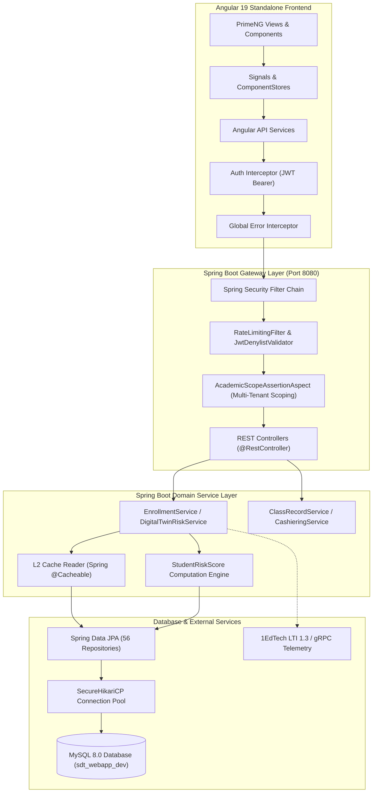

# Student Digital Twin (SDT) Enterprise Platform — System Flow & Architecture Data Pipeline

This document details the operational architecture, ingress pipelines, digital twin risk telemetry calculation engines, and frontend reactive signal flows verified across the Student Digital Twin platform.

---

## 1. Architectural Data Pipeline Overview

---

## 2. Ingestion & Operations Flow Details

### Ingestion & Data Flow
1. **API Ingress:** Requests enter Tomcat 11 on HTTP 8080 under Bearer JWT RFC 6750 specifications.
2. **Security & Scoping:** `WebSecurityConfig` delegates token validation to `JwtDecoder` and `JwtDenylistValidator`. Scoping assertions (`AcademicScopeAssertionService`) verify department/program access control.
3. **Controller Handling:** `@RestController` endpoints map payloads into immutable DTO records.
4. **Service & Domain Business Rules:** `EnrollmentService`, `ClassRecordService`, `FeeAssessmentService`, and `DigitalTwinRiskService` enforce transaction boundaries (`@Transactional`).
5. **Persistence Layer:** Spring Data JPA executes optimized queries (`JOIN FETCH` / `Set` collections) through `SecureHikariCP` to MySQL 8.0.

### Digital Twin Telemetry & ML Risk Computation Flow
1. **Student Ingestion:** Student profile, course enlistment, academic status, and fee clearance logs are read from `student_profiles` and `student_enrollments`.
2. **Telemetry Aggregation:** Real-time QR attendance (`attendance_sessions`, `attendance_records`), dynamic class records (`student_assessment_scores`), and LMS activity logs feed into `DigitalTwinRiskService`.
3. **Multi-Factor Risk Calculation:**
   $$\text{Academic Risk Score} = \text{GPA Transmutation Weight} + \text{Failing Assessment Penalty}$$
   $$\text{Attendance Risk Score} = \max(0, 100 - \text{Attendance \%}) \times \text{Weight}$$
   $$\text{Composite Risk Level} \in \{\text{LOW}, \text{MODERATE}, \text{HIGH}, \text{CRITICAL}\}$$
4. **Storage & Advisory Interventions:** Computed scores update `student_risk_scores` and trigger early-warning notifications for guidance counselors and academic advisers.

### Frontend Presentation Flow
1. **Navigation & Access Control:** `AuthGuard` and `RoleGuard` evaluate route activation.
2. **API Interaction:** Reactive HTTP services call backend endpoints, automatically appending Bearer tokens via `AuthInterceptor`.
3. **Reactive Signal Management:** Angular Signals (`signal()`, `computed()`, `toSignal()`) update local view state without manual `.subscribe()` calls.
4. **UI Presentation:** PrimeNG 21 components render responsive tables, early warning radar cards, empty-state placeholders, and toast notifications.
