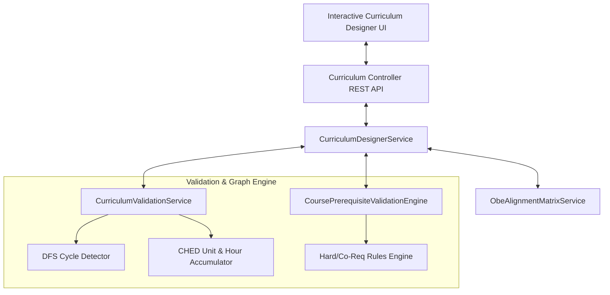
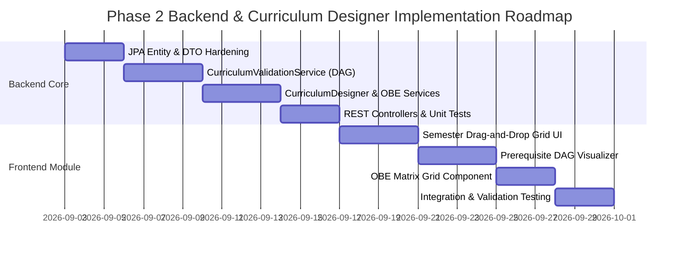

**Audit Date**: `September 2026`  
**Target Repositories**:
- `student-digital-twin-v1.0.0-backend` (Spring Boot 3.4.1 / Java 21)
- `student-digital-twin-v1.0.0-frontend` (Angular 19)  
**Auditor**: Antigravity AI Code Audit Agent  
**Overall Verdict**: **PHASE 2 FOUNDATION PARTIALLY COMPLETE (Entities & Schema Present; Services, DAG Engine, Validation & API Contracts Missing)**

---

## Executive Summary

A comprehensive architectural audit was conducted across the backend repository to evaluate the completeness of **Phase 2: Academic Backbone (Curriculum & Outcome-Based Education Architecture)**.

While the Flyway migration (`V5__phase2_curriculum_obe.sql`), JPA domain entities (`Program`, `Course`, `Curriculum`, `CurriculumCourse`, `CoursePrerequisite`, `ProgramOutcome`, `CourseOutcome`, `CiloPiloMapping`), and Spring Data repositories are defined, **the core operational business services, prerequisite validation engine, DAG cycle detection, OBE matrix engine, and REST/GraphQL API controllers are entirely missing**.

---

## 1. Phase 2 Backend Readiness Audit

### 1.1 Detailed Codebase Audit Matrix

| Domain Category | Component / File | Implementation Status | Technical Assessment & Missing Capabilities |
| :--- | :--- | :--- | :--- |
| **Schema Migration** | [`V5__phase2_curriculum_obe.sql`](file:///C:/Users/jkmor/Documents/projects/student-digital-twin-v1.0.0-backend/src/main/resources/db/migration/V5__phase2_curriculum_obe.sql) | **100% Present** | Tables created for programs, courses, curricula, curriculum_courses, course_prerequisites, program_outcomes, course_outcomes, cilo_pilo_mappings. |
| **Domain Entities** | `com.sdt.web_app.entities.institution.*` | **70% Complete** | Entities exist but lack status state machines (`DRAFT`, `APPROVED`, `ACTIVE`), versioning metadata, unit totals, course categories (`GENED`, `MAJOR`, `ELECTIVE`), sequence ordering, and Bloom's/IILO associations. |
| **Spring Data Repositories** | `com.sdt.web_app.repositories.institution.*` | **50% Complete** | Repositories extend `JpaRepository`, but lack `@EntityGraph` eager fetching for graph traversals, custom JPQL queries for term blocks, and OBE matrix aggregations. |
| **Prerequisite Engine** | [`PrerequisiteEvaluationService.java`](file:///C:/Users/jkmor/Documents/projects/student-digital-twin-v1.0.0-backend/src/main/java/com/sdt/web_app/service/institution/PrerequisiteEvaluationService.java) | **0% Implemented** | Stub class body with zero logic. Missing hard prerequisite, co-requisite, standing evaluation, and student transcript clearance checks. |
| **Validation Service** | `CurriculumValidationService` | **0% Implemented** | **Missing completely**. No Directed Acyclic Graph (DAG) cycle detection (DFS / Kahn's algorithm), no CHED unit accumulation validation, no contact hour calculation. |
| **Curriculum Designer Service** | `CurriculumDesignerService` | **0% Implemented** | **Missing completely**. No service to handle block assignments, term reordering, draft/approval state transitions, or revision cloning. |
| **OBE Alignment Matrix** | `ObeAlignmentMatrixService` | **0% Implemented** | **Missing completely**. No service to generate or bulk update CILO-PILO mapping matrices (I/E/D emphasis levels). |
| **REST Controllers** | `com.sdt.web_app.controller.*` | **0% Implemented** | Zero REST API endpoints exist for Phase 2 (only Phase 1 Auth/PasswordReset controllers exist). |
| **Automated Test Suite** | `src/test/java/...` | **0% Coverage for Phase 2** | Existing 40 passing tests cover Phase 1 auth/master tables. Zero unit/integration tests exist for Phase 2 entities or services. |

---

### 1.2 Identified Business Rule & Regulatory Gaps (CHED / UniFAST Standards)

1. **CHED CMO Minimum Unit Compliance**:
   - Lack of automated validation ensuring curricula meet CMO minimum unit thresholds (e.g. BSIT CMO No. 25 s. 2017 requires minimum units across General Education, Professional Core, Electives, and Capstone).
2. **Contact Hours vs. Credit Unit Calculation**:
   - Standard CHED ratio dictates `1 Lecture Unit = 1 Contact Hour/Week` and `1 Laboratory Unit = 3 Contact Hours/Week`.
   - The backend lacks real-time contact hour totalizers and fails to flag overloads (e.g., student weekly contact hours exceeding 30 hours/week).
3. **Prerequisite DAG Hardening**:
   - `CoursePrerequisite` stores raw `rule_type` strings without min grade thresholds (`min_grade_required`), min units earned, standing year checks, or support for logical prerequisite trees (AND/OR grouping).
4. **Draft vs. Approved State Machine & Historical Locking**:
   - No workflow locking (`DRAFT` → `UNDER_REVIEW` → `APPROVED` → `ACTIVE` → `ARCHIVED`).
   - Active curricula must be immutable to prevent accidental modification of program requirements for retrofitted, currently enrolled student cohorts.

---

## 2. Curriculum Designer Module Feasibility

### 2.1 Feasibility Assessment
- **Can we build a full interactive Curriculum Designer UI today?**  
  **NO.** The existing backend lacks all operational services, DAG validation engines, state handlers, DTOs, and REST controller endpoints required to feed an interactive drag-and-drop UI.

### 2.2 Missing Backend Capabilities Required for Interactive Designer



1. **Curriculum State Machine & Lifecycle Management**:
   - Version branching / cloning (`cloneCurriculumAsNewRevision(curriculumId)`).
   - Approval workflows and immutability locking once status = `APPROVED` or `ACTIVE`.
2. **Bulk Course Assignment & Reordering Mutations**:
   - Single-transaction endpoint to insert, remove, or reorder courses across (Year Level, Semester) blocks (`sequenceOrder` updating).
3. **Real-Time Prerequisite Graph Mutation & Cycle Prevention**:
   - Immediate cycle check before saving a new prerequisite link (returning the exact circular path if invalid, e.g., `IT 101 -> IT 102 -> IT 201 -> IT 101`).
4. **DAG Graph & Structured Diagnostic Projection**:
   - Graph serialization endpoint returning nodes (courses, units, contact hours) and edges (prerequisites) optimized for graph visualization libraries (Cytoscape / React Flow / ELK).
   - Validation report endpoint (`POST /api/v1/curricula/{id}/validate`) returning structured JSON with errors, warnings, and unit totals.

---

## 3. Frontend Implementation Roadmap & API Specifications

### 3.1 REST API Contracts Specification

#### 1. `CurriculumController` Endpoints (`/api/v1/curricula`)

- **`POST /api/v1/curricula`**: Create draft curriculum metadata.
- **`GET /api/v1/curricula/{id}/designer`**: Fetch complete hierarchical designer tree.
  ```json
  {
    "curriculumId": 10,
    "code": "BSIT-2026",
    "name": "BSIT Curriculum 2026-2030",
    "status": "DRAFT",
    "totalUnits": 146.0,
    "totalContactHours": 210,
    "yearBlocks": [
      {
        "yearLevel": 1,
        "semesters": [
          {
            "semester": "1ST_SEM",
            "totalUnits": 20.0,
            "totalContactHours": 26,
            "courses": [
              {
                "curriculumCourseId": 101,
                "courseId": 5,
                "code": "IT 101",
                "title": "Introduction to Computing",
                "lectureUnits": 2.0,
                "labUnits": 1.0,
                "creditUnits": 3.0,
                "contactHoursLec": 2,
                "contactHoursLab": 3,
                "category": "PROFESSIONAL_MAJOR",
                "sequenceOrder": 1,
                "prerequisites": []
              }
            ]
          }
        ]
      }
    ]
  }
  ```
- **`PUT /api/v1/curricula/{id}/courses/position`**: Move / reorder course across term blocks.
- **`POST /api/v1/curricula/{id}/prerequisites`**: Add prerequisite edge.
- **`DELETE /api/v1/curricula/{id}/prerequisites/{prereqId}`**: Delete prerequisite edge.
- **`POST /api/v1/curricula/{id}/validate`**: Execute validation audit. Returns:
  ```json
  {
    "valid": false,
    "summary": {
      "totalUnits": 142.0,
      "requiredUnits": 146.0,
      "unitDeficit": 4.0
    },
    "errors": [
      {
        "code": "CIRCULAR_DEPENDENCY_DETECTED",
        "severity": "ERROR",
        "message": "Circular prerequisite dependency detected: IT 101 -> IT 102 -> IT 101",
        "targetCourseCode": "IT 101"
      }
    ],
    "warnings": [
      {
        "code": "SEMESTER_OVERLOAD_WARNING",
        "severity": "WARNING",
        "message": "Year 2 Semester 1 total units (26.0) exceeds recommended max limit of 24.0 units",
        "yearLevel": 2,
        "semester": "1ST_SEM"
      }
    ]
  }
  ```
- **`POST /api/v1/curricula/{id}/clone`**: Clone curriculum into new draft version.
- **`POST /api/v1/curricula/{id}/transition-state`**: Update status (`DRAFT` → `UNDER_REVIEW` → `APPROVED`).

#### 2. `ObeMatrixController` Endpoints (`/api/v1/curricula/{id}/obe-matrix`)

- **`GET /api/v1/curricula/{id}/obe-matrix`**: Fetch matrix grid data (PILOs, CILOs, current mappings).
- **`PUT /api/v1/curricula/{id}/obe-matrix`**: Bulk update CILO-PILO cell emphasis levels (`I`, `E`, `D`, `NONE`).

---

### 3.2 Frontend Architecture & Visualization Strategy (Angular 19)

1. **State Management**:
   - Utilize **Angular Signals** (`signal`, `computed`, `effect`) or NgRx ComponentStore for local reactive state during editing.
   - Computes term units and contact hours in real time on the client side before calling backend validation.
2. **Semester-by-Semester Course Grid**:
   - **Angular CDK Drag and Drop** (`@angular/cdk/drag-drop`) with connected drop lists across 4 Year Levels x 2 Semesters (+ Summer).
   - Card UI displaying credit units, lab/lec split, and category badge.
3. **Real-Time CHED Accumulator Component**:
   - Sticky header summary cards per term block.
   - Highlights warning banners (e.g. Red badge if term units > 24.0 or contact hours > 30 hrs/wk).
4. **Prerequisite DAG Visualizer**:
   - **Cytoscape.js** or **ELK.js** integrated via SVG/Canvas.
   - Layout: Layered hierarchical layout (`dagre` or `elk`).
   - Node selection highlights upstream prerequisite paths (blue) and downstream dependent courses (green).
5. **OBE Alignment Matrix Grid**:
   - Interactive 2D matrix table with sticky row headers (CILOs/Courses) and sticky column headers (PILOs).
   - Cell click toggles state: `I` (Introduced) → `E` (Enabled) → `D` (Demonstrated) → `Empty`.
   - Column coverage indicator highlighting unmapped PILOs in yellow/red.

---

## 4. Recommended Sequential Milestones & Implementation Plan



### Milestone 1: Backend Domain & Validation Engine (Days 1–7)
- [ ] Refine JPA entities (`Curriculum`, `CurriculumCourse`, `CoursePrerequisite`, `CiloPiloMapping`) with state enums, category fields, and sequence order.
- [ ] Implement `CurriculumValidationService` featuring DFS DAG cycle detection, CHED unit total validation, and contact hour calculation.
- [ ] Implement `PrerequisiteEvaluationService` for advising eligibility.
- [ ] Implement `CurriculumDesignerService` and `ObeAlignmentMatrixService`.
- [ ] Create DTOs and `CurriculumController` + `ObeMatrixController`.
- [ ] Write 100% unit and integration test suite coverage for all Phase 2 services.

### Milestone 2: Frontend Curriculum Designer UI (Days 8–14)
- [ ] Build Angular 19 Curriculum Designer component layout with CDK Drag and Drop semester blocks.
- [ ] Implement real-time unit accumulation badges and CHED threshold alerts using Angular Signals.
- [ ] Integrate Cytoscape.js / ELK.js for visual Prerequisite DAG rendering.
- [ ] Build interactive 2D OBE Alignment Matrix grid component.
- [ ] End-to-end integration testing and sign-off.


