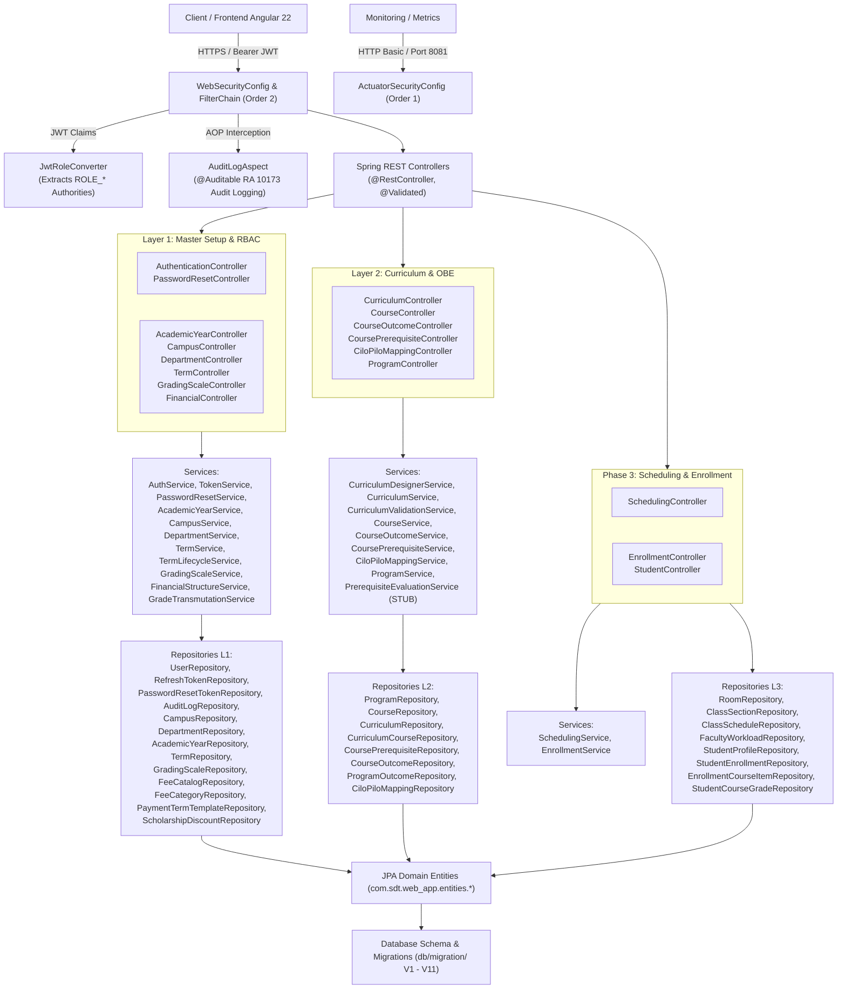
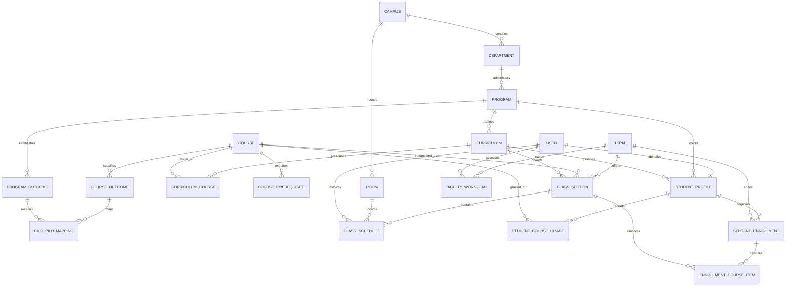

# Backend File Relationships & Architecture Topology

**Audited System:** `student-digital-twin-v1.0.0-backend`  
**Framework Stack:** Java 21, Spring Boot 3.4.3, Hibernate 6.6, Spring Security 6.4, Nimbus JOSE JWT, Flyway 10.x, MySQL 8 / Testcontainers  
**Audit Scope:** Layer 1 (Foundation & RBAC), Layer 2 (Curriculum & OBE), Phase 3 (Scheduling & Enrollment), Security Infrastructure  
**Execution Mode:** READ-ONLY COMPREHENSIVE ARCHITECTURAL AUDIT  

---

## 1. High-Level Architectural Flow & System Topology

The backend application implements a domain-driven, layered N-tier architecture with strictly segregated concerns. Flow traversal follows:

$$\text{Client HTTP Request} \longrightarrow \text{Security Filter Chain} \longrightarrow \text{DTO Validation} \longrightarrow \text{REST Controller} \longrightarrow \text{Domain Service} \longrightarrow \text{Spring Data JPA Repository} \longrightarrow \text{JPA Entity} \longrightarrow \text{Flyway Migrations (V1–V11)}$$

---

## 2. Complete Entity-to-Repository-to-Service-to-Controller Bindings Matrix

Below is the complete, exhaustive binding registry extracted directly from the application source code:

| Layer / Subsystem | Domain Entity (`entities/`) | Spring Data Repository (`repositories/`) | Domain Service (`service/`) | REST Controller (`controller/`) | Primary Flyway Migrations |
| :--- | :--- | :--- | :--- | :--- | :--- |
| **RBAC & Auth** | `User` | `UserRepository` | `AuthService` `TokenService` | `AuthenticationController` | `V1`, `V2` |
| **RBAC & Auth** | `RefreshToken` | `RefreshTokenRepository` | `AuthService` | `AuthenticationController` | `V1` |
| **RBAC & Auth** | `PasswordResetToken` | `PasswordResetTokenRepository` | `PasswordResetService` | `PasswordResetController` | `V1` |
| **RBAC & Auth** | `Permissions` | *(None - Orphaned Entity)* | *(None)* | *(None)* | `V4` |
| **Audit** | `AuditLog` | `AuditLogRepository` | `AuditLogService` | `AuditLogAspect` (AOP) | `V3` |
| **Master: Campus** | `Campus` | `CampusRepository` | `CampusService` | `CampusController` | `V4` |
| **Master: Dept** | `Department` | `DepartmentRepository` | `DepartmentService` | `DepartmentController` | `V4` |
| **Master: Calendar**| `AcademicYear` | `AcademicYearRepository` | `AcademicYearService` `TermLifecycleService` | `AcademicYearController` | `V4` |
| **Master: Terms** | `Term` | `TermRepository` | `TermService` `TermLifecycleService` | `TermController` | `V4`, `V11` |
| **Master: Grading**| `GradingScale` | `GradingScaleRepository` | `GradingScaleService` `GradeTransmutationService` | `GradingScaleController` | `V4` |
| **Master: Fees** | `FeeCategory` | `FeeCategoryRepository` | `FinancialStructureService` | `FinancialController` | `V4` |
| **Master: Fees** | `FeeCatalog` | `FeeCatalogRepository` | `FinancialStructureService` | `FinancialController` | `V4` |
| **Master: Fees** | `PaymentTermTemplate`| `PaymentTermTemplateRepository` | `FinancialStructureService` | `FinancialController` | `V4` |
| **Master: Aid** | `ScholarshipDiscount`| `ScholarshipDiscountRepository` | `FinancialStructureService` | `FinancialController` | `V4` |
| **Curriculum** | `Program` | `ProgramRepository` | `ProgramService` | `ProgramController` | `V5` |
| **Curriculum** | `Course` | `CourseRepository` | `CourseService` | `CourseController` | `V5`, `V6`, `V7` |
| **Curriculum** | `Curriculum` | `CurriculumRepository` | `CurriculumService` `CurriculumDesignerService` `CurriculumValidationService` | `CurriculumController` | `V5`, `V7`, `V9` |
| **Curriculum** | `CurriculumCourse` | `CurriculumCourseRepository` | `CurriculumDesignerService` `CurriculumService` `CurriculumValidationService` | `CurriculumController` | `V5`, `V7`, `V9` |
| **Curriculum** | `CoursePrerequisite`| `CoursePrerequisiteRepository`| `CoursePrerequisiteService` `CurriculumValidationService` | `CoursePrerequisiteController` `CurriculumController` | `V5`, `V7` |
| **OBE Outcomes** | `CourseOutcome` (CILO)| `CourseOutcomeRepository` | `CourseOutcomeService` | `CourseOutcomeController` | `V5`, `V8` |
| **OBE Outcomes** | `ProgramOutcome` (PILO)| `ProgramOutcomeRepository` | `ProgramService` | `ProgramController` | `V5`, `V8` |
| **OBE Outcomes** | `CiloPiloMapping` | `CiloPiloMappingRepository` | `CiloPiloMappingService` | `CiloPiloMappingController` | `V5`, `V8` |
| **Facilities** | `Room` | `RoomRepository` | `SchedulingService` | `SchedulingController` | `V10` |
| **Scheduling** | `ClassSection` | `ClassSectionRepository` | `SchedulingService` `EnrollmentService` | `SchedulingController` | `V10` |
| **Scheduling** | `ClassSchedule` | `ClassScheduleRepository` | `SchedulingService` | `SchedulingController` | `V10` |
| **Scheduling** | `FacultyWorkload` | `FacultyWorkloadRepository` | `SchedulingService` | `SchedulingController` | `V10`, `V11` |
| **Student** | `StudentProfile` | `StudentProfileRepository` | `EnrollmentService` | `StudentController` `EnrollmentController` | `V10` |
| **Enrollment** | `StudentEnrollment` | `StudentEnrollmentRepository` | `EnrollmentService` | `EnrollmentController` | `V10` |
| **Enrollment** | `EnrollmentCourseItem`| `EnrollmentCourseItemRepository`| `EnrollmentService` | `EnrollmentController` | `V10` |
| **Grades** | `StudentCourseGrade`| `StudentCourseGradeRepository`| `EnrollmentService` | `EnrollmentController` | `V10` |

---

## 3. Dependency Trees Based on Imports and Dependency Injection (DI)

### 3.1. Infrastructure & Security Configuration Layer
* **`WebSecurityConfig.java`**:
  * **Imports:** `org.springframework.security.web.SecurityFilterChain`, `NimbusJwtDecoder`, `JwtRoleConverter`, `applicationCookieSameSiteSupplier`.
  * **DI Dependencies:** Injects `@Qualifier("localJwtDecoder") JwtDecoder` and `JwtRoleConverter`.
  * **Exposes:** `SecurityFilterChain` (Order 2) handling `/api/**` and `/ws/**`.
* **`ActuatorSecurityConfig.java`**:
  * **Imports:** `org.springframework.boot.security.autoconfigure.actuate.web.servlet.EndpointRequest`.
  * **Exposes:** `SecurityFilterChain` (Order 1) isolating actuator endpoints on port 8081 (`/actuator/**`).
* **`AsyncSecurityConfig.java`**:
  * **Imports:** `io.micrometer.context.ContextRegistry`, `io.micrometer.context.ContextSnapshotFactory`, `ThreadPoolTaskExecutor`.
  * **Configuration:** Enables `@EnableAsync`, registers `SECURITY_CONTEXT` thread-local accessor, and configures `applicationTaskExecutor` with virtual threads (`executor.setVirtualThreads(true)`).
* **`GrpcAuthInterceptor.java`**:
  * **Imports:** `io.grpc.ServerInterceptor`, `io.grpc.Context`, `JwtDecoder`, `JwtRoleConverter`.
  * **DI Dependencies:** `JwtDecoder`, `JwtRoleConverter`.
* **`SsrfProtectingClientInterceptor.java`**:
  * **Imports:** `ClientHttpRequestInterceptor`, `RestClient`.
  * **Mitigation:** Blocks metadata endpoints (`169.254.169.254`, `metadata.google.internal`) and RFC-1918 private IP subnets on outbound REST client calls.
* **`JacksonHardeningConfig.java`**:
  * **Imports:** `tools.jackson.databind.jsontype.BasicPolymorphicTypeValidator` (Jackson 3).
  * **Mitigation:** Strict polymorphic type validation whitelisting only `com.sdt.web_app.dto.*`, `List`, and `Map`.
* **`AuditLogAspect.java`**:
  * **Imports:** `org.aspectj.lang.ProceedingJoinPoint`, `@Auditable`.
  * **DI Dependencies:** `AuditLogService`, `UserRepository`, `RefreshTokenRepository`, `PasswordResetTokenRepository`, `ObjectMapper`.

### 3.2. Layer 1 (Master Setup & RBAC) Dependency Tree
* **`AcademicYearService`** $\longleftarrow$ `AcademicYearRepository`.
* **`CampusService`** $\longleftarrow$ `CampusRepository`, `DepartmentRepository`.
* **`DepartmentService`** $\longleftarrow$ `DepartmentRepository`, `CampusRepository`, `UserRepository`, `ProgramRepository`.
* **`TermService`** $\longleftarrow$ `TermRepository`, `AcademicYearRepository`.
* **`TermLifecycleService`** $\longleftarrow$ `TermRepository`, `AcademicYearRepository`.
* **`GradingScaleService`** $\longleftarrow$ `GradingScaleRepository`.
* **`GradeTransmutationService`** $\longleftarrow$ `GradingScaleRepository`.
* **`FinancialStructureService`** $\longleftarrow$ `FeeCategoryRepository`, `FeeCatalogRepository`, `PaymentTermTemplateRepository`, `ScholarshipDiscountRepository`.

### 3.3. Layer 2 (Curriculum & OBE) Dependency Tree
* **`ProgramService`** $\longleftarrow$ `ProgramRepository`, `DepartmentRepository`, `ProgramOutcomeRepository`, `CiloPiloMappingRepository`, `CurriculumRepository`.
* **`CourseService`** $\longleftarrow$ `CourseRepository`, `CurriculumCourseRepository`, `CoursePrerequisiteRepository`.
* **`CourseOutcomeService`** $\longleftarrow$ `CourseOutcomeRepository`, `CourseRepository`.
* **`CoursePrerequisiteService`** $\longleftarrow$ `CoursePrerequisiteRepository`, `CourseRepository`.
* **`CiloPiloMappingService`** $\longleftarrow$ `CiloPiloMappingRepository`, `CourseOutcomeRepository`, `ProgramOutcomeRepository`.
* **`CurriculumService`** $\longleftarrow$ `CurriculumRepository`, `CurriculumCourseRepository`.
* **`CurriculumDesignerService`** $\longleftarrow$ `CurriculumRepository`, `CurriculumCourseRepository`, `CourseRepository`, `CoursePrerequisiteRepository`, `ProgramRepository`, `CurriculumValidationService`.
* **`CurriculumValidationService`** $\longleftarrow$ `CurriculumRepository`, `CurriculumCourseRepository`, `CoursePrerequisiteRepository`.
* **`PrerequisiteEvaluationService`** $\longleftarrow$ *(None - Empty class stub)*.

### 3.4. Phase 3 (Scheduling & Enrollment) Dependency Tree
* **`SchedulingService`** $\longleftarrow$ `RoomRepository`, `ClassSectionRepository`, `ClassScheduleRepository`, `FacultyWorkloadRepository`, `CampusRepository`, `TermRepository`, `CurriculumRepository`, `CurriculumCourseRepository`, `CourseRepository`, `UserRepository`.
* **`EnrollmentService`** $\longleftarrow$ `StudentProfileRepository`, `StudentCourseGradeRepository`, `StudentEnrollmentRepository`, `EnrollmentCourseItemRepository`, `ClassSectionRepository`, `CurriculumCourseRepository`, `CoursePrerequisiteRepository`, `TermRepository`.

---

## 4. Flyway Database Schema Evolution (`V1` to `V11`)

The database migration trajectory spans 11 incremental Flyway scripts targeting MySQL 8 (InnoDB utf8mb4):

| Version | Migration Script Name | Primary DDL / DML Scope | Key Integrity Constraints & Notes |
| :--- | :--- | :--- | :--- |
| **`V1`** | `V1__init_auth_schema.sql` | `users`, `user_roles`, `refresh_tokens`, `password_reset_tokens` | Cascading foreign keys on user deletion. Indexed tokens. |
| **`V2`** | `V2__seed_users.sql` | Seed users: `admin`, `dean_tech`, `chair_it`, `registrar_jane`, `prof_smith`, `student_john` | Argon2-hashed credentials for all institutional actor personas. |
| **`V3`** | `V3__add_audit_logs_schema.sql` | `audit_logs` | Immutable audit trails for RA 10173 (Data Privacy Act) compliance. |
| **`V4`** | `V4__phase1_master_setup.sql` | `campuses`, `departments`, `academic_years`, `terms`, `grading_scales`, `fee_categories`, `fee_catalog`, `scholarship_discounts`, `payment_term_templates`, `permissions`, `role_permissions` | Core institutional master data. Seeded 4 CHMSU campuses and regional fee structures. |
| **`V5`** | `V5__phase2_curriculum_obe.sql` | `programs`, `courses`, `curricula`, `curriculum_courses`, `course_prerequisites`, `program_outcomes`, `course_outcomes`, `cilo_pilo_mappings` | Academic backbone and Outcome-Based Education (OBE) mapping tables. |
| **`V6`** | `V6__add_category_to_courses.sql` | Alter `courses` table | Added `category` column (`PROFESSIONAL_MAJOR`, `GENERAL_EDUCATION`, etc.). |
| **`V7`** | `V7__seed_chmsu_curriculum_catalog.sql` | Seed course catalog and curricula | Initial bulk course catalog seed data. |
| **`V8`** | `V8__seed_chmsu_pilos_and_cilo_mappings.sql` | Seed PILOs and CILO-PILO mappings | CHED CMO 25 s. 2015 competency mappings. |
| **`V9`** | `V9__seed_distinct_curriculum_course_mappings.sql` | Clean up duplicate course mappings | Resolves Cartesian join duplicates; seeds 486 authentic curriculum courses across 26 degree programs. |
| **`V10`**| `V10__create_phase3_scheduling_and_enrollment.sql` | `rooms`, `class_sections`, `class_schedules`, `faculty_workloads`, `student_profiles`, `student_course_grades`, `student_enrollments`, `enrollment_course_items` | Phase 3 operational core schema. Collision indexes on `(room_id, day, start, end)` and `(faculty_id, day, start, end)`. |
| **`V11`**| `V11__add_faculty_preparations_and_scheduling_caps.sql` | Alter `faculty_workloads`, Alter `terms` | Added `number_of_preparations`, `custom_max_load_units`, `override_reason`, and `terms.max_hours_per_class`. |

---

## 5. Security Posture & Hardening Verification

### 5.1. Authentication & Token Lifecycle
1. **Password Hashing:** Enforced via `Argon2PasswordEncoder.defaultsForSpringSecurity_v5_8()` in `AuthCryptoConfig.java`.
2. **Ephemeral Key Pair Risk:** `AuthCryptoConfig.rsaKeyPair()` generates a dynamic RSA 2048-bit keypair on JVM startup. While functional for local single-instance operation, it invalidates all active JWTs on server restart and blocks horizontal scaling across multiple container instances unless backed by a persistent JWK Keystore.
3. **Audience Configuration Discrepancy:**
   - `application.yml` configures `spring.security.oauth2.resourceserver.jwt.audiences: ["api://sdt-webapp"]`.
   - `WebSecurityConfig` defaults to `api://sdt-webapp`.
   - `TokenService` defaults to `api://web-app`.
   - `localJwtDecoder` does not bind `expectedAudiences` validator, whereas `resourceServerJwtDecoder` (which is `@Primary` but not injected into the filter chain) does.

### 5.2. Network & Edge Hardening
1. **Actuator Port Segregation:** `ActuatorSecurityConfig` binds to `EndpointRequest.toAnyEndpoint()` (Order 1). `health` and `info` endpoints are open, while `prometheus` and `metrics` require `ROLE_MONITORING`, running on dedicated management port 8081.
2. **SSRF Interceptor:** `SsrfProtectingClientInterceptor` blocks DNS-resolved IPv4 loopback, link-local, site-local, and cloud metadata hostnames (`169.254.169.254`, `metadata.google.internal`).
3. **Modern Headers:** Content Security Policy (`default-src 'self'`) and Permissions-Policy (`camera=(), microphone=(), geolocation=(), payment=()`) injected on all `/api/**` responses. Refresh token cookies are issued with `HttpOnly`, `Secure`, `SameSite=None`, and `Partitioned` (CHIPS).

### 5.3. Async Security & Virtual Threads
1. **Virtual Thread Context Propagation:** Java 21 Virtual Threads are enabled globally (`spring.threads.virtual.enabled: true`).
2. **Micrometer Context Snapshotting:** `AsyncSecurityConfig` initializes `ContextRegistry` with a thread-local accessor for `SECURITY_CONTEXT` and wraps `applicationTaskExecutor` with a `ContextSnapshotFactory` task decorator, ensuring `SecurityContextHolder` is faithfully propagated into virtual thread tasks.

---

## 6. Entity Relationship Diagram (ERD)

---
*Generated by Antigravity Agentic Security & Architectural Auditor.*
