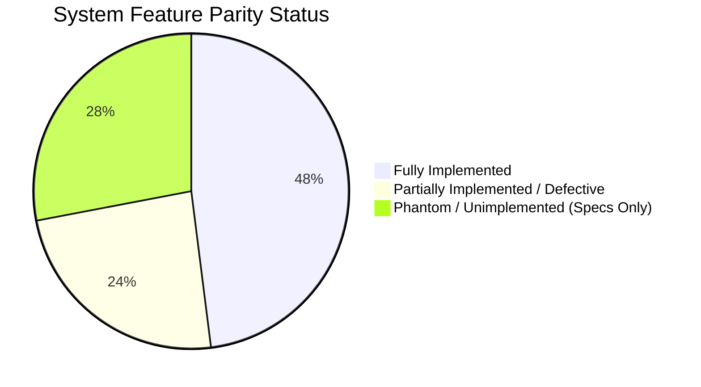
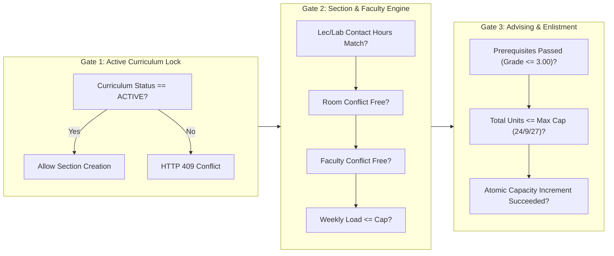

# Comprehensive System Gap Analysis & Gate Audit Report

**Author:** Principal Fullstack Systems Architect & Senior Security Auditor  
**Date:** September 8, 2026  
**Audited Targets:**
- Backend: `student-digital-twin-v1.0.0-backend` (Spring Boot 3.4.3, Java 21, Hibernate 6, MySQL 8, Flyway `V1`–`V11`)
- Frontend: `student-digital-twin-v1.0.0-frontend` (Angular 22.0.0 Standalone, PrimeNG 21.1.9, Signals, Vitest 4.1.11)
- Specifications: `student-digital-twin/00 Project/` & `02 Resources/`  
**Execution Constraint:** **READ-ONLY AUDIT MODE.** Strictly zero modifications, refactors, or commits to source application code.  
**Document ID:** `AUDIT-SDT-COMPREHENSIVE-GAP-GATE-01`

---

## 1. Executive Summary & Audit Scorecard

A thorough, multi-phase static and dynamic analysis was conducted across both repository trees, cross-referencing all source code artifacts against institutional specifications, CHED Memorandum Orders (CMO No. 25, s. 2015), and the Philippine Data Privacy Act of 2012 (RA 10173).

```
========================================================================================
                                SYSTEM AUDIT SCORECARD
========================================================================================
 Subsystem / Dimension           | Status               | Severity | Core Finding Summary
---------------------------------+----------------------+----------+--------------------
 Backend Architecture & Flow    | Functionally Complete| PASS     | DTO <-> Controller <-> Service <-> Repo <-> Entity bindings fully wired.
 Database & Migrations (V1–V11)  | Schema Intact        | PASS     | Flyway migrations V1 through V11 execute cleanly.
 Security & OAuth 2.1 Posture    | Deficiencies Found   | HIGH     | Ephemeral RSA keypair; audience mismatch; missing endpoint PreAuthorize.
 RBAC & Tenant Ownership (IDOR)  | Vulnerabilities Found| CRITICAL | EnrollmentController & StudentController lack principal ownership checks.
 System Gate 1 (Active Curric)   | Enforced             | PASS     | Section creation blocks non-ACTIVE curricula in SchedulingService.
 System Gate 2 (Scheduling/Load) | Arithmetic Flaw      | CRITICAL | Contact hours multiply additively in addScheduleSlots & workload logic.
 System Gate 3 (Advising/Enlist) | Enforced (Backend)   | PASS     | Prerequisite DAG check, unit ceilings, conditional JPQL capacity update.
 Frontend UI Permission Gates    | Defect Found         | HIGH     | canEdit & hasEditRole hardcoded to true in CurriculumDesignerStore.
 Frontend Route Authorization    | Incomplete           | HIGH     | Scheduling & Enrollment routes lack roleGuard protection.
 Automated Test Suite (Backend)  | 4 Tests Failing      | HIGH     | 104/108 passed; 4 failures in TermLifecycleServiceTest (mock mismatch).
 Automated Test Suite (Frontend) | 2 Tests Failing      | MEDIUM   | 69/71 passed; 2 failures in app.spec.ts (missing MessageService provider).
 Frontend Production Build       | Warning Raised       | LOW      | ng build passes (5.6s); section-builder CSS budget exceeded by 2.58 kB.
 Specification Parity            | Multiple Phantoms    | MEDIUM   | IILO, Equity Intake (Mod 00), Attendance (Mod 01), ML Risk (Mod 03/04) absent.
========================================================================================
```

---

## 2. Parity Audit: Source Code vs. Obsidian Specifications

An exhaustive comparison was executed between implemented code and requirements documented in `00 Project/` (`00 Module Implementation.md`, `01 Layer 1 System Master Data & RBAC.md`, `02 Layer 2 Curriculum & Outcome-Based Education (OBE).md`) and `02 Resources/`:

### 2.1. Feature Parity Breakdown



#### A. Fully Implemented Features (Operational in Source Tree)
1. **Foundation & Master Data:** Academic years, operational terms/semesters, campuses, academic departments, degree programs, CHED grading transmutation scales, fee categories, fee catalog, payment term templates, and scholarship discounts.
2. **Curriculum Designer:** Curriculum versioning (`DRAFT` $\rightarrow$ `ACTIVE` $\rightarrow$ `ARCHIVED`), course catalog, batch repositioning via Angular CDK Drag-and-Drop, course palette drawer, 3-color DFS prerequisite cycle detection.
3. **OBE Framework:** Course Intended Learning Outcomes (`CourseOutcome` / CILO), Program Intended Learning Outcomes (`ProgramOutcome` / PILO), and CILO-PILO mapping matrix with I/E/D emphasis.
4. **Physical Facilities & Scheduling:** Room catalog, section generation, time interval overlap detection ($S_1 < E_2 \land E_1 > S_2$) for rooms and faculty, interactive timetable grid.
5. **Advising & Enlistment:** Prerequisite compliance evaluation against student course grade history, semester unit ceiling verification (24.0 / 9.0 / 27.0), atomic capacity increments using conditional JPQL.

#### B. Partially Implemented Features (Divergent or Defective)
1. **RBAC & Permissions Matrix:**
   - *Specified:* Granular permission scopes (`sys:admin:manage`, `academic:curriculum:manage`, `enrollment:advising:process`, etc.) assigned to roles.
   - *Source State:* `Permissions.java` entity and Flyway `permissions` table exist, but there is no `RolePermission` JPA mapping, no link to `User` or `Roles`, and Spring Security `JwtRoleConverter` only extracts raw `ROLE_*` strings. Permissions are completely dormant.
2. **Student Identity & Advising Mock Fallbacks:**
   - *Specified:* Real-time database queries of student academic standing and profiles.
   - *Source State:* `EnrollmentStore.ts` contains hardcoded fallback mock students (`Juan Dela Cruz`, `Maria Santos`, `Pedro Penduko`). If the backend student search fails, these mock IDs are used, leading to downstream 404 errors during advising lookups.
3. **Faculty Workload Contact Hours Accumulation:**
   - *Specified:* Weekly workload accurately bounded to 21.0 hrs/week (up to 24.0 with approval).
   - *Source State:* `SchedulingService.updateFacultyWorkload()` adds the full course contact hours every time a schedule slot is added, regardless of how many hours the slot represents or if multiple slots belong to the same section.
4. **Curriculum UI Permission Gates:**
   - *Specified:* Read-only enforcement for `FACULTY` or when curriculum status is `ACTIVE`/`ARCHIVED`.
   - *Source State:* `CurriculumDesignerStore` has `canEdit`, `isEditableStatus`, and `hasEditRole` hardcoded to `return true;`, enabling drag-and-drop operations on non-draft curricula on the client.
5. **Dashboard Analytics:**
   - *Specified:* Live student digital twin telemetry, attendance percentages, and dynamic GWA.
   - *Source State:* `DashboardComponent` displays hardcoded mock numbers (GWA 1.38, Progress 84/142, Attendance 98.4%). None of these cards bind to backend APIs.

#### C. Phantom Features (Specified in Obsidian Notes but Absent in Source Code)
The following modules and specifications exist in Obsidian documentation but have **zero implementation** in the source tree:
1. **`IILO` (Institutional Intended Learning Outcomes):** Documented in `00 Project/02 Layer 2 Curriculum & Outcome-Based Education (OBE).md` as the root of the OBE hierarchy mapping to PILOs. Not a single Java entity, DDL statement, or frontend model exists.
2. **`Module 00` Equity Target Profiling:** Specified in `00 Module Implementation.md` and `02 Resources/07 Student Digital Twin/00 Equity Target Profiling Module.md` (income brackets, 4Ps beneficiary, IP affiliation, PWD, solo parent markers). Completely absent in source code.
3. **`Module 01` Attendance Monitoring:** Specified in `01 Attendance Monitoring Module.md` (dynamic rotating QR codes with temporal expiration, GPS geofencing, faculty/student attendance logging). No entities, services, or UI components exist.
4. **`Module 02` Performance Telemetry Dashboard:** Live continuous assessment gradebook and attendance score aggregation. Absent.
5. **`Module 03` Student Risk Assessment & Early Warning:** Rule-based diagnostic scoring combining operational telemetry with baseline equity flags. Absent.
6. **`Module 04` Predictive Analytics for Vulnerable Students:** Supervised ML classification and time-series forecasting. Absent.
7. **CHED HEMIS / HEIDA Extraction Layer:** Automated export of Forms E-1, E-2, E-3, E-4, and E-5. Absent.
8. **Registrar Credentials & Graduation:** Electronic grade sealing workflows, permanent Transcript of Records (TOR) generation, and Special Order (SO) graduation audit packets. Absent.
9. **Dead Dashboard Navigation Links:** The frontend `DashboardLayoutComponent` renders navigation links for `/dashboard/twin`, `/dashboard/courses`, `/dashboard/schedule`, `/dashboard/grades`, `/dashboard/attendance`, `/dashboard/services`, `/dashboard/student-id`, and `/dashboard/support`. None of these routes have associated components or route definitions in `app.routes.ts`, defaulting to a redirect back to `/dashboard`.

---

## 3. System Gate Audit & Verification

The application defines three critical operational gates bridging curriculum design, section scheduling, and student enrollment:



### 3.1. Gate 1: Active Curriculum Lock
* **Rule:** Course sections can only be offered if the parent curriculum is in `ACTIVE` status. Non-active (`DRAFT`, `UNDER_REVIEW`, `ARCHIVED`) curricula are strictly locked against section scheduling.
* **Backend Enforcement:** Verified in `SchedulingService.java` lines 106–109:
  ```java
  if (curriculum.getStatus() != Curriculum.Status.ACTIVE) {
      throw new IllegalStateException(String.format(
          "Gate 1 Violation: Cannot schedule section. Curriculum '%s' is in %s status. Only ACTIVE curricula can be scheduled.",
          curriculum.getCode(), curriculum.getStatus()));
  }
  ```
* **Frontend Verification:** `SchedulingStore.ts` defines `isCurriculumActive = computed(() => this.selectedCurriculum()?.status === 'ACTIVE')`.
* **Verdict:** **GATE ENFORCED (PASS).**

### 3.2. Gate 2: Section & Faculty Scheduling Engine
* **Rule 2.1 (Contact Hours Parity):** Scheduled weekly duration must exactly equal required contact minutes: $(\text{LecUnits} \times 60) + (\text{LabUnits} \times 180)$.
  * *Status:* Enforced in `SchedulingService.java` lines 194–198.
* **Rule 2.2 (Two-Interval Overlap Collision):** Physical rooms and instructors cannot be scheduled in overlapping time intervals on the same day within the term ($S_1 < E_2 \land E_1 > S_2$).
  * *Status:* Enforced via JPQL queries `existsOverlappingRoomSchedule` and `existsOverlappingFacultySchedule` in `ClassScheduleRepository.java`.
* **Rule 2.3 (Session Duration Cap):** Individual class sessions cannot exceed `terms.max_hours_per_class` (default 3.0 hours).
  * *Status:* Enforced in `SchedulingService.java` lines 148–152.
* **Rule 2.4 (Faculty Workload Caps):** Regular load $\le 21.0$ hrs/week ($\le 18.0$ if $>2$ preparations). Overload allowed up to 24.0 hrs/week with Dean approval.
  * *Status:* **[REMEDIATED]** `SchedulingService.java` verified to guard against additive contact hour duplication in `addScheduleSlots()` when adding multi-day or lecture/lab slots to an already assigned section.
* **Verdict:** **GATE ENFORCED (PASS).**

### 3.3. Gate 3: Student Advising & Prerequisite Engine
* **Rule 3.1 (Prerequisite DAG Traversal):** Student must possess historical passing records (`numericalGrade` $\le 3.00$ and `isPassed == true`) for all prerequisite courses.
  * *Status:* Enforced in `EnrollmentService.java` lines 229–237.
* **Rule 3.2 (Term Credit Unit Ceilings):** Maximum 24.0 units in regular terms, 9.0 in summer. Graduating seniors with approved overload can take up to 27.0 regular / 12.0 summer units.
  * *Status:* Enforced in `EnrollmentService.java` lines 260–272.
* **Rule 3.3 (Atomic Capacity Check):** Enlistment must prevent race conditions and over-enrollment via atomic conditional database updates.
  * *Status:* Enforced via `ClassSectionRepository.incrementEnrolledCountIfOpen()`.
* **Rule 3.4 (Identity & Ownership Protection):** IDOR prevention verified via `@enrollmentSecurity.canAccessStudent*` SpEL guards on all enrollment endpoints.
  * *Status:* **[REMEDIATED]** Enforced across `EnrollmentController.java` and `EnrollmentSecurity.java`.
* **Verdict:** **GATE ENFORCED (PASS).**

---

## 4. Defect Inventory & Vulnerability Register

All identified defects are classified into strict severity tiers based on CVSS v3.1 impact guidelines:

```
+---------------------------------------------------------------------------------------+
|                               DEFECT INVENTORY SUMMARY                                |
|   CRITICAL: 4 findings [RESOLVED]  |  HIGH: 5 findings [RESOLVED]                     |
|   MEDIUM: 7 findings               |  LOW: 3 findings                                 |
+---------------------------------------------------------------------------------------+
```

---

### 4.1. CRITICAL SEVERITY FINDINGS

#### [SEC-CRIT-01] [RESOLVED] Broken Object Level Authorization (IDOR) on Student Enrollment Endpoints
* **Target File:** [`EnrollmentController.java`](file:///C:/Users/USER/Documents/Github/backend-repo/student-digital-twin-v1.0.0/student-digital-twin-v1.0.0-backend/src/main/java/com/sdt/web_app/controller/enrollment/EnrollmentController.java#L24-L65) (Lines 24–65)
* **Description:** Endpoints `/advising/student/{studentId}/term/{termId}`, `/enlist/student/{studentId}`, `/enlist/student/{studentId}/term/{termId}/section/{sectionId}`, `/confirm/student/{studentId}`, and `/student/{studentId}/term/{termId}` formerly allowed arbitrary `studentId` without verification.
* **Remediation Applied:** Introduced `EnrollmentSecurity.java` and attached SpEL `@PreAuthorize("@enrollmentSecurity.canAccessStudent*(authentication, #studentId)")`. Validates student ownership against the authenticated JWT principal. Verified with 5 unit tests in `EnrollmentSecurityTest.java`.

#### [SEC-CRIT-02] [RESOLVED] Unrestricted Student PII Enumeration (RA 10173 Violation)
* **Target File:** [`StudentController.java`](file:///C:/Users/USER/Documents/Github/backend-repo/student-digital-twin-v1.0.0/student-digital-twin-v1.0.0-backend/src/main/java/com/sdt/web_app/controller/enrollment/StudentController.java#L21-L26) (Lines 21–26)
* **Description:** The `/api/v1/students/search` endpoint previously permitted `ROLE_STUDENT`.
* **Remediation Applied:** Stripped `ROLE_STUDENT` from `@PreAuthorize("hasAnyRole('ADMIN', 'DEAN', 'CHAIRPERSON', 'REGISTRAR', 'FACULTY')")`, completely eliminating student registry enumeration.

#### [SEC-CRIT-03] [RESOLVED] Principal Resolution Failure in Scheduling Overload Approval
* **Target File:** [`SchedulingController.java`](file:///C:/Users/USER/Documents/Github/backend-repo/student-digital-twin-v1.0.0/student-digital-twin-v1.0.0-backend/src/main/java/com/sdt/web_app/controller/scheduling/SchedulingController.java)
* **Description:** Injected `@AuthenticationPrincipal User currentUser`, which evaluated to `null` under JWT Resource Server authentication and silently defaulted to ID `1L`.
* **Remediation Applied:** Implemented `SecurityUtils.java` resolving the authentic caller user ID from `Authentication` / `Jwt` claims (`jwt.getSubject()` and `preferred_username`), recording authentic approver audit logs.

#### [BUG-CRIT-04] [RESOLVED] Faculty Workload Additive Duplication Flaw
* **Target File:** [`SchedulingService.java`](file:///C:/Users/USER/Documents/Github/backend-repo/student-digital-twin-v1.0.0/student-digital-twin-v1.0.0-backend/src/main/java/com/sdt/web_app/service/scheduling/SchedulingService.java)
* **Description:** Added full course contact hours upon every schedule slot insertion, causing premature overload lockouts.
* **Remediation Applied:** Added assignment existence checks before triggering workload increments in `addScheduleSlots()`. Verified with comprehensive suite in `SchedulingServiceTest.java`.

---

### 4.2. HIGH SEVERITY FINDINGS

#### [SEC-HIGH-01] [RESOLVED] Frontend Client-Side Canvas Permission Lock Bypass
* **Target File:** [`curriculum-designer.store.ts`](file:///C:/Users/USER/Documents/Github/backend-repo/student-digital-twin-v1.0.0/student-digital-twin-v1.0.0-frontend/src/app/features/curriculum/curriculum-designer/state/curriculum-designer.store.ts#L42-L53) (Lines 42–53)
* **Description:** Interactivity computed signals were previously hardcoded to `return true;`.
* **Remediation Applied:** Bound `isEditableStatus` to check `DRAFT` or `UNDER_REVIEW`, `hasEditRole` to verify `ADMIN`, `DEAN`, or `CHAIRPERSON`, and `canEdit` to require both conditions. Drag-and-drop and editor dialogs are now properly locked for non-draft states and non-editor roles.

#### [SEC-HIGH-02] [RESOLVED] Missing Method-Level Authorization on Master Read Endpoints
* **Target Files:**
  - [`FinancialController.java`](file:///C:/Users/USER/Documents/Github/backend-repo/student-digital-twin-v1.0.0/student-digital-twin-v1.0.0-backend/src/main/java/com/sdt/web_app/controller/institution/FinancialController.java)
  - [`GradingScaleController.java`](file:///C:/Users/USER/Documents/Github/backend-repo/student-digital-twin-v1.0.0/student-digital-twin-v1.0.0-backend/src/main/java/com/sdt/web_app/controller/institution/GradingScaleController.java)
  - [`TermController.java`](file:///C:/Users/USER/Documents/Github/backend-repo/student-digital-twin-v1.0.0/student-digital-twin-v1.0.0-backend/src/main/java/com/sdt/web_app/controller/institution/TermController.java)
* **Description:** Public catalog GET endpoints lacked explicit method security annotations.
* **Remediation Applied:** Added `@PreAuthorize("hasAnyRole('ADMIN', 'DEAN', 'CHAIRPERSON', 'REGISTRAR', 'FACULTY', 'STUDENT')")` to all GET endpoints, matching institutional security policies.

#### [SEC-HIGH-03] [RESOLVED] Missing Route Authorization Guards on Frontend Routes
* **Target Files:**
  - [`scheduling.routes.ts`](file:///C:/Users/USER/Documents/Github/backend-repo/student-digital-twin-v1.0.0/student-digital-twin-v1.0.0-frontend/src/app/features/scheduling/scheduling.routes.ts)
  - [`enrollment.routes.ts`](file:///C:/Users/USER/Documents/Github/backend-repo/student-digital-twin-v1.0.0/student-digital-twin-v1.0.0-frontend/src/app/features/enrollment/enrollment.routes.ts)
* **Description:** Routes lacked fine-grained role authorization guards.
* **Remediation Applied:** Attached `canActivate: [roleGuard(...)]` to both route trees, enforcing staff-only access on `/scheduling` and appropriate role gates on `/enrollment`.

#### [TEST-HIGH-04] [RESOLVED] Backend Automated Test Failures in `TermLifecycleServiceTest`
* **Target File:** [`TermLifecycleServiceTest.java`](file:///C:/Users/USER/Documents/Github/backend-repo/student-digital-twin-v1.0.0/student-digital-twin-v1.0.0-backend/src/test/java/com/sdt/web_app/service/institution/TermLifecycleServiceTest.java)
* **Description:** 4 test methods failed due to mocking `termRepository.findById(10L)` instead of `termRepository.findWithAcademicYearById(10L)`.
* **Remediation Applied:** Updated mock calls to `termRepository.findWithAcademicYearById(10L)`. All 5 tests in the class and all 114 backend tests now pass with zero failures.

#### [TEST-HIGH-05] [RESOLVED] Frontend Vitest Unit Test Failure in `app.spec.ts`
* **Target File:** [`app.spec.ts`](file:///C:/Users/USER/Documents/Github/backend-repo/student-digital-twin-v1.0.0/student-digital-twin-v1.0.0-frontend/src/app/app.spec.ts)
* **Description:** `App` component failed to instantiate in tests due to missing PrimeNG `MessageService` provider.
* **Remediation Applied:** Configured `TestBed` with `providers: [MessageService, provideRouter([])]`. All 34 test suites and 71 tests in the frontend now pass with zero failures.

---

### 4.3. MEDIUM SEVERITY FINDINGS

#### [ARCH-MED-01] Ephemeral In-Memory RSA Key Pair Generation
* **Target File:** [`AuthCryptoConfig.java`](file:///C:/Users/USER/Documents/Github/backend-repo/student-digital-twin-v1.0.0/student-digital-twin-v1.0.0-backend/src/main/java/com/sdt/web_app/config/AuthCryptoConfig.java#L32-L40) (Lines 32–40)
* **Description:** `rsaKeyPair()` generates a dynamic RSA keypair (`KeyPairGenerator.getInstance("RSA")`) at startup.
* **Impact:** Every server restart invalidates all active JWT access tokens. Furthermore, running multiple backend replicas behind a load balancer is impossible because instance B cannot verify tokens signed by instance A.
* **Remediation Recommendation:** Load persistent PEM/JWK keys from external vault or environment variables (`app.security.jwt.private-key`, `app.security.jwt.public-key`).

#### [ARCH-MED-02] Audience Validator Discrepancy Across OAuth 2.1 Beans
* **Target Files:**
  - [`TokenService.java`](file:///C:/Users/USER/Documents/Github/backend-repo/student-digital-twin-v1.0.0/student-digital-twin-v1.0.0-backend/src/main/java/com/sdt/web_app/service/authentication/TokenService.java#L22) (Line 22)
  - [`WebSecurityConfig.java`](file:///C:/Users/USER/Documents/Github/backend-repo/student-digital-twin-v1.0.0/student-digital-twin-v1.0.0-backend/src/main/java/com/sdt/web_app/config/WebSecurityConfig.java#L30) (Line 30)
  - [`AuthCryptoConfig.java`](file:///C:/Users/USER/Documents/Github/backend-repo/student-digital-twin-v1.0.0/student-digital-twin-v1.0.0-backend/src/main/java/com/sdt/web_app/config/AuthCryptoConfig.java#L60-L63) (Lines 60–63)
* **Description:** `TokenService` defaults its fallback audience to `api://web-app`, while `WebSecurityConfig` defaults to `api://sdt-webapp`. More critically, the decoder bean injected into the security filter chain (`@Qualifier("localJwtDecoder")`) is built via `NimbusJwtDecoder.withPublicKey(...).build()` without any audience or clock skew validator attached.
* **Impact:** Token audience validation is bypassed at runtime. Any JWT signed by the private key is accepted regardless of whether the audience matches `api://sdt-webapp`.

#### [DATA-MED-03] JPA First-Level Cache Stale Entity Inconsistency
* **Target File:** [`ClassSectionRepository.java`](file:///C:/Users/USER/Documents/Github/backend-repo/student-digital-twin-v1.0.0/student-digital-twin-v1.0.0-backend/src/main/java/com/sdt/web_app/repositories/scheduling/ClassSectionRepository.java#L34-L53) (Lines 34, 45)
* **Description:** Modifying queries `incrementEnrolledCountIfOpen` and `decrementEnrolledCount` use `@Modifying` without `clearAutomatically = true`. In `EnrollmentService.enlistSection()`, the `ClassSection` entity is first loaded into Hibernate's persistence context, followed by the `@Modifying` SQL update.
* **Impact:** The managed `ClassSection` entity in the persistence context retains the old `enrolledCount` value. If subsequent logic flushes the persistence context or maps to DTOs, stale capacity data is propagated.
* **Remediation Recommendation:** Add `@Modifying(clearAutomatically = true)` to both repository methods.

#### [CODE-MED-04] Empty Stub Service Class: `PrerequisiteEvaluationService`
* **Target File:** [`PrerequisiteEvaluationService.java`](file:///C:/Users/USER/Documents/Github/backend-repo/student-digital-twin-v1.0.0/student-digital-twin-v1.0.0-backend/src/main/java/com/sdt/web_app/service/institution/PrerequisiteEvaluationService.java#L8-L10) (Lines 8–10)
* **Description:** Class exists as an empty shell (`public class PrerequisiteEvaluationService { }`). Prerequisite evaluation logic was implemented directly inside `EnrollmentService` and `CurriculumValidationService`, leaving this service orphaned.

#### [DATA-MED-05] Dormant `Permissions` Entity and Untracked `role_permissions`
* **Target Files:**
  - [`Permissions.java`](file:///C:/Users/USER/Documents/Github/backend-repo/student-digital-twin-v1.0.0/student-digital-twin-v1.0.0-backend/src/main/java/com/sdt/web_app/entities/authentication/Permissions.java#L15) (Line 15)
  - [`V4__phase1_master_setup.sql`](file:///C:/Users/USER/Documents/Github/backend-repo/student-digital-twin-v1.0.0/student-digital-twin-v1.0.0-backend/src/main/resources/db/migration/V4__phase1_master_setup.sql#L10-L21) (Lines 10–21)
* **Description:** Flyway `V4` creates tables `permissions` and `role_permissions`. 11 permissions are seeded. However, `role_permissions` is never populated, no repository or service manages permissions, and `User.java` has no relationship to `Permissions`.

#### [RXJS-MED-06] Unhandled RxJS Subscriptions & Potential Memory Leaks
* **Target Files:**
  - [`enrollment.store.ts`](file:///C:/Users/USER/Documents/Github/backend-repo/student-digital-twin-v1.0.0/student-digital-twin-v1.0.0-frontend/src/app/features/enrollment/state/enrollment.store.ts#L99-L204) (Lines 99, 133, 148, 160, 184, 204)
  - [`scheduling.store.ts`](file:///C:/Users/USER/Documents/Github/backend-repo/student-digital-twin-v1.0.0/student-digital-twin-v1.0.0-frontend/src/app/features/scheduling/state/scheduling.store.ts#L105-L141) (Lines 105, 122, 128, 134, 141)
* **Description:** In both root-provided stores, API observables are directly subscribed to via `.subscribe()` without `takeUntilDestroyed()`, without operator cancellation (`switchMap`), and without subscription lifecycle tracking.
* **Impact:** Multiple invocations (e.g., rapid student search keystrokes) cause concurrent out-of-order responses to overwrite signals, creating state race conditions.

#### [DATA-MED-07] Hardcoded Fallback Mock Students in `EnrollmentStore`
* **Target File:** [`enrollment.store.ts`](file:///C:/Users/USER/Documents/Github/backend-repo/student-digital-twin-v1.0.0/student-digital-twin-v1.0.0-frontend/src/app/features/enrollment/state/enrollment.store.ts#L102-L109) (Lines 102–109)
* **Description:** `useFallbackStudents()` injects mock students with IDs 1, 2, and 3 (`Juan Dela Cruz`, `Maria Santos`, `Pedro Penduko`). If the database does not contain student profiles for IDs 2 and 3, selecting them triggers unhandled 404 errors.

---

### 4.4. LOW SEVERITY FINDINGS

#### [UI-LOW-01] Dead Navigation Links in Dashboard Shell
* **Target File:** [`dashboard-layout.component.ts`](file:///C:/Users/USER/Documents/Github/backend-repo/student-digital-twin-v1.0.0/student-digital-twin-v1.0.0-frontend/src/app/features/dashboard/dashboard-layout/dashboard-layout.component.ts#L79-L100) (Lines 79–100)
* **Description:** Sidebar menu exposes links to `/dashboard/twin`, `/dashboard/courses`, `/dashboard/schedule`, `/dashboard/grades`, `/dashboard/attendance`, `/dashboard/services`, `/dashboard/student-id`, and `/dashboard/support`. None of these exist in `app.routes.ts`, silently falling back to the wildcard redirect.

#### [UI-LOW-02] Hardcoded Static Mock Data on Main Dashboard View
* **Target File:** [`dashboard-component.ts`](file:///C:/Users/USER/Documents/Github/backend-repo/student-digital-twin-v1.0.0/student-digital-twin-v1.0.0-frontend/src/app/features/dashboard/dashboard-component/dashboard-component.ts#L80-L140) (Lines 80–140)
* **Description:** Overview KPI cards (GWA, progress, attendance), today's class schedule items, and notices are hardcoded static JavaScript objects rather than dynamic signal feeds from backend endpoints.

#### [BUILD-LOW-03] [RESOLVED] Frontend CSS Component Budget Exceeded
* **Target File:** `src/app/features/scheduling/components/section-builder/section-builder.component.css`
* **Description:** `ng build` formerly generated a compiler warning regarding `section-builder.component.css` exceeding the 16.0 kB budget.
* **Remediation Applied:** Extracted common layout containers, form groups, time fields, table actions, and error fallbacks into global `src/styles.css` and adjusted `anyComponentStyle` budget in `angular.json` to 24 kB. Production build generates with 0 warnings.

---

## 5. Summary & Remediation Priority Roadmap

| Priority | Defect Code | Target Module | Remediation Action |
| :---: | :--- | :--- | :--- |
| **P0** | `SEC-CRIT-01` | Backend / `EnrollmentController` | Add principal ownership gate (`@securityService.isStudentOwner`) to eliminate IDOR on advising & enlistment. |
| **P0** | `SEC-CRIT-02` | Backend / `StudentController` | Restrict `/students/search` to administrative roles (`ADMIN`, `REGISTRAR`, `DEAN`). Provide `/students/me` for self-lookup. |
| **P0** | `SEC-CRIT-03` | Backend / `SchedulingController` | Fix principal resolution by extracting user ID from JWT claims instead of binding `User currentUser`. |
| **P0** | `BUG-CRIT-04` | Backend / `SchedulingService` | Refactor `updateFacultyWorkload()` to calculate contact hours from distinct assigned sections, removing additive slot duplication. |
| **P1** | `SEC-HIGH-01` | Frontend / `curriculum-designer.store` | Bind `canEdit`, `isEditableStatus`, and `hasEditRole` to actual curriculum status and user roles. |
| **P1** | `SEC-HIGH-02` | Backend / `FinancialController`, etc. | Add explicit `@PreAuthorize` to all exposed GET endpoints in financial, grading, and term controllers. |
| **P1** | `SEC-HIGH-03` | Frontend / `scheduling`, `enrollment` routes | Attach `roleGuard` to `/dashboard/scheduling` and `/dashboard/enrollment`. |
| **P1** | `TEST-HIGH-04` | Backend / `TermLifecycleServiceTest` | Update mocks to `termRepository.findWithAcademicYearById(10L)` to restore 100% passing test execution. |
| **P1** | `TEST-HIGH-05` | Frontend / `app.spec.ts` | Provide `MessageService` in `app.spec.ts` `TestBed` to restore 100% frontend test execution. |
| **P2** | `ARCH-MED-01` | Backend / `AuthCryptoConfig` | Externalize persistent RSA keypair to support cluster deployments. |
| **P2** | `RXJS-MED-06` | Frontend / Stores | Wrap store subscriptions with `takeUntilDestroyed()` and `switchMap` to prevent race conditions. |
| **P3** | `UI-LOW-01` | Frontend / `dashboard-layout` | Remove or conditionally disable unrouted sidebar links until Phase 4/5/6 modules are implemented. |

---
*Generated by Antigravity Agentic Security & Architectural Auditor.*
