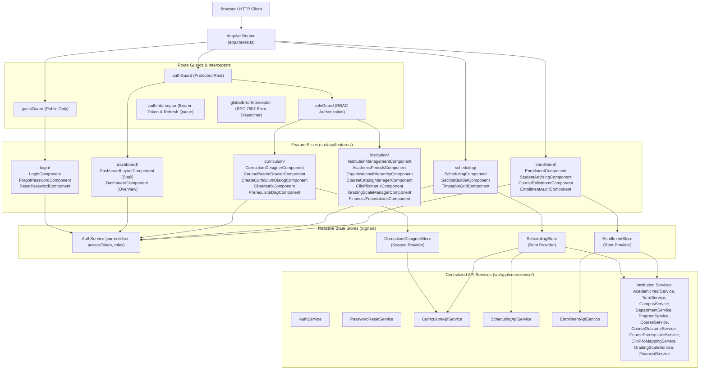
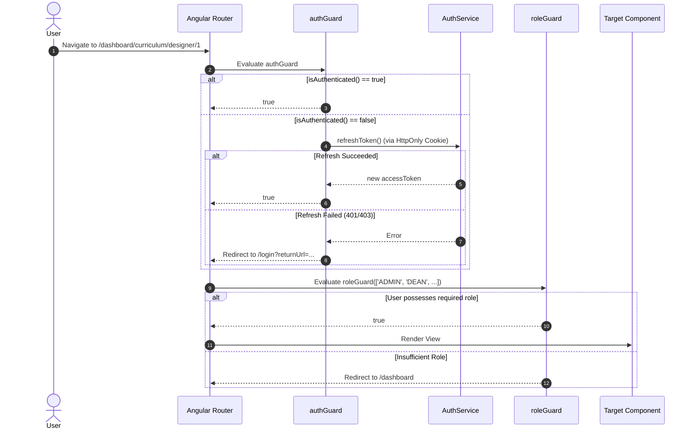

# Frontend Component Hierarchy & State Matrix

**Audited System:** `student-digital-twin-v1.0.0-frontend`  
**Framework Stack:** Angular 22.0.0 (Standalone Components, Signals, Computed Derivations, Effect APIs), PrimeNG 21.1.9, PrimeIcons 7.0, Cytoscape.js 3.34.2, Vitest 4.1.11, RxJS 7.8  
**Audit Scope:** Core Infrastructure (`guards/`, `interceptors/`, `services/`, `models/`), Feature Slices (`login`, `dashboard`, `curriculum`, `institution`, `scheduling`, `enrollment`)  
**Execution Mode:** READ-ONLY COMPREHENSIVE FRONTEND ARCHITECTURAL AUDIT  

---

## 1. Frontend System Architectural Topology

The frontend is architected as an Angular 22 **Strict Standalone Single Page Application** organized around feature slices, centralized core abstractions, and fine-grained reactive state stores powered by Angular Signals.

---

## 2. Component Hierarchy & Dependency Registry

### 2.1. Feature Slice: `login`
| Component | Class Type | Injected Dependencies | PrimeNG UI Modules | Functional Description |
| :--- | :--- | :--- | :--- | :--- |
| `login-component` | Smart | `AuthService`, `Router`, `ActivatedRoute`, `MessageService` | `Card`, `InputText`, `Password`, `Button`, `Toast` | Authenticates users, receives JWT token, stores claims in `AuthService`, redirects to target `returnUrl`. |
| `forgot-password-component` | Smart | `PasswordResetService`, `MessageService`, `Router` | `Card`, `InputText`, `Button`, `Toast` | Submits password reset initiation link to `/api/public/auth/forgot-password`. |
| `reset-password-component` | Smart | `PasswordResetService`, `ActivatedRoute`, `Router`, `MessageService` | `Card`, `Password`, `Button`, `Toast` | Validates token parameter and completes password updates via `/api/public/auth/reset-password`. |

### 2.2. Feature Slice: `dashboard`
| Component | Class Type | Injected Dependencies | PrimeNG UI Modules | Functional Description |
| :--- | :--- | :--- | :--- | :--- |
| `dashboard-layout` | Shell (Smart) | `AuthService`, `Router` | `Avatar`, `Badge`, `InputText`, `Menu`, `Button` | Main dashboard shell with collapsible sidebar rail, responsive drawer, user profile menu, and navigation links. |
| `dashboard-component` | Presentation (Dumb/Mock) | `AuthService` | `Button`, `Card`, `Skeleton`, `ProgressBar`, `Tag`, `Drawer` | Displays hardcoded KPI metric cards (GWA, Progress, Attendance), today's scheduled classes, competencies, and notices. |

### 2.3. Feature Slice: `curriculum/curriculum-designer`
| Component | Class Type | Injected Dependencies | PrimeNG UI Modules / CDK | Functional Description |
| :--- | :--- | :--- | :--- | :--- |
| `curriculum-designer` | Master (Smart) | `CurriculumDesignerStore`, `ActivatedRoute`, `ConfirmationService`, `MessageService` | `Button`, `Card`, `Dialog`, `Drawer`, `Skeleton`, `Tag`, `Tooltip`, `SelectButton`, `Select`, `CDK DragDrop` | Central canvas for curriculum assembly, state transition modal, clone dialog, and validation reports. |
| `course-palette-drawer` | Smart Drawer | `CurriculumDesignerStore` | `Drawer`, `InputText`, `Button`, `Badge`, `Skeleton`, `Tag`, `CDK DragDrop` | Slide-out unassigned subject drawer with dynamic backend course search. |
| `create-curriculum-dialog`| Smart Modal | `CurriculumDesignerStore`, `ProgramService` | `Dialog`, `InputText`, `Select`, `Button` | Form dialog for defining new curriculum versions and attaching them to programs. |
| `obe-matrix` | Interactive Subview | `CiloPiloMappingService`, `CourseOutcomeService`, `ProgramService`, `MessageService` | `Table`, `SelectButton`, `Tag`, `Skeleton` | 2D alignment matrix linking CILOs to PILOs with I/E/D emphasis toggles. |
| `prerequisite-dag` | Visualization Canvas | `CurriculumDesignerStore`, `CoursePrerequisiteService`, `MessageService` | `Cytoscape.js`, `Dagre`, `Button`, `Dialog`, `Select` | Interactive graph visualization of prerequisite rule DAGs with cycle indicators. |

### 2.4. Feature Slice: `institution`
| Component | View / Type | Injected Services | Key Data Models Managed |
| :--- | :--- | :--- | :--- |
| `institution-management` | Tab Container | `Router`, `ActivatedRoute` | Top-level routing tabs: Academic Periods, Hierarchy, Courses, OBE Matrix, Grading, Financials. |
| `academic-periods` | Tab View | `AcademicYearService`, `TermService`, `MessageService` | Displays nested tree of Academic Years and their operational Terms. |
| `organizational-hierarchy`| Tab View | `CampusService`, `DepartmentService`, `ProgramService` | Campuses $\rightarrow$ Departments $\rightarrow$ Degree Programs tree. |
| `course-catalog-manager` | Tab View | `CourseService`, `DepartmentService` | Master course catalog with paginated search, lab/lec unit ratios, and category filters. |
| `cilo-pilo-matrix` | Tab View | `ProgramService`, `CourseService`, `CiloPiloMappingService` | Cross-program OBE alignment matrix. |
| `grading-scale-manager` | Tab View | `GradingScaleService` | Transmutation tables, GPA points, percentage ranges, passing remarks. |
| `financial-foundations` | Tab View | `FinancialService` | Fee categories, fee catalog items, payment term percentages, and scholarships. |

### 2.5. Feature Slice: `scheduling`
| Component | Class Type | Injected Dependencies | PrimeNG UI Modules | Functional Description |
| :--- | :--- | :--- | :--- | :--- |
| `scheduling` | Container | `SchedulingStore`, `AuthService` | `Button`, `SelectButton` | Toggle container between Section Builder and Timetable Grid views. |
| `section-builder` | Master-Detail | `SchedulingStore`, `AuthService`, `FormBuilder`, `MessageService`, `ConfirmationService`, `CurriculumApiService` | `Table`, `Button`, `Tag`, `Dialog`, `ConfirmDialog`, `InputText`, `Select`, `SelectButton`, `Checkbox`, `Drawer`, `Skeleton` | Reactive form for defining sections, schedule slots, room assignments, instructor selection, and workload cap overrides. |
| `timetable-grid` | 2D Interactive Grid | `SchedulingStore` | `Button`, `Select`, `Tag`, `Tooltip` | Visual timetable matrix (Monday–Saturday, 07:00–21:00) with color-coded slots, room filters, and conflict badges. |

### 2.6. Feature Slice: `enrollment`
| Component | Class Type | Injected Dependencies | PrimeNG UI Modules | Functional Description |
| :--- | :--- | :--- | :--- | :--- |
| `enrollment` | Container | `EnrollmentStore`, `AuthService` | `Button`, `SelectButton`, `Select` | Container with tab toggles: Student Advising, Enlisted Courses, and Registrar Audit. |
| `student-advising` | Smart View | `EnrollmentStore`, `MessageService` | `Table`, `Button`, `Tag`, `Dialog`, `Drawer`, `Skeleton`, `ProgressBar`, `Select`, `InputText` | Displays prescribed curriculum courses, prerequisite locks, eligibility tags, and opens section selection modal. |
| `course-enlistment` | Master-Detail | `EnrollmentStore`, `ConfirmationService`, `MessageService` | `Table`, `Button`, `Tag`, `ConfirmDialog`, `ProgressBar`, `Message`, `Card` | Enlists selected sections, checks running unit total against 24.0-unit meter, and confirms enrollment. |
| `enrollment-audit` | Staff View | `EnrollmentStore`, `MessageService` | `Table`, `Button`, `Tag`, `Select`, `Drawer`, `Skeleton` | Registrar oversight table displaying all student enrollments per term with status update drawer. |

---

## 3. State Management & SignalStore Matrix

The frontend uses Angular Signals and custom Signal Stores (`*.store.ts`) instead of legacy NgRx global reducers:

| State Store | Injection Scope | Core Signals | Key Computed Signals | State Mutation Flow & Invariant Handling |
| :--- | :--- | :--- | :--- | :--- |
| **`AuthService`** | `root` | `currentUser: Signal<User>` `accessToken: Signal<string \| null>` | `isAuthenticated: computed` `hasRole(role): method` `hasAnyRole(roles): method` | Token stored in memory. Refresh token held in HttpOnly cookie. On 401, `authInterceptor` queues requests while `AuthService.refreshToken()` executes. |
| **`CurriculumDesignerStore`**| Feature (`@Injectable()` on component) | `curriculum: Signal<DesignerViewResponse \| null>` `availableCourses: Signal<AvailableCourseDto[]>` `validationReport: Signal<ValidationReportDto \| null>` `selectedCourse: Signal<CourseItemDto \| null>` | `totalCurriculumUnits: computed` `termStatistics: computed` `canEdit: computed (HARDCODED)` `isEditableStatus: computed (HARDCODED)` `hasEditRole: computed (HARDCODED)` | Optimistic Drag-and-Drop: Uses CDK `moveItemInArray` and `transferArrayItem` to update local signals immediately; sends batch positions to backend; rolls back on HTTP error. |
| **`SchedulingStore`** | `root` | `terms: Signal<SchedulingTermDto[]>` `curricula: Signal<CurriculumLookupOption[]>` `rooms: Signal<RoomResponse[]>` `instructors: Signal<InstructorOptionDto[]>` `sections: Signal<SectionDetailResponse[]>` `selectedTermId: Signal<number \| null>` `selectedFacultyWorkload: Signal<FacultyLoadSummaryResponse \| null>` | `selectedTerm: computed` `maxHoursPerClass: computed` `selectedCurriculum: computed` `isCurriculumActive: computed` `totalSections: computed` | Loads terms, curricula, rooms, instructors on init. Updates local sections list optimistically upon successful section creation. Updates faculty overload status reactively. |
| **`EnrollmentStore`** | `root` | `studentId: Signal<number>` (Defaults to 1) `searchedStudents: Signal<StudentSearchResultDto[]>` `selectedTermId: Signal<number \| null>` `terms: Signal<TermResponse[]>` `advising: Signal<AdvisingEligibilityResponse \| null>` `enrollment: Signal<StudentEnrollmentResponse \| null>` | `totalUnits: computed` `maxUnits: computed` `unitPercentage: computed` `isUnitCapReached: computed` `eligibleCourses: computed` `lockedCourses: computed` `passedCourses: computed` | Multi-phase enlistment: `loadStudentAdvising` queries Gate 3 eligibility. `enlistSection` adds item, updates running units, and automatically triggers background re-advising query to refresh capacities. |

---

## 4. Route Guards & Authorization Architecture

### 4.1. Guard Execution Flow

### 4.2. Guard Route Mapping Audit
* **`authGuard`**: Applied to `/dashboard` root route. Secures all child views (`curriculum`, `institution`, `scheduling`, `enrollment`).
* **`guestGuard`**: Applied to `/login`, `/forgot-password`, `/reset-password`. Redirects already authenticated users to `/dashboard`.
* **`roleGuard`**:
  * `/dashboard/curriculum/designer`: Restricted to `['ADMIN', 'DEAN', 'CHAIRPERSON', 'REGISTRAR', 'FACULTY']`.
  * `/dashboard/institution/**`: Restricted to `['ADMIN', 'DEAN', 'REGISTRAR', 'CHAIRPERSON']`.
  * `/dashboard/scheduling`: **MISSING `roleGuard`!** (Only secured by parent `authGuard`).
  * `/dashboard/enrollment`: **MISSING `roleGuard`!** (Only secured by parent `authGuard`).

---

## 5. UI Integration & PrimeNG Component Hardening

1. **PrimeNG v21 Theming:** Applied via custom Aura preset (`custom-theme.ts`), providing dark/light CSS token bindings, unified primary emerald palettes, surface darks, and high-contrast borders.
2. **Dialog Collision Prevention:** All dialogs and confirmation modals explicitly declare local `key` bindings:
   - `SectionBuilderComponent`: `key="sectionActionDialog"`, `key="sectionDeleteConfirm"`
   - `CourseEnlistmentComponent`: `key="enrollmentConfirmDialog"`
   - `CurriculumDesignerComponent`: `key="curriculumConfirmDialog"`
3. **Change Detection Strategy:** Strictly configured as `ChangeDetectionStrategy.OnPush` across 100% of standalone components, ensuring minimal dirty-checking cycles and direct Signal binding updates.

---
*Generated by Antigravity Agentic Security & Architectural Auditor.*
