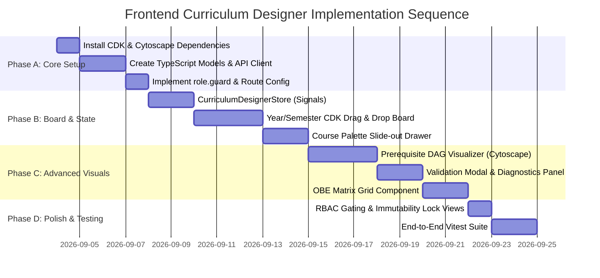

# Phase 2 Frontend Curriculum Designer: Architectural Readiness Audit & Implementation Strategy

**Audit & Strategy Date**: `September 2026`  
**Auditor**: Antigravity AI Code Audit Agent  
**Target Repositories**:
- **Backend**: `student-digital-twin-v1.0.0-backend` (Spring Boot 3.4.1 / Java 21 / Hibernate 6 / Flyway / Maven)
- **Frontend**: `student-digital-twin-v1.0.0-frontend` (Angular 19 / Zoneless Change Detection / PrimeNG 21 / Signals)
**Vault Target**: `/00 Project/00 AI Audit/05 Phase 2 Frontend Curriculum Designer Readiness & Architecture.md`

---

## Executive Summary & Readiness Verdict

| Category | Readiness Status | Verdict | Summary Assessment |
| :--- | :--- | :--- | :--- |
| **Backend Core Endpoints** | **85% Ready** | **CONDITIONAL PASS** | All fundamental endpoints (`/designer`, `/available-courses`, `/courses`, `/batch-positions`, `/prerequisites`, `/validate`, `/transition-state`) are implemented and pass unit tests. |
| **Backend Robustness & Best Practices** | **45% Ready** | **BLOCKERS IDENTIFIED** | Missing Jakarta validation (`@Valid` and DTO constraints), uncaught exception handling (`IllegalArgumentException` and `IllegalStateException` mapped to generic 500s), N+1 query leaks during graph serialization and cycle detection. |
| **Backend Security & RBAC** | **30% Ready** | **BLOCKERS IDENTIFIED** | `/api/v1/curricula/**` lacks role-based security in `WebSecurityConfig` and method security (`@PreAuthorize`); any authenticated user can mutate curricula. |
| **OBE Matrix Backend** | **0% Ready** | **BLOCKER (FOR OBE TAB)** | `ObeAlignmentMatrixService` and controller endpoints (`/obe-matrix`) are completely missing. |
| **Database Migration Integrity** | **Degraded** | **ACTION REQUIRED** | Flyway checksum mismatches on `V1__init_auth_schema.sql` and `V2__seed_users.sql` block `@SpringBootTest` context loading. |
| **Frontend Architecture Foundation** | **75% Ready** | **PASSED** | Standalone Angular 19 zoneless architecture with Signals, JWT interceptor, silent token refresh, and PrimeNG 21 preset is established. |
| **Frontend RBAC & Designer Module** | **20% Ready** | **READY TO IMPLEMENT** | `role.guard.ts` is missing, `@angular/cdk` is missing from `package.json`, and Curriculum Designer components/services are yet to be built. |

### Overall Verdict: **PROCEED TO FRONTEND IMPLEMENTATION WITH CONCURRENT BACKEND REFACTORINGS**
The frontend team can immediately begin scaffold and board development against the verified REST contracts. However, the backend blockers (RBAC security, Jakarta Bean Validation, and HTTP Exception handling) must be resolved prior to staging deployment to avoid data integrity violations and unauthorized mutations.

---

## 1. Backend Readiness & Spring Boot Best Practices Audit

### 1.1 Operational Endpoints Verification Matrix

| Endpoint | HTTP Method | Controller Method | Service Method | Readiness Status | Code Assessment & Identified Defects |
| :--- | :--- | :--- | :--- | :--- | :--- |
| `/api/v1/curricula/{id}/designer` | `GET` | `getDesignerView` | `CurriculumDesignerService.getDesignerView` | **Operational (with N+1 Defect)** | Serializes tree structure into `YearBlockDto -> SemesterBlockDto -> CourseItemDto`. **Defect:** Iterates over courses and executes `prerequisiteRepository.findByCourseId(c.getId())` individually (N+1 query leak). |
| `/api/v1/curricula/{id}/available-courses` | `GET` | `getAvailableCourses` | `CurriculumDesignerService.getAvailableCourses` | **Operational (Inefficient)** | Returns unassigned subjects filtered by code/title. **Defect:** Executes `courseRepository.findByIsActiveTrue()`, loading all institutional courses into JVM heap before filtering in Java streams. Lacks SQL pagination. |
| `/api/v1/curricula/{id}/courses` | `POST` | `addCourseToCurriculum` | `CurriculumDesignerService.addCourseToCurriculum` | **Operational** | Checks duplicate assignment, auto-increments `sequenceOrder` if omitted, checks `assertEditable(curriculum)`. Missing Jakarta `@Valid`. |
| `/api/v1/curricula/{id}/courses/{ccId}` | `DELETE` | `removeCourseFromCurriculum` | `CurriculumDesignerService.removeCourseFromCurriculum` | **Operational** | Enforces immutability guard, checks curriculum ownership, and deletes entity. Missing cascade orphan cleanup for prerequisite edges. |
| `/api/v1/curricula/{id}/courses/batch-positions` | `PUT` | `updateBatchCoursePositions` | `CurriculumDesignerService.batchRelocatePositions` | **Operational** | Batch-fetches targets via `findAllById(targetIds)`, verifies ownership, and modifies positions in a single transaction. Prevents N+1 HTTP calls during drag-and-drop. |
| `/api/v1/curricula/{id}/courses/position` | `PUT` | `updateCoursePosition` | `CurriculumDesignerService.relocateCoursePosition` | **Operational** | Single-course relocate fallback. |
| `/api/v1/curricula/{id}/prerequisites` | `POST` | `addPrerequisite` | `CurriculumDesignerService.addPrerequisite` | **Operational (High Risk)** | Prevents self-reference (`courseId == prereqId`), saves edge, and triggers immediate DFS cycle check. If circular, rolls back transaction. **Defect:** Does not check `existsByCourseIdAndPrerequisiteCourseId`, triggering unhandled `DataIntegrityViolationException` on duplicate. Does not validate chronological term ordering. |
| `/api/v1/curricula/{id}/prerequisites/{prereqId}` | `DELETE` | `removePrerequisite` | `CurriculumDesignerService.removePrerequisite` | **Operational** | Deletes prerequisite rule with immutability check. |
| `/api/v1/curricula/{id}/validate` | `POST` | `validateCurriculum` | `CurriculumValidationService.validateCurriculum` | **Operational (with N+1 Defect)** | Audits total units against `Program.totalUnitsRequired`, detects semester credit overloads (> 24.0), contact hour overloads (> 30 hrs/wk), lecture/lab conversion anomalies, and DFS 3-color graph cycle detection. **Defect:** Cycle detection executes N+1 repository queries. |
| `/api/v1/curricula/{id}/transition-state` | `POST` | `transitionState` | `CurriculumDesignerService.transitionCurriculumState` | **Operational** | Validates curriculum before allowing transition to `APPROVED` or `ACTIVE`. |
| `/api/v1/curricula/{id}/clone` | `POST` | `cloneCurriculumAsNewRevision` | `CurriculumDesignerService.cloneCurriculumAsNewRevision` | **Operational** | Clones metadata and deep-copies course assignments into a new revision with `versionNumber + 1`. |
| `/api/v1/curricula/program/{programId}` | `GET` | `getCurriculaByProgram` | `CurriculumDesignerService.getCurriculaByProgram` | **Operational** | Fetches curriculum history list for a program. |
| `/api/v1/curricula/{id}/obe-matrix` | `GET` / `PUT` | *Missing* | *Missing* | **0% Implemented** | **Blocker for OBE Matrix UI.** No service or controller exists for CILO-PILO matrix grid manipulation. |

---

### 1.2 Persistence & Architecture Standards Review

#### 1. Encapsulation & Domain Invariants (Verdict: EXCELLENT)
- **Constructors & Setters**: All Phase 2 entities (`Curriculum`, `CurriculumCourse`, `CoursePrerequisite`, `Course`, `CiloPiloMapping`) strictly enforce clean domain-driven encapsulation:
  - `@NoArgsConstructor(access = AccessLevel.PROTECTED)` prevents direct instantiation outside JPA.
  - `@AllArgsConstructor(access = AccessLevel.PRIVATE)` blocks arbitrary constructor calls.
  - **Zero public `@Setter` annotations**: Entities cannot be corrupted via accidental field mutation.
  - State mutations are encapsulated in expressive domain methods:
    - `Curriculum.transitionTo(Status newStatus)`
    - `CurriculumCourse.relocatePosition(int yearLevel, String semester, int sequenceOrder)`
    - `CoursePrerequisite.updateRule(String ruleType, String minGradeRequired)`
    - `Course.updateCourseDetails(...)`

#### 2. Immutability Guards & State Transition Control (Verdict: GOOD with Minor Edge Case)
- `assertEditable(curriculum)` is consistently invoked before any write operation in `CurriculumDesignerService`:
  ```java
  private void assertEditable(Curriculum curriculum) {
      if (!curriculum.isEditable()) {
          throw new IllegalStateException("Curriculum is locked under status: " + curriculum.getStatus());
      }
  }
  ```
- `Curriculum.isEditable()` accurately permits mutations only when status is `DRAFT` or `UNDER_REVIEW`.
- **Identified Edge Case**: In `Curriculum.java`, `transitionTo()` prevents transitions from `ACTIVE` to anything other than `ARCHIVED`, but fails to block transitions out of `ARCHIVED` (e.g. an archived curriculum could theoretically be transitioned back to `DRAFT`). Also lacks a strict transition map (e.g., `DRAFT` can transition directly to `ACTIVE`, skipping `UNDER_REVIEW` and `APPROVED`).

#### 3. Transaction Management & Read-Only Optimizations (Verdict: EXCELLENT)
- Services consistently declare class-level `@Transactional` or `@Transactional(readOnly = true)`.
- Methods performing reads (`getDesignerView`, `getAvailableCourses`, `getCurriculaByProgram`, and `validateCurriculum`) explicitly declare `@Transactional(readOnly = true)`, allowing Hibernate to disable dirty checking and optimize connection usage.

#### 4. `@EntityGraph` & Query Degradation (Verdict: WARNING - N+1 LEAKS DETECTED)
- While `CurriculumCourseRepository` defines `@EntityGraph(attributePaths = {"curriculum", "course"})` for `findByCurriculumId`, **severe N+1 query leaks exist in service logic**:
  1. **In `CurriculumDesignerService.getDesignerView` (Line 75)**:
     ```java
     // RUNS 1 SELECT PER COURSE IN STREAM
     List<String> prereqs = prerequisiteRepository.findByCourseId(c.getId()).stream()
             .map(p -> p.getPrerequisiteCourse().getCode())
             .toList();
     ```
     For a standard 4-year curriculum with 55 courses, fetching the designer view executes **56 SQL queries** (1 for curriculum courses + 55 for prerequisites).
  2. **In `CurriculumValidationService.detectCycles` (Line 114)**:
     ```java
     for (Long courseId : courseMap.keySet()) {
         List<CoursePrerequisite> prereqs = coursePrerequisiteRepository.findByCourseId(courseId);
         adjList.put(courseId, prereqs.stream().map(CoursePrerequisite::getPrerequisiteCourse).toList());
     }
     ```
     Validation generates an additional **$N$ queries** during DFS adjacency list construction.

---

### 1.3 Jakarta Bean Validation & API Robustness Review

#### Critical Defect 1: Missing `@Valid` on All Controller Endpoints
In `CurriculumController.java`, every mutating endpoint receives `@RequestBody` without `@Valid`:
```java
// VULNERABLE: No validation triggering
@PostMapping
public ResponseEntity<CurriculumSummaryResponse> createCurriculum(@RequestBody CreateCurriculumRequest request)

@PostMapping("/{id}/courses")
public ResponseEntity<Void> addCourseToCurriculum(@PathVariable Long id, @RequestBody AddCourseToCurriculumRequest request)

@PutMapping("/{id}/courses/batch-positions")
public ResponseEntity<Void> updateBatchCoursePositions(@PathVariable Long id, @RequestBody List<RelocateCourseRequest> requests)
```

#### Critical Defect 2: DTO Records Lack Jakarta Field Constraints
In `CurriculumDesignerDtos.java`, records contain zero constraints:
- `RelocateCourseRequest`: `targetYearLevel` can be negative; `targetSemester` can be blank or arbitrary string; `curriculumCourseId` can be null.
- `CreateCurriculumRequest`: `programId`, `code`, `name`, and `effectiveAcademicYear` have no `@NotBlank` or `@NotNull`.
- `AddPrerequisiteRequest`: `courseId` and `prerequisiteCourseId` have no `@NotNull`.

#### Critical Defect 3: Unhandled Exception Paths in `GlobalExceptionHandler`
`GlobalExceptionHandler.java` does NOT handle `IllegalArgumentException` or `IllegalStateException`.
- When `CurriculumDesignerService` throws:
  - `IllegalArgumentException("Curriculum not found with ID: " + id)`
  - `IllegalArgumentException("Course is already assigned to this curriculum...")`
  - `IllegalStateException("Curriculum is locked under status: APPROVED")`
  - `IllegalStateException("Prerequisite insertion rejected. It introduces a circular dependency.")`
- **Result**: The exception falls through to `handleGenericException(Exception ex)`, which responds with **HTTP 500 Internal Server Error** and a masked message (`"An unexpected error occurred"`).
- **Impact on Frontend**: The Angular client cannot distinguish between a validation/immutability conflict (which should be HTTP 400/409/422 with a clear toast message) and a fatal server crash.

---

## 2. Security, Access Control & Token Flow Verification

### 2.1 Backend Spring Security Configuration Audit

Inspection of `WebSecurityConfig.java`:
```java
.authorizeHttpRequests(auth -> auth
    .requestMatchers("/api/public/**").permitAll()
    .requestMatchers("/api/admin/**").hasRole("ADMIN")
    .requestMatchers("/api/orders/**").hasAnyRole("STUDENT", "ADMIN", "FACULTY")
    .anyRequest().authenticated()
)
```
- **Security Finding**: `/api/v1/curricula/**` is caught only by `.anyRequest().authenticated()`.
- **Absence of `@PreAuthorize`**: No method-level security exists on `CurriculumController`.
- **Vulnerability**: Any authenticated user—including a student or guest account possessing a valid JWT—can perform administrative curriculum modifications, batch relocations, and state approvals.

### 2.2 Role Mapping & Authority Structure

From `Roles.java` and `V2__seed_users.sql`, the institutional authority matrix is defined as:
`SUPER_ADMIN`, `ADMIN`, `REGISTRAR`, `DEAN`, `CHAIRPERSON`, `FACULTY`, `STUDENT`, `GUIDANCE`, `CASHIER`.

`JwtRoleConverter.java` maps claims from `roles` or `realm_access.roles` by prepending `ROLE_` (e.g. `ROLE_DEAN`, `ROLE_CHAIRPERSON`).

#### Recommended Security Mapping Table

| Backend Endpoint | Method | Required Backend Role / Authority (`@PreAuthorize`) | Frontend Route Guard & Required Roles |
| :--- | :--- | :--- | :--- |
| `/api/v1/curricula/program/{programId}` | `GET` | `hasAnyRole('ADMIN', 'DEAN', 'CHAIRPERSON', 'REGISTRAR', 'FACULTY')` | `authGuard`, `roleGuard(['ADMIN', 'DEAN', 'CHAIRPERSON', 'REGISTRAR', 'FACULTY'])` |
| `/api/v1/curricula/{id}/designer` | `GET` | `hasAnyRole('ADMIN', 'DEAN', 'CHAIRPERSON', 'REGISTRAR', 'FACULTY')` | `authGuard`, `roleGuard(['ADMIN', 'DEAN', 'CHAIRPERSON', 'REGISTRAR', 'FACULTY'])` |
| `/api/v1/curricula/{id}/available-courses` | `GET` | `hasAnyRole('ADMIN', 'DEAN', 'CHAIRPERSON')` | *Drawer component check: `hasEditPermission`* |
| `/api/v1/curricula` | `POST` | `hasAnyRole('ADMIN', 'DEAN', 'CHAIRPERSON')` | `authGuard`, `roleGuard(['ADMIN', 'DEAN', 'CHAIRPERSON'])` |
| `/api/v1/curricula/{id}/courses` | `POST` | `hasAnyRole('ADMIN', 'DEAN', 'CHAIRPERSON')` | *UI action guarded by `hasEditPermission`* |
| `/api/v1/curricula/{id}/courses/{ccId}` | `DELETE` | `hasAnyRole('ADMIN', 'DEAN', 'CHAIRPERSON')` | *UI action guarded by `hasEditPermission`* |
| `/api/v1/curricula/{id}/courses/batch-positions` | `PUT` | `hasAnyRole('ADMIN', 'DEAN', 'CHAIRPERSON')` | *UI drag-drop guarded by `hasEditPermission`* |
| `/api/v1/curricula/{id}/prerequisites` | `POST` | `hasAnyRole('ADMIN', 'DEAN', 'CHAIRPERSON')` | *UI DAG link guarded by `hasEditPermission`* |
| `/api/v1/curricula/{id}/prerequisites/{prereqId}` | `DELETE` | `hasAnyRole('ADMIN', 'DEAN', 'CHAIRPERSON')` | *UI action guarded by `hasEditPermission`* |
| `/api/v1/curricula/{id}/validate` | `POST` | `hasAnyRole('ADMIN', 'DEAN', 'CHAIRPERSON', 'REGISTRAR')` | `authGuard`, `roleGuard(['ADMIN', 'DEAN', 'CHAIRPERSON', 'REGISTRAR'])` |
| `/api/v1/curricula/{id}/transition-state` | `POST` | `hasAnyRole('ADMIN', 'DEAN', 'REGISTRAR')` | `authGuard`, `roleGuard(['ADMIN', 'DEAN', 'REGISTRAR'])` *(Chairperson cannot approve)* |
| `/api/v1/curricula/{id}/clone` | `POST` | `hasAnyRole('ADMIN', 'DEAN', 'CHAIRPERSON')` | `authGuard`, `roleGuard(['ADMIN', 'DEAN', 'CHAIRPERSON'])` |

---

### 2.3 Angular Frontend Security Architecture & Token Flow Audit

#### 1. HTTP Interceptor (`auth-interceptor.ts`)
- **Status**: Implemented as functional interceptor (`HttpInterceptorFn`).
- **Authorization Injection**: Correctly injects `Authorization: Bearer ${token}` for all requests except `/api/public/auth`.
- **401 Silent Refresh Queue**: Properly intercepts 401 responses, freezes concurrent outgoing calls with a `BehaviorSubject`, requests a new access token via the partitioned HttpOnly cookie, and replays requests.
- **Architectural Gap**: **No global error notification interceptor exists**. When non-401 HTTP errors (e.g. 400 Bad Request, 403 Forbidden, 409 Conflict, 422 Unprocessable Entity, 500 Internal Server Error) occur, they must be caught and routed to PrimeNG's `MessageService` (Toast) so users receive feedback.

#### 2. Route Guards & Authorization Services
- `auth-guard.ts` verifies authentication status and redirects unauthenticated users to `/login?returnUrl=...`.
- **Architectural Gap**: `role.guard.ts` is **missing**. There is currently no guard preventing a `STUDENT` or `FACULTY` user from manually typing `/dashboard/curriculum/designer/:id` into the browser address bar.
- **User Role Resolution Gap**: In `AuthService.ts`:
  ```typescript
  // DEFECT: Only extracts the first role!
  role: (payload.roles && payload.roles[0]) ? payload.roles[0].replace('ROLE_', '') : 'Student'
  ```
  Users with multiple roles (such as `dean_morris`, who holds both `ROLE_DEAN` and `ROLE_FACULTY`) will have secondary roles ignored. This must be upgraded to expose `roles: string[]` and a helper `hasAnyRole(roles: string[]): boolean`.

#### 3. Client-Side Immutability & Edit Mode Gating
To ensure security and user experience consistency, the interactive designer views must conditionally render edit controls based on:
1. **Lifecycle State**: `curriculum.status === 'DRAFT' || curriculum.status === 'UNDER_REVIEW'`
2. **User Role**: `hasAnyRole(['ADMIN', 'DEAN', 'CHAIRPERSON'])`
```typescript
readonly isEditable = computed(() => {
  const status = this.curriculum()?.status;
  return status === 'DRAFT' || status === 'UNDER_REVIEW';
});

readonly canEdit = computed(() => {
  return this.isEditable() && this.authService.hasAnyRole(['ADMIN', 'DEAN', 'CHAIRPERSON']);
});
```
When `canEdit() === false`:
- Drag handles are hidden; cards are static (`[cdkDragDisabled]="!canEdit()"`).
- "Add Course", "Delete Course", and "Add Prerequisite" buttons are disabled or removed from the DOM.
- The available course drawer is hidden.
- The interface displays an informational banner: *"This curriculum is in [APPROVED / ACTIVE / ARCHIVED] status and is read-only."*

---

## 3. Frontend Implementation Guide (Angular 19 / Zoneless)

### 3.1 State Management & Architecture Blueprint

The frontend will leverage **Angular Signals** (`signal`, `computed`, `effect`) in a dedicated feature store (`CurriculumDesignerStore`) to manage local reactivity with zero zone.js overhead.

```mermaid
flowchart TD
    subgraph UI Components
        Header[Designer Header & State Controls]
        Board[Year/Semester Board cdkDropListGroup]
        Drawer[Course Palette Drawer]
        DAG[Cytoscape Prerequisite DAG]
        Matrix[OBE CILO-PILO Matrix]
    end

    subgraph Store [CurriculumDesignerStore (Angular Signals)]
        State[(curriculum signal)]
        Avail[(availableCourses signal)]
        Report[(validationReport signal)]
        ActiveTab[(activeTab signal)]
        
        Totals[computed: termTotals & chedCompliance]
        CanEdit[computed: canEdit & isEditable]
    end

    subgraph Backend Services
        API[CurriculumApiService]
    end

    Header --> Store
    Board --> Store
    Drawer --> Store
    DAG --> Store
    Matrix --> Store

    Store <--> API
```

#### Client-Side Real-Time CHED Unit & Contact Hour Accumulator
As cards move between columns, Angular computed signals immediately calculate term statistics locally without round-tripping to the server:

```typescript
// Computed term statistics
readonly termStatistics = computed(() => {
  const curr = this.curriculum();
  if (!curr) return new Map<string, TermStats>();

  const stats = new Map<string, TermStats>();
  for (const year of curr.yearBlocks) {
    for (const sem of year.semesters) {
      const key = `${year.yearLevel}_${sem.semester}`;
      const totalUnits = sem.courses.reduce((acc, c) => acc + c.creditUnits, 0);
      const totalHours = sem.courses.reduce((acc, c) => acc + (c.contactHoursLec + c.contactHoursLab), 0);
      
      stats.set(key, {
        totalUnits,
        totalHours,
        isOverloadedUnits: totalUnits > 24.0,
        isOverloadedHours: totalHours > 30,
        hasAnomalousCourses: sem.courses.some(c => 
          c.contactHoursLec !== c.lectureUnits || c.contactHoursLab !== (c.labUnits * 3)
        )
      });
    }
  }
  return stats;
});
```

---

### 3.2 Interactive Year/Semester Board (`@angular/cdk/drag-drop`)

#### Dependency Addition
`@angular/cdk` must be added to `package.json` (`npm install @angular/cdk@^19.0.0`).

#### Board Layout & Connected Drop Lists
- The board renders 4 Year Levels. Each Year Level contains:
  - `1ST_SEM` (Drop list `list-1-1ST_SEM`)
  - `2ND_SEM` (Drop list `list-1-2ND_SEM`)
  - `SUMMER` (Optional, toggleable drop list `list-1-SUMMER`)
- All semester drop lists are linked via `cdkDropListGroup`.

#### Batch Mutation Dispatch on `cdkDropListDropped`
When a course card is moved within or across drop lists:
1. **Optimistic Local Update**: The store reorders the course array and recalculates sequence orders in-memory.
2. **Payload Construction**: Generates a compact batch payload containing the affected items.
3. **Dispatch**: Sends `PUT /api/v1/curricula/{id}/courses/batch-positions`.
4. **Error Recovery**: If the backend returns an error (e.g. 409 Conflict), the store rolls back to the previous snapshot and displays a toast notification.

```typescript
onCourseDropped(event: CdkDragDrop<CourseItemDto[], CourseItemDto[], CourseItemDto>): void {
  if (!this.canEdit()) return;

  const previousContainerId = event.previousContainer.id; // e.g. "term-1-1ST_SEM"
  const currentContainerId = event.container.id;           // e.g. "term-2-1ST_SEM"

  const [_, targetYearStr, targetSem] = currentContainerId.split('-');
  const targetYear = parseInt(targetYearStr, 10);

  // 1. Snapshot previous state for rollback
  const rollbackSnapshot = structuredClone(this.curriculum());

  // 2. Perform optimistic local reorder
  if (event.previousContainer === event.container) {
    moveItemInArray(event.container.data, event.previousIndex, event.currentIndex);
  } else {
    transferArrayItem(
      event.previousContainer.data,
      event.container.data,
      event.previousIndex,
      event.currentIndex
    );
  }

  // 3. Build Batch Payload for the destination container
  const batchPayload: RelocateCourseRequest[] = event.container.data.map((course, idx) => ({
    curriculumCourseId: course.curriculumCourseId,
    targetYearLevel: targetYear,
    targetSemester: targetSem,
    targetSequenceOrder: idx + 1
  }));

  // 4. Dispatch to backend
  this.curriculumService.batchRelocatePositions(this.curriculumId(), batchPayload).subscribe({
    error: (err) => {
      // Rollback on failure
      this.curriculum.set(rollbackSnapshot);
      this.messageService.add({
        severity: 'error',
        summary: 'Reorder Failed',
        detail: err.error?.detail || 'Unable to update course position.'
      });
    }
  });
}
```

---

### 3.3 Course Library Palette Drawer Component

- Integrated as a slide-out PrimeNG `Drawer` / `Sidebar` (`position="right"`).
- Fetches unassigned subjects via `GET /api/v1/curricula/{id}/available-courses?search=...`.
- Search input uses an Angular signal with a 300ms debounce.
- Each course item card displays:
  - Subject Code & Title
  - Credit Units (`Lec: X | Lab: Y`)
  - "Add to Semester" quick-action dialog (Year 1–4, Sem 1–2).
  - Drag source item compatible with semester CDK drop lists.

---

### 3.4 Prerequisite DAG Visualizer (Cytoscape.js Integration)

- **Library**: `cytoscape` and `cytoscape-dagre` (`npm install cytoscape cytoscape-dagre @types/cytoscape`).
- **Node Data**: Courses mapped as nodes with labels, units, and year level badges.
- **Edge Data**: Prerequisites mapped as directed edges (`source: prereqCourseId`, `target: courseId`).
- **Interactive Capabilities**:
  - **Edge Drawing / Linking**: Drag handle from Node A to Node B creates a prerequisite dependency.
  - **Cycle Interception**: The UI performs a quick client-side Kahn's check. If clean, dispatches `POST /{id}/prerequisites`.
  - **Path Tracing**: Selecting a node highlights upstream prerequisites in blue and downstream dependent courses in green.
  - **Edge Deletion**: Clicking an edge exposes a delete action that dispatches `DELETE /{id}/prerequisites/{prereqId}`.

---

### 3.5 Outcome-Based Education (OBE) Alignment Matrix

- **Structure**: 2D grid component comparing Course Learning Outcomes (CILOs) against Program Intended Learning Outcomes (PILOs).
- **Cell Emphasis Toggle**: Clicking a cell cycles through CHED emphasis levels:
  - `Empty` $\rightarrow$ `I` (Introduced) $\rightarrow$ `E` (Enabled) $\rightarrow$ `D` (Demonstrated) $\rightarrow$ `Empty`.
- **Coverage Indicators**:
  - Column total counters highlighting unmapped PILOs.
  - Warning badges if a required PILO has no "Demonstrated" (D) level mapping across the 4-year curriculum.
- *Note for Backend Coordination*: Requires implementation of `GET /api/v1/curricula/{id}/obe-matrix` and `PUT /api/v1/curricula/{id}/obe-matrix` before full persistence can be enabled.

---

## 4. Frontend Folder Structure & File Manifest

The Curriculum Designer will reside in the `student-digital-twin-v1.0.0-frontend` repository under `src/app/features/curriculum/`:

```
src/app/
├── core/
│   ├── guards/
│   │   ├── authentication/
│   │   │   └── auth-guard.ts                 (Existing)
│   │   └── authorization/
│   │       ├── role.guard.ts                 (NEW: RBAC route guard)
│   │       └── role.guard.spec.ts
│   ├── interceptors/
│   │   ├── authentication/
│   │   │   └── auth-interceptor.ts           (Existing)
│   │   └── error/
│   │       └── global-error.interceptor.ts   (NEW: Global HTTP error toaster)
│   ├── models/
│   │   ├── auth.model.ts                     (Existing - update to support roles[])
│   │   └── curriculum-designer.model.ts      (NEW: TypeScript interfaces for designer)
│   └── service/
│       ├── authentication/
│       │   └── auth-service.ts               (Existing - update hasAnyRole helper)
│       └── curriculum/
│           ├── curriculum-api.service.ts     (NEW: HTTP client service)
│           └── curriculum-api.service.spec.ts
└── features/
    └── curriculum/
        ├── curriculum.routes.ts              (NEW: Feature child routes)
        ├── curriculum-list/                  (NEW: Curriculum revision catalog)
        │   ├── curriculum-list.component.ts
        │   ├── curriculum-list.component.html
        │   └── curriculum-list.component.css
        └── curriculum-designer/              (NEW: Main Interactive Designer)
            ├── curriculum-designer.component.ts
            ├── curriculum-designer.component.html
            ├── curriculum-designer.component.css
            ├── state/
            │   └── curriculum-designer.store.ts (NEW: Signal-based store)
            └── components/
                ├── designer-header/          (NEW: Metadata, State buttons, Validation trigger)
                │   ├── designer-header.component.ts
                │   ├── designer-header.component.html
                │   └── designer-header.component.css
                ├── year-board/               (NEW: CDK drag-and-drop board)
                │   ├── year-board.component.ts
                │   ├── year-board.component.html
                │   └── year-board.component.css
                ├── semester-column/          (NEW: Single semester drop list)
                │   ├── semester-column.component.ts
                │   ├── semester-column.component.html
                │   └── semester-column.component.css
                ├── course-card/              (NEW: Individual draggable card)
                │   ├── course-card.component.ts
                │   ├── course-card.component.html
                │   └── course-card.component.css
                ├── course-palette-drawer/    (NEW: Slide-out unassigned subjects)
                │   ├── course-palette-drawer.component.ts
                │   ├── course-palette-drawer.component.html
                │   └── course-palette-drawer.component.css
                ├── prerequisite-dag/         (NEW: Cytoscape visualizer)
                │   ├── prerequisite-dag.component.ts
                │   ├── prerequisite-dag.component.html
                │   └── prerequisite-dag.component.css
                ├── obe-matrix/               (NEW: 2D CILO-PILO grid)
                │   ├── obe-matrix.component.ts
                │   ├── obe-matrix.component.html
                │   └── obe-matrix.component.css
                └── validation-dialog/        (NEW: Structured diagnostic report modal)
                    ├── validation-dialog.component.ts
                    ├── validation-dialog.component.html
                    └── validation-dialog.component.css
```

---

## 5. Required Backend Refactorings (Recommendations)

*Note: In accordance with audit instructions, no files were modified. The following changes are documented for the backend team to execute.*

### 1. Fix N+1 Query Degradation
- **In `CurriculumCourseRepository.java`**: Add a batch query for prerequisites:
  ```java
  @Query("SELECT cp FROM CoursePrerequisite cp JOIN FETCH cp.prerequisiteCourse WHERE cp.course.id IN :courseIds")
  List<CoursePrerequisite> findPrerequisitesForCourseIds(@Param("courseIds") Collection<Long> courseIds);
  ```
- **In `CurriculumDesignerService.getDesignerView`**: Fetch all prerequisites for the curriculum in a single query and group them into a `Map<Long, List<String>>` in-memory prior to building `CourseItemDto`.
- **In `CurriculumValidationService.detectCycles`**: Replace the per-course loop with the same batch-fetched prerequisite map.

### 2. Implement Database-Level Filtering & Pagination for Available Courses
- In `CourseRepository.java`:
  ```java
  @Query("SELECT c FROM Course c WHERE c.isActive = true AND c.id NOT IN :assignedIds " +
         "AND (:search IS NULL OR LOWER(c.code) LIKE LOWER(CONCAT('%', :search, '%')) " +
         "OR LOWER(c.title) LIKE LOWER(CONCAT('%', :search, '%')))")
  Page<Course> findAvailableCourses(@Param("assignedIds") Collection<Long> assignedIds, 
                                    @Param("search") String search, 
                                    Pageable pageable);
  ```

### 3. Add Jakarta Bean Validation Constraints
- Add `@Valid` to all `@RequestBody` controller parameters in `CurriculumController.java`.
- Annotate DTO records in `CurriculumDesignerDtos.java`:
  ```java
  public record RelocateCourseRequest(
      @NotNull Long curriculumCourseId,
      @Min(1) @Max(5) int targetYearLevel,
      @NotBlank @Pattern(regexp = "^(1ST_SEM|2ND_SEM|SUMMER)$") String targetSemester,
      @Min(1) int targetSequenceOrder
  ) {}

  public record AddCourseToCurriculumRequest(
      @NotNull Long courseId,
      @Min(1) @Max(5) int yearLevel,
      @NotBlank @Pattern(regexp = "^(1ST_SEM|2ND_SEM|SUMMER)$") String semester,
      @Pattern(regexp = "^(GEN_ED|PROFESSIONAL_MAJOR|ELECTIVE|MANDATED)$") String category,
      Integer sequenceOrder
  ) {}
  ```

### 4. Enhance `GlobalExceptionHandler`
- Add dedicated handlers in `GlobalExceptionHandler.java`:
  ```java
  @ExceptionHandler(IllegalArgumentException.class)
  public ProblemDetail handleIllegalArgumentException(IllegalArgumentException ex) {
      ProblemDetail problem = ProblemDetail.forStatusAndDetail(HttpStatus.BAD_REQUEST, ex.getMessage());
      problem.setTitle("Invalid Request Argument");
      problem.setProperty("timestamp", Instant.now());
      return problem;
  }

  @ExceptionHandler(IllegalStateException.class)
  public ProblemDetail handleIllegalStateException(IllegalStateException ex) {
      ProblemDetail problem = ProblemDetail.forStatusAndDetail(HttpStatus.CONFLICT, ex.getMessage());
      problem.setTitle("State Conflict / Rule Violation");
      problem.setProperty("timestamp", Instant.now());
      return problem;
  }
  ```

### 5. Secure Backend Endpoints via Method Security
- Annotate `CurriculumController.java` methods with `@PreAuthorize`:
  ```java
  @PreAuthorize("hasAnyRole('ADMIN', 'DEAN', 'CHAIRPERSON')")
  @PutMapping("/{id}/courses/batch-positions")
  ...

  @PreAuthorize("hasAnyRole('ADMIN', 'DEAN', 'REGISTRAR')")
  @PostMapping("/{id}/transition-state")
  ...
  ```

### 6. Synchronize Flyway Migration Checksums
- Resolve migration checksum mismatches on `V1__init_auth_schema.sql` and `V2__seed_users.sql` by running `mvn flyway:repair` or resetting the local development database migration table.

---

## 6. Step-by-Step Implementation Sequence for the UI Team



### Step 1: Package Dependencies Installation
```bash
cd student-digital-twin-v1.0.0-frontend
npm install @angular/cdk@^19.0.0 cytoscape@^3.30.0 cytoscape-dagre@^2.5.0
npm install --save-dev @types/cytoscape@^3.21.0
```

### Step 2: Foundation Models & RBAC Route Guard
1. Create `src/app/core/models/curriculum-designer.model.ts` mapping all backend DTO records.
2. Create `src/app/core/guards/authorization/role.guard.ts` checking `route.data['roles']` against `authService.currentUser().role`.
3. Create `src/app/core/service/curriculum/curriculum-api.service.ts` exposing typed observable methods for all 12 operational backend endpoints.

### Step 3: Feature Routes & Navigation Wiring
1. In `src/app/app.routes.ts`, register child routes under `/dashboard`:
   ```typescript
   {
     path: 'curriculum',
     children: [
       {
         path: '',
         loadComponent: () => import('./features/curriculum/curriculum-list/curriculum-list.component').then(m => m.CurriculumListComponent),
         canActivate: [roleGuard],
         data: { roles: ['ADMIN', 'DEAN', 'CHAIRPERSON', 'REGISTRAR', 'FACULTY'] }
       },
       {
         path: 'designer/:id',
         loadComponent: () => import('./features/curriculum/curriculum-designer/curriculum-designer.component').then(m => m.CurriculumDesignerComponent),
         canActivate: [roleGuard],
         data: { roles: ['ADMIN', 'DEAN', 'CHAIRPERSON', 'REGISTRAR', 'FACULTY'] }
       }
     ]
   }
   ```
2. In `DashboardLayoutComponent.ts`, add "Curriculum Designer" under the `Academics` nav section with icon `pi pi-sitemap`.

### Step 4: Reactive State Store (`CurriculumDesignerStore`)
1. Implement signals for `curriculum`, `availableCourses`, `validationReport`, `activeTab`, and `isDrawerOpen`.
2. Implement computed totalizers for term credit units, weekly contact hours, and CHED compliance warnings.
3. Implement optimistic mutation handlers for drag-and-drop batch reorders and prerequisite additions with error rollback.

### Step 5: CDK Drag-and-Drop Year/Semester Board
1. Build `YearBoardComponent`, `SemesterColumnComponent`, and `CourseCardComponent`.
2. Wrap board in `cdkDropListGroup`.
3. Connect all semester columns with `[cdkDropListData]` and handle `(cdkDropListDropped)="store.onCourseDropped($event)"`.
4. Render real-time unit and contact hour badges on semester column headers with conditional warning styling (amber for > 24 units, red for > 30 hours).

### Step 6: Available Courses Palette Drawer
1. Implement `CoursePaletteDrawerComponent` using PrimeNG `Drawer` or custom animated slide-out.
2. Implement search input with debounced querying.
3. Allow direct dragging into semester drop lists or single-click "Add to Block" dialog.

### Step 7: Prerequisite DAG Visualizer
1. Implement `PrerequisiteDagComponent` embedding Cytoscape.js.
2. Apply `dagre` hierarchical layout with `rankDir: 'TB'` (Top to Bottom).
3. Connect node tap handlers to highlight prerequisite chains.
4. Provide interactive edge creation and deletion modals.

### Step 8: Diagnostics Dialog & Lifecycle State Controller
1. Embed `ValidationDialogComponent` displaying structured errors (red) and warnings (yellow) returned by `POST /validate`.
2. Header action buttons:
   - "Validate Curriculum" $\rightarrow$ opens diagnostic report modal.
   - "Submit for Review" / "Approve Curriculum" $\rightarrow$ triggers `POST /transition-state` with confirmation dialog.
   - "Clone as New Revision" $\rightarrow$ opens modal prompting for new code and academic year.

### Step 9: Testing & Sign-off
1. Write Vitest unit tests for `CurriculumDesignerStore`, `role.guard`, and `CourseCardComponent`.
2. Verify read-only state lock behavior by switching mock user roles to `STUDENT` and status to `APPROVED`.
3. Sign-off and prepare for integration testing.
