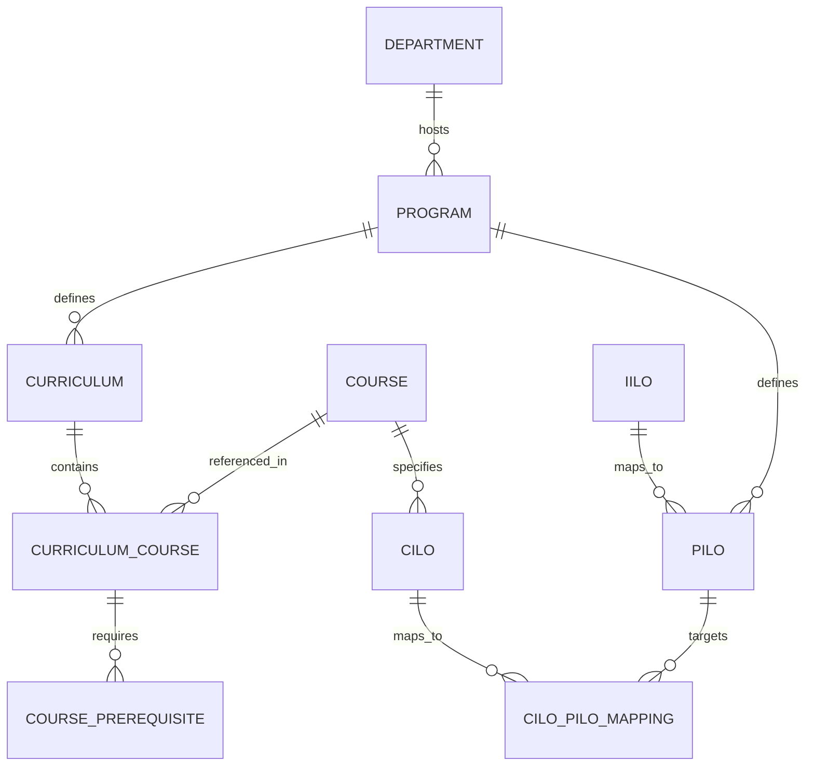

# Layer 2: Curriculum & Outcome-Based Education (OBE) Architecture

**Layer**: `02`  
**Parent Phase**: `Phase 2: Academic Backbone`  
**Upstream Dependencies**: `Layer 01: System Master Data & RBAC` (`Campus`, `Department`, `AcademicYear`, `Permissions`)  
**Downstream Consumers**: `Phase 3: Faculty & Scheduling`, `Phase 4: Enrollment & Advising Engine`, `Phase 5: Performance Dashboards & OBE Tracking`

---

## 1. Executive Summary & Domain Scope

Phase 2 establishes the core **Academic Backbone** of the School Management System. It models degree programs, course catalogs, prerequisite/co-requisite dependency rule trees, and CHED-aligned Outcome-Based Education (OBE) learning outcome matrices.

### Core Domain Capabilities

1. **Program & CMO Registry**: Degree programs (e.g. BSIT, BSCS, BSED, BSBA) mapped to official CHED Memorandum Orders (CMOs), Government Authority permits, and hosting Academic Departments.
2. **Course Catalog & Unit Assessment**: Subject codes, descriptive titles, lecture/laboratory credit units, weekly contact hours, and course classifications (General Education, Professional Major, Institutional Core).
3. **Prerequisite & Co-Requisite Rule Engine**: Hard prerequisite subjects, co-requisites, minimum grade thresholds, and standing year-level requirements modeled as a Directed Acyclic Graph (DAG).
4. **Curriculum Versioning**: Academic Year versioning for curricula (e.g., BSIT 2026-2027 Curriculum), tracking effective start terms, revision history, and lock/approval workflows.
5. **OBE Matrix Mapping**:
   - **Institutional Intended Learning Outcomes (IILOs)**: SUC/HEI core graduate attributes (e.g., Critical Thinking, Social Responsibility, Professional Ethics).
   - **Program Intended Learning Outcomes (PILOs)**: Program-specific graduate competencies aligned with CHED CMO standards.
   - **Course Intended Learning Outcomes (CILOs)**: Subject-level learning objectives categorized by Bloom's Taxonomy.
   - **CILO-PILO Alignment Matrix**: Mapping matrix with I/E/D emphasis levels (**I**ntroduced, **E**nabled, **D**emonstrated).

---

## 2. Entity-Relationship Architecture & Domain Models

All domain entities follow the strict persistence and encapsulation standards established in Phase 1 (`User.java`, `Campus.java`):
- `@NoArgsConstructor(access = AccessLevel.PROTECTED)`, `@AllArgsConstructor(access = AccessLevel.PRIVATE)`
- No public `@Setter` annotations; state mutations managed via domain methods.
- Natural key identity in `equals()` and `hashCode()`.
- Lazy fetching on `@ManyToOne` / `@OneToMany` with `@EntityGraph` optimization in repositories.



---

## 3. Database Schema Blueprint (`V5__phase2_curriculum_obe_schema.sql`)

```sql
-- 1. Programs & Degrees
CREATE TABLE IF NOT EXISTS programs (
    id BIGINT AUTO_INCREMENT PRIMARY KEY,
    department_id BIGINT NOT NULL,
    code VARCHAR(20) NOT NULL UNIQUE,
    name VARCHAR(150) NOT NULL,
    degree_level VARCHAR(20) NOT NULL DEFAULT 'UNDERGRADUATE',
    cmo_reference VARCHAR(100),
    government_permit_no VARCHAR(100),
    total_units_required INT NOT NULL,
    is_active BOOLEAN NOT NULL DEFAULT TRUE,
    CONSTRAINT fk_programs_dept FOREIGN KEY (department_id) REFERENCES departments (id) ON DELETE CASCADE
) ENGINE = InnoDB DEFAULT CHARSET = utf8mb4 COLLATE = utf8mb4_unicode_ci;

-- 2. Curricula (Versioned)
CREATE TABLE IF NOT EXISTS curricula (
    id BIGINT AUTO_INCREMENT PRIMARY KEY,
    program_id BIGINT NOT NULL,
    code VARCHAR(30) NOT NULL UNIQUE,
    name VARCHAR(150) NOT NULL,
    version VARCHAR(20) NOT NULL,
    effective_ay_id BIGINT NOT NULL,
    status VARCHAR(20) NOT NULL DEFAULT 'DRAFT',
    is_current BOOLEAN NOT NULL DEFAULT FALSE,
    CONSTRAINT fk_curricula_program FOREIGN KEY (program_id) REFERENCES programs (id) ON DELETE CASCADE,
    CONSTRAINT fk_curricula_ay FOREIGN KEY (effective_ay_id) REFERENCES academic_years (id) ON DELETE RESTRICT
) ENGINE = InnoDB DEFAULT CHARSET = utf8mb4 COLLATE = utf8mb4_unicode_ci;

-- 3. Course Catalog
CREATE TABLE IF NOT EXISTS courses (
    id BIGINT AUTO_INCREMENT PRIMARY KEY,
    department_id BIGINT NOT NULL,
    code VARCHAR(20) NOT NULL UNIQUE,
    title VARCHAR(150) NOT NULL,
    description TEXT,
    lecture_units DECIMAL(3,1) NOT NULL DEFAULT 3.0,
    lab_units DECIMAL(3,1) NOT NULL DEFAULT 0.0,
    total_units DECIMAL(3,1) NOT NULL DEFAULT 3.0,
    lecture_hours INT NOT NULL DEFAULT 3,
    lab_hours INT NOT NULL DEFAULT 0,
    is_general_education BOOLEAN NOT NULL DEFAULT FALSE,
    is_ched_mandated BOOLEAN NOT NULL DEFAULT FALSE,
    CONSTRAINT fk_courses_dept FOREIGN KEY (department_id) REFERENCES departments (id) ON DELETE CASCADE
) ENGINE = InnoDB DEFAULT CHARSET = utf8mb4 COLLATE = utf8mb4_unicode_ci;

-- 4. Curriculum Courses (Curriculum Structure)
CREATE TABLE IF NOT EXISTS curriculum_courses (
    id BIGINT AUTO_INCREMENT PRIMARY KEY,
    curriculum_id BIGINT NOT NULL,
    course_id BIGINT NOT NULL,
    year_level INT NOT NULL,
    term_type VARCHAR(20) NOT NULL,
    category VARCHAR(30) NOT NULL DEFAULT 'MAJOR',
    sequence_order INT NOT NULL DEFAULT 1,
    is_included_in_gwa BOOLEAN NOT NULL DEFAULT TRUE,
    CONSTRAINT uq_curr_course UNIQUE (curriculum_id, course_id),
    CONSTRAINT fk_curr_courses_curr FOREIGN KEY (curriculum_id) REFERENCES curricula (id) ON DELETE CASCADE,
    CONSTRAINT fk_curr_courses_course FOREIGN KEY (course_id) REFERENCES courses (id) ON DELETE RESTRICT
) ENGINE = InnoDB DEFAULT CHARSET = utf8mb4 COLLATE = utf8mb4_unicode_ci;

-- 5. Course Prerequisites
CREATE TABLE IF NOT EXISTS course_prerequisites (
    id BIGINT AUTO_INCREMENT PRIMARY KEY,
    curriculum_course_id BIGINT NOT NULL,
    prerequisite_course_id BIGINT NOT NULL,
    requirement_type VARCHAR(20) NOT NULL DEFAULT 'PREREQUISITE',
    min_grade_required VARCHAR(10) DEFAULT '3.00',
    min_units_earned INT DEFAULT 0,
    CONSTRAINT fk_prereq_curr_course FOREIGN KEY (curriculum_course_id) REFERENCES curriculum_courses (id) ON DELETE CASCADE,
    CONSTRAINT fk_prereq_course FOREIGN KEY (prerequisite_course_id) REFERENCES courses (id) ON DELETE CASCADE
) ENGINE = InnoDB DEFAULT CHARSET = utf8mb4 COLLATE = utf8mb4_unicode_ci;

-- 6. Institutional Intended Learning Outcomes (IILOs)
CREATE TABLE IF NOT EXISTS iilos (
    id BIGINT AUTO_INCREMENT PRIMARY KEY,
    code VARCHAR(20) NOT NULL UNIQUE,
    title VARCHAR(150) NOT NULL,
    description TEXT NOT NULL,
    domain VARCHAR(30) NOT NULL DEFAULT 'COGNITIVE',
    is_active BOOLEAN NOT NULL DEFAULT TRUE
) ENGINE = InnoDB DEFAULT CHARSET = utf8mb4 COLLATE = utf8mb4_unicode_ci;

-- 7. Program Intended Learning Outcomes (PILOs)
CREATE TABLE IF NOT EXISTS pilos (
    id BIGINT AUTO_INCREMENT PRIMARY KEY,
    program_id BIGINT NOT NULL,
    iilo_id BIGINT,
    code VARCHAR(20) NOT NULL,
    title VARCHAR(150) NOT NULL,
    description TEXT NOT NULL,
    ched_competency_code VARCHAR(50),
    CONSTRAINT uq_program_pilo UNIQUE (program_id, code),
    CONSTRAINT fk_pilos_program FOREIGN KEY (program_id) REFERENCES programs (id) ON DELETE CASCADE,
    CONSTRAINT fk_pilos_iilo FOREIGN KEY (iilo_id) REFERENCES iilos (id) ON DELETE SET NULL
) ENGINE = InnoDB DEFAULT CHARSET = utf8mb4 COLLATE = utf8mb4_unicode_ci;

-- 8. Course Intended Learning Outcomes (CILOs)
CREATE TABLE IF NOT EXISTS cilos (
    id BIGINT AUTO_INCREMENT PRIMARY KEY,
    course_id BIGINT NOT NULL,
    code VARCHAR(20) NOT NULL,
    description TEXT NOT NULL,
    bloom_taxonomy_level VARCHAR(30) NOT NULL DEFAULT 'APPLYING',
    CONSTRAINT uq_course_cilo UNIQUE (course_id, code),
    CONSTRAINT fk_cilos_course FOREIGN KEY (course_id) REFERENCES courses (id) ON DELETE CASCADE
) ENGINE = InnoDB DEFAULT CHARSET = utf8mb4 COLLATE = utf8mb4_unicode_ci;

-- 9. CILO-PILO Matrix Mapping
CREATE TABLE IF NOT EXISTS cilo_pilo_mappings (
    id BIGINT AUTO_INCREMENT PRIMARY KEY,
    cilo_id BIGINT NOT NULL,
    pilo_id BIGINT NOT NULL,
    emphasis_level VARCHAR(20) NOT NULL DEFAULT 'ENABLING',
    CONSTRAINT uq_cilo_pilo UNIQUE (cilo_id, pilo_id),
    CONSTRAINT fk_mapping_cilo FOREIGN KEY (cilo_id) REFERENCES cilos (id) ON DELETE CASCADE,
    CONSTRAINT fk_mapping_pilo FOREIGN KEY (pilo_id) REFERENCES pilos (id) ON DELETE CASCADE
) ENGINE = InnoDB DEFAULT CHARSET = utf8mb4 COLLATE = utf8mb4_unicode_ci;
```

---

## 4. Java Domain Model Specifications (`com.sdt.web_app.entities.curriculum`)

### Key Classes

1. **`Program.java`**: Domain model representing degree programs (e.g. BSIT). Encapsulates `updateDetails(...)` and status toggles.
2. **`Curriculum.java`**: Represents a specific versioned curriculum. State transitions (`DRAFT` -> `UNDER_REVIEW` -> `APPROVED` -> `ACTIVE`) enforced via domain methods.
3. **`Course.java`**: Represents a catalog subject. Enforces `totalUnits = lectureUnits + labUnits` calculation.
4. **`CurriculumCourse.java`**: Join entity assigning a subject to a specific year level and term in a curriculum.
5. **`CoursePrerequisite.java`**: Prerequisite rule link. Enforces hard prerequisite vs. co-requisite rules.
6. **`IILO.java`, `PILO.java`, `CILO.java`**: OBE outcome entities.
7. **`CiloPiloMapping.java`**: Matrix link specifying emphasis level (`INTRODUCED`, `ENABLED`, `DEMONSTRATED`).

---

## 5. Core Services & Prerequisite Engine Architecture

### 1. `CurriculumValidationService`
- **Prerequisite Circular Dependency Check**: Uses Depth-First Search (DFS) on the prerequisite graph to ensure no cycle exists before approving a curriculum.
- **Unit Load Verification**: Validates that total curriculum units match `program.totalUnitsRequired`.

### 2. `PrerequisiteEvaluationService`
- **Advising Rule Engine**: Evaluates whether a student is eligible to enroll in a target `Course` given their passed course history and current year standing.

### 3. `ObeMatrixService`
- Generates the official **CILO-PILO Matrix Grid** for CHED CMO compliance audits.

---

## 6. Implementation Roadmap for Phase 2

1. **Migration Script**: Create `src/main/resources/db/migration/V5__phase2_curriculum_obe_schema.sql` with table definitions and baseline CHMSU program seed data (BSIT, BSCS, BSED).
2. **Entities & Enums**: Build Java entity classes under `com.sdt.web_app.entities.curriculum` (`Program`, `Curriculum`, `Course`, `CurriculumCourse`, `CoursePrerequisite`, `IILO`, `PILO`, `CILO`, `CiloPiloMapping`).
3. **Spring Data Repositories**: Create repository interfaces under `com.sdt.web_app.repositories.curriculum` utilizing `@EntityGraph` for eager fetching.
4. **Services**: Implement `CurriculumValidationService`, `PrerequisiteEvaluationService`, and `ObeMatrixService` under `com.sdt.web_app.service.curriculum`.
5. **Unit & Integration Tests**: Implement unit tests for DAG cycle detection, prerequisite evaluation, and OBE matrix generation.
