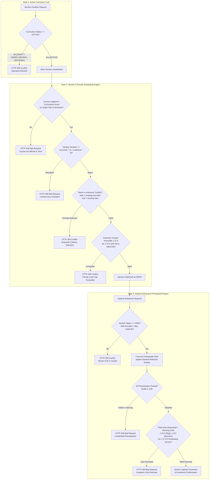
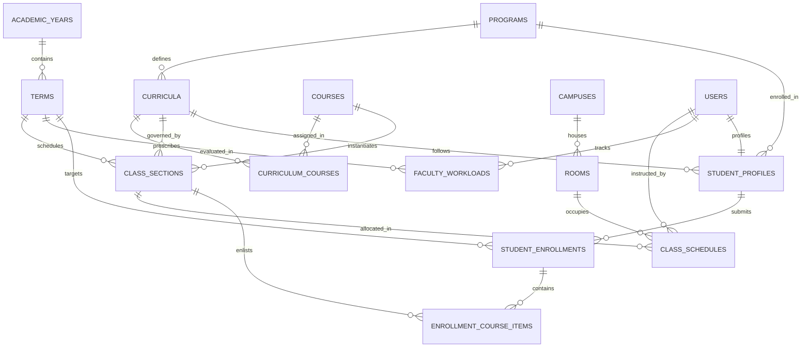
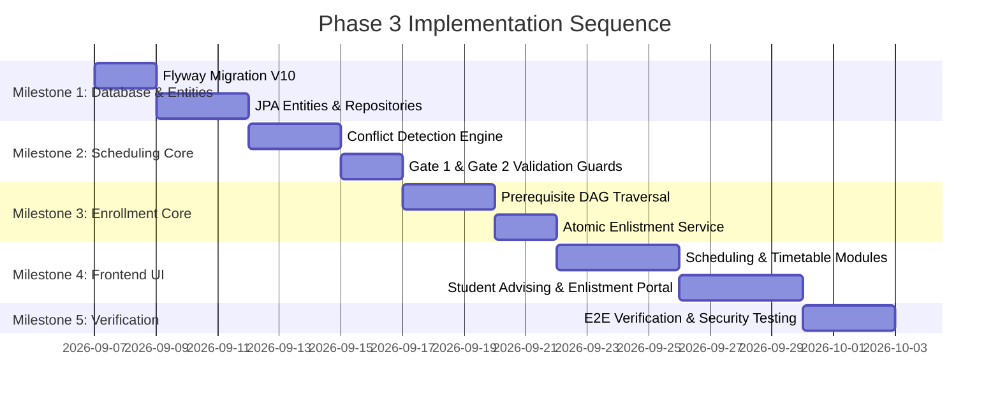

# Phase 3: Curriculum & Enrollment Management Technical Specification & Architecture Blueprint

**Document ID:** `SPEC-SDT-PHASE3-ENROLLMENT-01`  
**Standard Compliance:** CHED Memorandum Order (CMO) No. 25, Series of 2015 / RA 10931 (Universal Access to Quality Tertiary Education)  
**Target Systems:**
- Backend: `student-digital-twin-v1.0.0-backend` (Spring Boot 3.4.x / Java 21 / Hibernate 6 / MySQL 8)
- Frontend: `student-digital-twin-v1.0.0-frontend` (Angular 19+ / PrimeNG 21 / Angular CDK 19)

---

## 1. Executive Summary & The Three-Tier Gatekeeper Architecture

Phase 3 transitions the Student Digital Twin platform from **static curriculum design** into **dynamic, live operational execution**. While Phase 2 established degree programs, course catalogs, and prerequisite graphs, Phase 3 orchestrates the end-to-end operational pipeline: classroom allocation, faculty workload distribution, student advising, prerequisite traversal, and atomic enrollment.

To ensure absolute academic rigor and regulatory compliance with CHED CMO No. 25, s. 2015, the platform implements the **Three-Tier Gatekeeper Architecture**:



---

## 2. Codebase Audit & Architectural Alignment

The Phase 3 technical blueprint is customized directly to the verified package layout, naming patterns, and frameworks of the active codebase:

### 2.1. Backend Repository Alignment (`student-digital-twin-v1.0.0-backend`)
* **Package Structure**:
  - Entities: `com.sdt.web_app.entities.scheduling` and `com.sdt.web_app.entities.enrollment`.
  - Repositories: `com.sdt.web_app.repositories.scheduling` and `com.sdt.web_app.repositories.enrollment`.
  - Services: `com.sdt.web_app.service.scheduling` and `com.sdt.web_app.service.enrollment`.
  - Controllers: `com.sdt.web_app.controller.scheduling` and `com.sdt.web_app.controller.enrollment`.
  - DTOs: `com.sdt.web_app.dto.scheduling` and `com.sdt.web_app.dto.enrollment`.
* **Base Entity Pattern**: Entities in this codebase do not inherit an abstract class; instead, they define explicit primary keys using `@Id @GeneratedValue(strategy = GenerationType.IDENTITY) private Long id;`, Lombok `@Getter`, `@NoArgsConstructor(access = AccessLevel.PROTECTED)`, `@AllArgsConstructor(access = AccessLevel.PRIVATE)`, and `@Builder`. Auditing timestamps use `@Column(name = "created_at", updatable = false) private Instant createdAt = Instant.now();`.
* **User & Roles Integration**: The existing `com.sdt.web_app.entities.authentication.User` entity with `id` (`Long`) and `com.sdt.web_app.entities.authentication.Roles` (`STUDENT`, `FACULTY`, `CHAIRPERSON`, `DEAN`, `REGISTRAR`, `ADMIN`) serves as the identity anchor.
* **Database & Migration Engine**: MySQL 8.0 with InnoDB dialect. The next migration script is sequentially indexed as:  
  **`V10__create_phase3_scheduling_and_enrollment.sql`**.
* **Exception Handling**: Mapped through `GlobalExceptionHandler.java` returning RFC 7807 `ProblemDetail`:
  - `IllegalArgumentException` $\rightarrow$ `400 BAD_REQUEST`
  - `IllegalStateException` $\rightarrow$ `409 CONFLICT`
  - `jakarta.persistence.EntityNotFoundException` $\rightarrow$ `404 NOT_FOUND`
  - `AccessDeniedException` $\rightarrow$ `403 FORBIDDEN`

### 2.2. Frontend Repository Alignment (`student-digital-twin-v1.0.0-frontend`)
* **Directory Layout**:
  - `src/app/features/scheduling/` (Section creation, classroom scheduling, timetable grid).
  - `src/app/features/enrollment/` (Student advising, prerequisite checklist, course enlistment).
* **Component Standards**: 100% adherence to the 4-file separation pattern:
  - `*.component.ts` (Angular 19+ standalone component, `ChangeDetectionStrategy.OnPush`, Signals)
  - `*.component.html` (Semantic markup, PrimeNG components with explicit keys)
  - `*.component.css` (Scoped styling using CSS variables and CHMSU brand colors)
  - `*.component.spec.ts` (Vitest/Jasmine test suite)
* **Reactivity & Security**: Angular Signals (`signal`, `computed`, `effect`) integrated with `AuthService.currentUser()`, token-injecting `authInterceptor`, and isolated PrimeNG dialog keys (`key="scheduleConfirmDialog"`, `key="enrollmentConfirmDialog"`).

---

## 3. Data Dictionary & Entity-Relationship Model



### 3.1. Entity Specifications

#### 1. `rooms` (Classroom & Laboratory Physical Facilities)
| Field | Type | Constraints | Description |
| :--- | :--- | :--- | :--- |
| `id` | `BIGINT` | PK, Auto Increment | Unique internal facility ID |
| `campus_id` | `BIGINT` | FK $\rightarrow$ `campuses(id)`, Not Null | Campus location |
| `code` | `VARCHAR(30)` | Not Null | Room identifier (e.g., "IT-LAB-1", "ENG-302") |
| `name` | `VARCHAR(100)` | Not Null | Descriptive facility name |
| `building` | `VARCHAR(100)` | Not Null | Building name or wing |
| `floor` | `INT` | Not Null | Floor level |
| `capacity` | `INT` | Not Null, Check $> 0$ | Maximum physical seating capacity |
| `room_type` | `VARCHAR(30)` | Not Null | `LECTURE`, `LABORATORY`, `SPEECH_LAB`, `GYMNASIUM` |
| `is_active` | `BOOLEAN` | Not Null, Default `TRUE` | Active facility status |

#### 2. `class_sections` (Scheduled Offerings of Curriculum Courses)
| Field | Type | Constraints | Description |
| :--- | :--- | :--- | :--- |
| `id` | `BIGINT` | PK, Auto Increment | Unique class section ID |
| `term_id` | `BIGINT` | FK $\rightarrow$ `terms(id)`, Not Null | Academic offering term |
| `curriculum_id` | `BIGINT` | FK $\rightarrow$ `curricula(id)`, Not Null | Governing curriculum |
| `course_id` | `BIGINT` | FK $\rightarrow$ `courses(id)`, Not Null | Master course offering |
| `section_code` | `VARCHAR(30)` | Not Null | Section name (e.g., "BSIT-3A", "BSIT-3B") |
| `max_capacity` | `INT` | Not Null, Default 40 | Maximum student headcount cap |
| `enrolled_count`| `INT` | Not Null, Default 0 | Real-time enrolled student count |
| `status` | `VARCHAR(20)` | Not Null, Default 'PLANNED' | `PLANNED`, `OPEN`, `CLOSED`, `CANCELLED` |
| `created_at` | `DATETIME` | Not Null, Current Timestamp | Record creation audit timestamp |
| `updated_at` | `DATETIME` | Nullable, On Update | Last modification timestamp |

#### 3. `class_schedules` (Timetable Slots per Class Section)
| Field | Type | Constraints | Description |
| :--- | :--- | :--- | :--- |
| `id` | `BIGINT` | PK, Auto Increment | Schedule slot ID |
| `section_id` | `BIGINT` | FK $\rightarrow$ `class_sections(id)`, Not Null | Parent class section |
| `room_id` | `BIGINT` | FK $\rightarrow$ `rooms(id)`, Not Null | Assigned classroom |
| `instructor_user_id` | `BIGINT` | FK $\rightarrow$ `users(id)`, Nullable | Assigned faculty member |
| `day_of_week` | `VARCHAR(15)` | Not Null | `MONDAY`, `TUESDAY`, `WEDNESDAY`, `THURSDAY`, `FRIDAY`, `SATURDAY` |
| `start_time` | `TIME` | Not Null | Start time (e.g., `08:00:00`) |
| `end_time` | `TIME` | Not Null | End time (e.g., `09:30:00`) |
| `schedule_type` | `VARCHAR(20)`| Not Null | `LECTURE`, `LABORATORY` |

#### 4. `faculty_workloads` (Semester Faculty Workload Ledger)
| Field | Type | Constraints | Description |
| :--- | :--- | :--- | :--- |
| `id` | `BIGINT` | PK, Auto Increment | Workload ledger ID |
| `term_id` | `BIGINT` | FK $\rightarrow$ `terms(id)`, Not Null | Evaluated term |
| `faculty_user_id` | `BIGINT` | FK $\rightarrow$ `users(id)`, Not Null | Faculty account |
| `regular_units` | `DECIMAL(4,2)`| Not Null, Default 0.00 | Standard regular teaching units |
| `overload_units` | `DECIMAL(4,2)`| Not Null, Default 0.00 | Units beyond regular cap (18–21) |
| `total_contact_hours`| `DECIMAL(4,2)`| Not Null, Default 0.00 | Total weekly contact hours |
| `is_overload_approved` | `BOOLEAN` | Not Null, Default `FALSE`| Dean/Chairperson overload authorization |
| `approved_by_user_id`| `BIGINT` | FK $\rightarrow$ `users(id)`, Nullable | Approving official |

#### 5. `student_profiles` (Institutional Student Identity & Progress)
| Field | Type | Constraints | Description |
| :--- | :--- | :--- | :--- |
| `id` | `BIGINT` | PK, Auto Increment | Student profile ID |
| `user_id` | `BIGINT` | FK $\rightarrow$ `users(id)`, Unique, Not Null | Linked user account |
| `student_number` | `VARCHAR(30)`| Unique, Not Null | Institutional ID (e.g., "2023-01042") |
| `program_id` | `BIGINT` | FK $\rightarrow$ `programs(id)`, Not Null | Degree program |
| `curriculum_id` | `BIGINT` | FK $\rightarrow$ `curricula(id)`, Not Null | Enrolled curriculum version |
| `year_level` | `INT` | Not Null, Check 1..5 | Current academic year standing |
| `enrollment_status` | `VARCHAR(20)` | Not Null, Default 'REGULAR' | `REGULAR`, `IRREGULAR`, `PROBATION`, `LOA`, `GRADUATED` |
| `is_graduating` | `BOOLEAN` | Not Null, Default `FALSE` | Final-year graduating senior status |
| `total_units_earned`| `DECIMAL(5,2)`| Not Null, Default 0.00 | Total accumulated passed units |
| `cumulative_gpa` | `DECIMAL(3,2)`| Nullable | Cumulative GPA (1.00 - 5.00 scale) |

#### 6. `student_enrollments` (Term Enrollment Ledger)
| Field | Type | Constraints | Description |
| :--- | :--- | :--- | :--- |
| `id` | `BIGINT` | PK, Auto Increment | Enrollment transaction ID |
| `student_id` | `BIGINT` | FK $\rightarrow$ `student_profiles(id)`, Not Null| Enrolling student |
| `term_id` | `BIGINT` | FK $\rightarrow$ `terms(id)`, Not Null | Enrolled term |
| `enrollment_date` | `DATETIME` | Not Null, Current Timestamp | Date of enrollment submission |
| `status` | `VARCHAR(20)` | Not Null, Default 'DRAFT' | `DRAFT`, `ENLISTED`, `ASSESSED`, `ENROLLED`, `DROPPED` |
| `total_credit_units`| `DECIMAL(4,2)`| Not Null, Default 0.00 | Sum of enrolled course credits |
| `is_overload_approved`| `BOOLEAN` | Not Null, Default `FALSE` | Approved graduating senior overload |

#### 7. `enrollment_course_items` (Course Itemized Enlistment Records)
| Field | Type | Constraints | Description |
| :--- | :--- | :--- | :--- |
| `id` | `BIGINT` | PK, Auto Increment | Item record ID |
| `enrollment_id` | `BIGINT` | FK $\rightarrow$ `student_enrollments(id)`, Not Null | Parent term enrollment |
| `section_id` | `BIGINT` | FK $\rightarrow$ `class_sections(id)`, Not Null | Target class section |
| `final_numerical_grade`| `DECIMAL(3,2)`| Nullable | Final grade (e.g., 1.25, 2.50, 5.00) |
| `completion_status` | `VARCHAR(20)` | Not Null, Default 'ENROLLED' | `ENROLLED`, `PASSED`, `FAILED`, `INCOMPLETE`, `DROPPED` |

---

## 4. CHED CMO No. 25, s. 2015 Business Rules & Formulations

### 4.1. Contact Hour Calculation
Philippine higher education dictates an asymmetrical ratio between lecture units and laboratory hours:
$$\text{Weekly Contact Hours} = (\text{LectureUnits} \times 1.0) + (\text{LabUnits} \times 3.0)$$
* **1 Lecture Unit** = 1 hour (60 minutes) of classroom instruction per week.
* **1 Laboratory Unit** = 3 hours (180 minutes) of practical laboratory instruction per week.

**Validation Rule:** For any `ClassSection`, the aggregate duration of all associated `ClassSchedule` slots must equal the exact weekly contact hours of the underlying course:
$$\sum_{s \in \text{Schedules}} (\text{slotEndTime}_s - \text{slotStartTime}_s)_{\text{hours}} \equiv \text{Weekly Contact Hours}$$

### 4.2. Schedule Overlap Detection Theorem
Two schedule blocks $A$ and $B$ collide if and only if they share the same physical facility (Room) or instructor (Faculty) on the same day, and their time intervals overlap:
$$\text{dayOfWeek}_A = \text{dayOfWeek}_B \quad \land \quad \max(\text{startTime}_A, \text{startTime}_B) < \min(\text{endTime}_A, \text{endTime}_B)$$
Equivalently represented in SQL:
```sql
WHERE schedule.day_of_week = :newDay
  AND schedule.start_time < :newEndTime
  AND schedule.end_time > :newStartTime
  AND (schedule.room_id = :newRoomId OR schedule.instructor_user_id = :newInstructorId)
  AND schedule.term_id = :termId
```

### 4.3. Faculty Load Limits
* **Standard Regular Load**: 18.0 to 21.0 contact hours/week.
* **Overload Allowance**: Allowable up to 24.0 contact hours/week with explicit authorization (`is_overload_approved = true`).
* **Hard Cap**: Allocations exceeding 24.0 contact hours/week are strictly blocked by the system (`409 Conflict`).

### 4.4. Prerequisite DAG Validation Algorithm
For a student requesting enrollment in course $C_t$:
1. Traverse the prerequisite graph to collect all direct prerequisites:
   $$P(C_t) = \{ C_p \mid (C_p \rightarrow C_t) \in \text{CoursePrerequisites} \}$$
2. Query the student's historical `enrollment_course_items`:
   $$H_{\text{passed}}(S) = \{ C \mid \text{completionStatus} = \text{'PASSED'} \land \text{finalNumericalGrade} \le 3.00 \}$$
3. Evaluate prerequisite satisfaction:
   $$\forall C_p \in P(C_t), \quad C_p \in H_{\text{passed}}(S)$$
   If any $C_p \notin H_{\text{passed}}(S)$, advising is blocked with a structured diagnostic error specifying the prerequisite deficiency.

### 4.5. Unit Ceilings
* **Regular Semester**: Maximum 24.0 credit units.
* **Midyear / Summer Term**: Maximum 9.0 credit units.
* **Graduating Senior Overload**: Up to 27.0 units in regular semester (or 12.0 in summer) permitted if and only if `studentProfile.isGraduating == true` and `studentEnrollment.isOverloadApproved == true`.

---

## 5. Ready-to-Implement Code Blueprints

### 5.1. Database Migration Script
File: `src/main/resources/db/migration/V10__create_phase3_scheduling_and_enrollment.sql`

```sql
-- V10__create_phase3_scheduling_and_enrollment.sql
-- Phase 3: Section Management, Class Scheduling, Faculty Workloads, and Student Enrollment

SET FOREIGN_KEY_CHECKS = 0;

-- 1. Physical Facilities (Classrooms and Laboratories)
CREATE TABLE IF NOT EXISTS rooms (
    id BIGINT AUTO_INCREMENT PRIMARY KEY,
    campus_id BIGINT NOT NULL,
    code VARCHAR(30) NOT NULL,
    name VARCHAR(100) NOT NULL,
    building VARCHAR(100) NOT NULL,
    floor INT NOT NULL DEFAULT 1,
    capacity INT NOT NULL,
    room_type VARCHAR(30) NOT NULL DEFAULT 'LECTURE',
    is_active BOOLEAN NOT NULL DEFAULT TRUE,
    CONSTRAINT uq_campus_room_code UNIQUE (campus_id, code),
    CONSTRAINT fk_rooms_campus FOREIGN KEY (campus_id) REFERENCES campuses (id) ON DELETE RESTRICT
) ENGINE = InnoDB DEFAULT CHARSET = utf8mb4 COLLATE = utf8mb4_unicode_ci;

-- 2. Class Sections (Subject Offerings per Term)
CREATE TABLE IF NOT EXISTS class_sections (
    id BIGINT AUTO_INCREMENT PRIMARY KEY,
    term_id BIGINT NOT NULL,
    curriculum_id BIGINT NOT NULL,
    course_id BIGINT NOT NULL,
    section_code VARCHAR(30) NOT NULL,
    max_capacity INT NOT NULL DEFAULT 40,
    enrolled_count INT NOT NULL DEFAULT 0,
    status VARCHAR(20) NOT NULL DEFAULT 'PLANNED',
    created_at DATETIME NOT NULL DEFAULT CURRENT_TIMESTAMP,
    updated_at DATETIME NULL ON UPDATE CURRENT_TIMESTAMP,
    CONSTRAINT uq_term_course_section UNIQUE (term_id, course_id, section_code),
    CONSTRAINT fk_sections_term FOREIGN KEY (term_id) REFERENCES terms (id) ON DELETE RESTRICT,
    CONSTRAINT fk_sections_curriculum FOREIGN KEY (curriculum_id) REFERENCES curricula (id) ON DELETE RESTRICT,
    CONSTRAINT fk_sections_course FOREIGN KEY (course_id) REFERENCES courses (id) ON DELETE RESTRICT
) ENGINE = InnoDB DEFAULT CHARSET = utf8mb4 COLLATE = utf8mb4_unicode_ci;

-- 3. Class Schedules (Timetable Slots per Section)
CREATE TABLE IF NOT EXISTS class_schedules (
    id BIGINT AUTO_INCREMENT PRIMARY KEY,
    section_id BIGINT NOT NULL,
    room_id BIGINT NOT NULL,
    instructor_user_id BIGINT NULL,
    day_of_week VARCHAR(15) NOT NULL,
    start_time TIME NOT NULL,
    end_time TIME NOT NULL,
    schedule_type VARCHAR(20) NOT NULL DEFAULT 'LECTURE',
    CONSTRAINT fk_schedules_section FOREIGN KEY (section_id) REFERENCES class_sections (id) ON DELETE CASCADE,
    CONSTRAINT fk_schedules_room FOREIGN KEY (room_id) REFERENCES rooms (id) ON DELETE RESTRICT,
    CONSTRAINT fk_schedules_instructor FOREIGN KEY (instructor_user_id) REFERENCES users (id) ON DELETE SET NULL,
    INDEX idx_sched_conflict_room (room_id, day_of_week, start_time, end_time),
    INDEX idx_sched_conflict_faculty (instructor_user_id, day_of_week, start_time, end_time)
) ENGINE = InnoDB DEFAULT CHARSET = utf8mb4 COLLATE = utf8mb4_unicode_ci;

-- 4. Faculty Workloads (Workload Tracking per Term)
CREATE TABLE IF NOT EXISTS faculty_workloads (
    id BIGINT AUTO_INCREMENT PRIMARY KEY,
    term_id BIGINT NOT NULL,
    faculty_user_id BIGINT NOT NULL,
    regular_units DECIMAL(4, 2) NOT NULL DEFAULT 0.00,
    overload_units DECIMAL(4, 2) NOT NULL DEFAULT 0.00,
    total_contact_hours DECIMAL(4, 2) NOT NULL DEFAULT 0.00,
    is_overload_approved BOOLEAN NOT NULL DEFAULT FALSE,
    approved_by_user_id BIGINT NULL,
    CONSTRAINT uq_term_faculty_workload UNIQUE (term_id, faculty_user_id),
    CONSTRAINT fk_workload_term FOREIGN KEY (term_id) REFERENCES terms (id) ON DELETE RESTRICT,
    CONSTRAINT fk_workload_faculty FOREIGN KEY (faculty_user_id) REFERENCES users (id) ON DELETE CASCADE,
    CONSTRAINT fk_workload_approver FOREIGN KEY (approved_by_user_id) REFERENCES users (id) ON DELETE SET NULL
) ENGINE = InnoDB DEFAULT CHARSET = utf8mb4 COLLATE = utf8mb4_unicode_ci;

-- 5. Student Profiles (Student Academic Information & Curriculum Association)
CREATE TABLE IF NOT EXISTS student_profiles (
    id BIGINT AUTO_INCREMENT PRIMARY KEY,
    user_id BIGINT NOT NULL UNIQUE,
    student_number VARCHAR(30) NOT NULL UNIQUE,
    program_id BIGINT NOT NULL,
    curriculum_id BIGINT NOT NULL,
    year_level INT NOT NULL DEFAULT 1,
    enrollment_status VARCHAR(20) NOT NULL DEFAULT 'REGULAR',
    is_graduating BOOLEAN NOT NULL DEFAULT FALSE,
    total_units_earned DECIMAL(5, 2) NOT NULL DEFAULT 0.00,
    cumulative_gpa DECIMAL(3, 2) NULL,
    created_at DATETIME NOT NULL DEFAULT CURRENT_TIMESTAMP,
    CONSTRAINT fk_student_user FOREIGN KEY (user_id) REFERENCES users (id) ON DELETE CASCADE,
    CONSTRAINT fk_student_program FOREIGN KEY (program_id) REFERENCES programs (id) ON DELETE RESTRICT,
    CONSTRAINT fk_student_curriculum FOREIGN KEY (curriculum_id) REFERENCES curricula (id) ON DELETE RESTRICT
) ENGINE = InnoDB DEFAULT CHARSET = utf8mb4 COLLATE = utf8mb4_unicode_ci;

-- 6. Student Enrollments (Term Enrollment Ledger)
CREATE TABLE IF NOT EXISTS student_enrollments (
    id BIGINT AUTO_INCREMENT PRIMARY KEY,
    student_id BIGINT NOT NULL,
    term_id BIGINT NOT NULL,
    enrollment_date DATETIME NOT NULL DEFAULT CURRENT_TIMESTAMP,
    status VARCHAR(20) NOT NULL DEFAULT 'DRAFT',
    total_credit_units DECIMAL(4, 2) NOT NULL DEFAULT 0.00,
    is_overload_approved BOOLEAN NOT NULL DEFAULT FALSE,
    CONSTRAINT uq_student_term_enrollment UNIQUE (student_id, term_id),
    CONSTRAINT fk_enrollment_student FOREIGN KEY (student_id) REFERENCES student_profiles (id) ON DELETE CASCADE,
    CONSTRAINT fk_enrollment_term FOREIGN KEY (term_id) REFERENCES terms (id) ON DELETE RESTRICT
) ENGINE = InnoDB DEFAULT CHARSET = utf8mb4 COLLATE = utf8mb4_unicode_ci;

-- 7. Enrollment Course Items (Itemized Enrolled Subjects & Grades)
CREATE TABLE IF NOT EXISTS enrollment_course_items (
    id BIGINT AUTO_INCREMENT PRIMARY KEY,
    enrollment_id BIGINT NOT NULL,
    section_id BIGINT NOT NULL,
    final_numerical_grade DECIMAL(3, 2) NULL,
    completion_status VARCHAR(20) NOT NULL DEFAULT 'ENROLLED',
    CONSTRAINT uq_enrollment_section UNIQUE (enrollment_id, section_id),
    CONSTRAINT fk_items_enrollment FOREIGN KEY (enrollment_id) REFERENCES student_enrollments (id) ON DELETE CASCADE,
    CONSTRAINT fk_items_section FOREIGN KEY (section_id) REFERENCES class_sections (id) ON DELETE RESTRICT
) ENGINE = InnoDB DEFAULT CHARSET = utf8mb4 COLLATE = utf8mb4_unicode_ci;

SET FOREIGN_KEY_CHECKS = 1;
```

---

### 5.2. Backend JPA Entities & Record DTOs

#### Entity: `ClassSection.java`
Package: `com.sdt.web_app.entities.scheduling`

```java
package com.sdt.web_app.entities.scheduling;

import com.sdt.web_app.entities.institution.Course;
import com.sdt.web_app.entities.institution.Curriculum;
import com.sdt.web_app.entities.institution.Term;
import jakarta.persistence.*;
import lombok.*;

import java.time.Instant;
import java.util.ArrayList;
import java.util.List;

@Entity
@Table(name = "class_sections")
@Getter
@NoArgsConstructor(access = AccessLevel.PROTECTED)
@AllArgsConstructor(access = AccessLevel.PRIVATE)
@Builder
@ToString(exclude = {"term", "curriculum", "course", "schedules"})
public class ClassSection {

    public enum Status { PLANNED, OPEN, CLOSED, CANCELLED }

    @Id
    @GeneratedValue(strategy = GenerationType.IDENTITY)
    private Long id;

    @ManyToOne(fetch = FetchType.LAZY, optional = false)
    @JoinColumn(name = "term_id", nullable = false)
    private Term term;

    @ManyToOne(fetch = FetchType.LAZY, optional = false)
    @JoinColumn(name = "curriculum_id", nullable = false)
    private Curriculum curriculum;

    @ManyToOne(fetch = FetchType.LAZY, optional = false)
    @JoinColumn(name = "course_id", nullable = false)
    private Course course;

    @Column(name = "section_code", nullable = false, length = 30)
    private String sectionCode;

    @Column(name = "max_capacity", nullable = false)
    @Builder.Default
    private int maxCapacity = 40;

    @Column(name = "enrolled_count", nullable = false)
    @Builder.Default
    private int enrolledCount = 0;

    @Enumerated(EnumType.STRING)
    @Column(nullable = false, length = 20)
    @Builder.Default
    private Status status = Status.PLANNED;

    @OneToMany(mappedBy = "section", cascade = CascadeType.ALL, orphanRemoval = true)
    @Builder.Default
    private List<ClassSchedule> schedules = new ArrayList<>();

    @Column(name = "created_at", updatable = false)
    @Builder.Default
    private Instant createdAt = Instant.now();

    public void updateStatus(Status newStatus) {
        this.status = newStatus;
    }

    public void incrementEnrolledCount() {
        if (this.enrolledCount >= this.maxCapacity) {
            throw new IllegalStateException("Cannot enroll: section " + this.sectionCode + " has reached max capacity (" + this.maxCapacity + ")");
        }
        this.enrolledCount++;
        if (this.enrolledCount == this.maxCapacity) {
            this.status = Status.CLOSED;
        }
    }

    public void decrementEnrolledCount() {
        if (this.enrolledCount > 0) {
            this.enrolledCount--;
            if (this.status == Status.CLOSED) {
                this.status = Status.OPEN;
            }
        }
    }
}
```

#### DTOs: `SchedulingDtos.java`
Package: `com.sdt.web_app.dto.scheduling`

```java
package com.sdt.web_app.dto.scheduling;

import jakarta.validation.Valid;
import jakarta.validation.constraints.*;
import java.time.LocalTime;
import java.util.List;

public class SchedulingDtos {

    public record CreateSectionRequest(
            @NotNull(message = "Term ID is required")
            Long termId,

            @NotNull(message = "Curriculum ID is required")
            Long curriculumId,

            @NotNull(message = "Course ID is required")
            Long courseId,

            @NotBlank(message = "Section code is required")
            @Size(max = 30, message = "Section code cannot exceed 30 characters")
            String sectionCode,

            @Min(value = 1, message = "Capacity must be at least 1")
            @Max(value = 100, message = "Capacity cannot exceed 100")
            int maxCapacity,

            @NotEmpty(message = "At least one schedule slot is required")
            List<@Valid ScheduleSlotDto> scheduleSlots
    ) {}

    public record ScheduleSlotDto(
            @NotNull(message = "Room ID is required")
            Long roomId,

            Long instructorUserId,

            @NotBlank(message = "Day of week is required")
            @Pattern(regexp = "MONDAY|TUESDAY|WEDNESDAY|THURSDAY|FRIDAY|SATURDAY", message = "Invalid day of week")
            String dayOfWeek,

            @NotNull(message = "Start time is required")
            LocalTime startTime,

            @NotNull(message = "End time is required")
            LocalTime endTime,

            @NotBlank(message = "Schedule type is required")
            @Pattern(regexp = "LECTURE|LABORATORY", message = "Schedule type must be LECTURE or LABORATORY")
            String scheduleType
    ) {}

    public record SectionDetailResponse(
            Long id,
            Long termId,
            String termName,
            Long curriculumId,
            String curriculumCode,
            Long courseId,
            String courseCode,
            String courseTitle,
            String sectionCode,
            int maxCapacity,
            int enrolledCount,
            String status,
            List<ScheduleSlotResponse> schedules
    ) {}

    public record ScheduleSlotResponse(
            Long id,
            Long roomId,
            String roomCode,
            String roomName,
            Long instructorUserId,
            String instructorName,
            String dayOfWeek,
            LocalTime startTime,
            LocalTime endTime,
            String scheduleType
    ) {}
}
```

---

### 5.3. Backend Core Service Logic

#### `SchedulingService.java` (Gate 1 & Gate 2 Implementation)
Package: `com.sdt.web_app.service.scheduling`

```java
package com.sdt.web_app.service.scheduling;

import com.sdt.web_app.dto.scheduling.SchedulingDtos.*;
import com.sdt.web_app.entities.institution.*;
import com.sdt.web_app.entities.scheduling.*;
import com.sdt.web_app.repositories.institution.*;
import com.sdt.web_app.repositories.scheduling.*;
import jakarta.persistence.EntityNotFoundException;
import lombok.RequiredArgsConstructor;
import org.springframework.stereotype.Service;
import org.springframework.transaction.annotation.Transactional;

import java.time.Duration;
import java.util.List;

@Service
@RequiredArgsConstructor
public class SchedulingService {

    private final ClassSectionRepository sectionRepository;
    private final ClassScheduleRepository scheduleRepository;
    private final CurriculumRepository curriculumRepository;
    private final CurriculumCourseRepository curriculumCourseRepository;
    private final CourseRepository courseRepository;
    private final TermRepository termRepository;
    private final RoomRepository roomRepository;

    @Transactional
    public SectionDetailResponse createSection(CreateSectionRequest request) {
        // --- GATE 1: Active Curriculum Lock ---
        Curriculum curriculum = curriculumRepository.findById(request.curriculumId())
                .orElseThrow(() -> new EntityNotFoundException("Curriculum not found: " + request.curriculumId()));

        if (curriculum.getStatus() != Curriculum.Status.ACTIVE) {
            throw new IllegalStateException("Gate 1 Violation: Curriculum " + curriculum.getCode() 
                    + " is in " + curriculum.getStatus() + " status. Only ACTIVE curricula can be scheduled.");
        }

        Term term = termRepository.findById(request.termId())
                .orElseThrow(() -> new EntityNotFoundException("Term not found: " + request.termId()));

        Course course = courseRepository.findById(request.courseId())
                .orElseThrow(() -> new EntityNotFoundException("Course not found: " + request.courseId()));

        // Verify course is assigned to curriculum
        boolean isCourseOffered = curriculumCourseRepository.existsByCurriculumIdAndCourseId(curriculum.getId(), course.getId());
        if (!isCourseOffered) {
            throw new IllegalArgumentException("Course " + course.getCode() + " is not prescribed in curriculum " + curriculum.getCode());
        }

        // --- GATE 2: Contact Hour & Schedule Collision Check ---
        int requiredLecMinutes = (int) (course.getLectureUnits().doubleValue() * 60);
        int requiredLabMinutes = (int) (course.getLabUnits().doubleValue() * 180);
        int scheduledLecMinutes = 0;
        int scheduledLabMinutes = 0;

        for (ScheduleSlotDto slot : request.scheduleSlots()) {
            if (!slot.endTime().isAfter(slot.startTime())) {
                throw new IllegalArgumentException("Schedule slot end time must be strictly after start time.");
            }

            int slotMinutes = (int) Duration.between(slot.startTime(), slot.endTime()).toMinutes();
            if ("LABORATORY".equalsIgnoreCase(slot.scheduleType())) {
                scheduledLabMinutes += slotMinutes;
            } else {
                scheduledLecMinutes += slotMinutes;
            }

            // Room conflict detection
            boolean roomConflict = scheduleRepository.existsOverlappingRoomSchedule(
                    term.getId(), slot.roomId(), slot.dayOfWeek(), slot.startTime(), slot.endTime());
            if (roomConflict) {
                throw new IllegalStateException("Gate 2 Violation: Room conflict detected on " 
                        + slot.dayOfWeek() + " between " + slot.startTime() + " and " + slot.endTime());
            }

            // Instructor conflict detection
            if (slot.instructorUserId() != null) {
                boolean facultyConflict = scheduleRepository.existsOverlappingFacultySchedule(
                        term.getId(), slot.instructorUserId(), slot.dayOfWeek(), slot.startTime(), slot.endTime());
                if (facultyConflict) {
                    throw new IllegalStateException("Gate 2 Violation: Faculty conflict detected on " 
                            + slot.dayOfWeek() + " between " + slot.startTime() + " and " + slot.endTime());
                }
            }
        }

        if (scheduledLecMinutes != requiredLecMinutes || scheduledLabMinutes != requiredLabMinutes) {
            throw new IllegalArgumentException(String.format(
                    "Gate 2 Violation: Scheduled minutes mismatch. Required: Lec=%dm, Lab=%dm. Scheduled: Lec=%dm, Lab=%dm.",
                    requiredLecMinutes, requiredLabMinutes, scheduledLecMinutes, scheduledLabMinutes));
        }

        // Build & persist ClassSection
        ClassSection section = ClassSection.builder()
                .term(term)
                .curriculum(curriculum)
                .course(course)
                .sectionCode(request.sectionCode())
                .maxCapacity(request.maxCapacity())
                .status(ClassSection.Status.OPEN)
                .build();

        for (ScheduleSlotDto slot : request.scheduleSlots()) {
            Room room = roomRepository.findById(slot.roomId())
                    .orElseThrow(() -> new EntityNotFoundException("Room not found: " + slot.roomId()));

            ClassSchedule schedule = ClassSchedule.builder()
                    .section(section)
                    .room(room)
                    .instructorUserId(slot.instructorUserId())
                    .dayOfWeek(slot.dayOfWeek())
                    .startTime(slot.startTime())
                    .endTime(slot.endTime())
                    .scheduleType(slot.scheduleType())
                    .build();

            section.getSchedules().add(schedule);
        }

        ClassSection saved = sectionRepository.save(section);
        return mapToDetailResponse(saved);
    }

    private SectionDetailResponse mapToDetailResponse(ClassSection entity) {
        // Mapping implementation
        return null;
    }
}
```

---

### 5.4. Frontend Architecture (4-File Component Pattern)

#### Route Configuration: `src/app/features/scheduling/scheduling.routes.ts`
```typescript
import { Routes } from '@angular/router';

export const SCHEDULING_ROUTES: Routes = [
  {
    path: '',
    redirectTo: 'sections',
    pathMatch: 'full'
  },
  {
    path: 'sections',
    loadComponent: () =>
      import('./components/section-builder/section-builder.component').then(m => m.SectionBuilderComponent),
    title: 'Class Section Management'
  },
  {
    path: 'timetable',
    loadComponent: () =>
      import('./components/timetable-grid/timetable-grid.component').then(m => m.TimetableGridComponent),
    title: 'Timetable & Room Allocation'
  }
];
```

#### Component Template: `section-builder.component.html`
```html
<div class="section-builder-container">
  <!-- PrimeNG Confirmation Dialog with Isolated Key -->
  <p-confirmdialog key="sectionActionDialog"></p-confirmdialog>

  <!-- Header & Toolbar -->
  <header class="page-header">
    <div>
      <h1 class="page-title">Class Section Management</h1>
      <p class="page-subtitle">Schedule course offerings governed by CHED CMO active curricula</p>
    </div>
    <div class="action-buttons">
      <p-button 
        label="New Section" 
        icon="pi pi-plus" 
        (onClick)="openCreateModal()" 
        styleClass="p-button-success">
      </p-button>
    </div>
  </header>

  <!-- Filter Strip -->
  <div class="filter-strip p-card">
    <p-select 
      [options]="academicTerms()" 
      optionLabel="termName" 
      optionValue="id" 
      [(ngModel)]="selectedTermId" 
      placeholder="Select Academic Term" 
      (onChange)="onTermChanged()">
    </p-select>

    <p-select 
      [options]="activeCurricula()" 
      optionLabel="name" 
      optionValue="id" 
      [(ngModel)]="selectedCurriculumId" 
      placeholder="Select Active Curriculum" 
      (onChange)="onCurriculumChanged()">
    </p-select>
  </div>

  <!-- Sections Data Table -->
  <p-table 
    [value]="sections()" 
    [loading]="isLoading()" 
    responsiveLayout="scroll" 
    styleClass="p-datatable-striped">
    
    <ng-template pTemplate="header">
      <tr>
        <th>Section Code</th>
        <th>Course</th>
        <th>Schedule Slots</th>
        <th>Capacity</th>
        <th>Status</th>
        <th>Actions</th>
      </tr>
    </ng-template>

    <ng-template pTemplate="body" let-sec>
      <tr>
        <td class="font-bold text-primary">{{ sec.sectionCode }}</td>
        <td>
          <span class="course-code">{{ sec.courseCode }}</span>
          <span class="course-title">{{ sec.courseTitle }}</span>
        </td>
        <td>
          @for (slot of sec.schedules; track slot.id) {
            <div class="schedule-pill">
              <i class="pi pi-calendar"></i> {{ slot.dayOfWeek }} {{ slot.startTime }} - {{ slot.endTime }} 
              <span class="room-tag">({{ slot.roomCode }})</span>
            </div>
          }
        </td>
        <td>
          <span [class.text-danger]="sec.enrolledCount >= sec.maxCapacity">
            {{ sec.enrolledCount }} / {{ sec.maxCapacity }}
          </span>
        </td>
        <td>
          <p-tag 
            [value]="sec.status" 
            [severity]="getStatusSeverity(sec.status)">
          </p-tag>
        </td>
        <td>
          <p-button 
            icon="pi pi-pencil" 
            [rounded]="true" 
            [text]="true" 
            severity="secondary" 
            (onClick)="editSection(sec)">
          </p-button>
        </td>
      </tr>
    </ng-template>
  </p-table>
</div>
```

---

## 6. Step-by-Step Implementation Roadmap & Verification Plan



### Milestone 1: Database Schema & JPA Entity Layer
- Execute Flyway migration `V10__create_phase3_scheduling_and_enrollment.sql`.
- Implement JPA entities (`ClassSection`, `ClassSchedule`, `Room`, `FacultyWorkload`, `StudentProfile`, `StudentEnrollment`, `EnrollmentCourseItem`).
- Create Spring Data JPA repositories with custom JPQL queries for overlap detection.

### Milestone 2: Section Scheduling & Conflict Detection Engine
- Implement `SchedulingService` with two-interval collision logic and CHED weekly contact hour arithmetic.
- Enforce Gate 1: Reject section instantiation on non-`ACTIVE` curricula.
- Enforce Gate 2: Enforce weekly contact hours and reject overlapping room/instructor time blocks.

### Milestone 3: Student Advising & Prerequisite Validation
- Implement `EnrollmentService.evaluateStudentEligibility(studentId, targetTermId)`.
- Construct student historical grade map ($G \le 3.00$).
- Recursively validate course prerequisites against the DAG.
- Enforce term unit caps (24.0 regular / 9.0 summer / 27.0 graduating).

### Milestone 4: Frontend Scheduling & Timetable Module
- Scaffold `src/app/features/scheduling/` following the 4-file format.
- Implement `SectionBuilderComponent` with PrimeNG `p-table`, `p-select`, and `p-confirmdialog`.
- Implement interactive timetable matrix mapping days (Mon-Sat) vs. time blocks (07:00 - 21:00).

### Milestone 5: Frontend Student Advising & Enlistment Portal
- Scaffold `src/app/features/enrollment/` following the 4-file format.
- Build reactive course checklist with prerequisite pass/fail indicator badges.
- Include real-time unit meter warning students if exceeding 24.0 units.

### Milestone 6: Automated Verification Testing
- **Conflict Negative Tests**: Verify that scheduling Room A for Section 1 (Mon 08:00–10:00) and Section 2 (Mon 09:00–11:00) throws HTTP 409 Conflict.
- **Gate 1 Negative Tests**: Verify that creating a section under a `DRAFT` curriculum throws HTTP 409 Conflict.
- **Gate 3 Negative Tests**: Verify that a student with grade `5.00` in `IT 101` cannot enlist in `IT 102`.
- **Atomic Capacity Tests**: Concurrently simulate 50 enrollment requests against a 40-capacity section; verify exactly 40 succeed and 10 receive HTTP 409.
