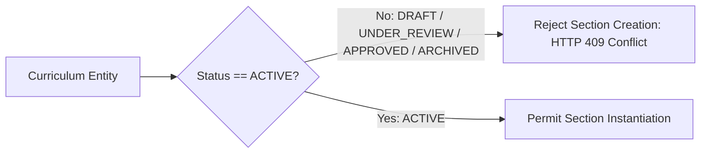

# 00 Curriculum Mapping & Gate 1 Active Curriculum Lock

**Parent Specification:** [[02 Curriculum & Enrollment Management]]  
**Standard Compliance:** CHED Memorandum Orders (CMOs) per Degree Program / CHMSU Academic Governance  
**Lifecycle Stage:** Phase 2 (Completed) $\rightarrow$ Phase 3 (Active Operational Lock)

---

## 1. Overview & Operational Role

Curriculum Mapping serves as the foundational data contract for the Student Digital Twin platform. It establishes the structured academic trajectory for every degree program offered across the university's campuses (Talisay Main, Fortune Towne, Binalbagan, and Alijis).

In Phase 3 (Curriculum & Enrollment Management), Curriculum Mapping transitions from an interactive design canvas into **Gate 1: Active Curriculum Lock**.

---

## 2. Gate 1: Active Curriculum Lock Specification

Under CHED CMO standards and university registrar rules, academic departments cannot schedule classes or open enrollment for courses based on draft or deprecated curriculum revisions.

### 2.1. Domain Rules
1. **Status Immutability**:
   - A curriculum in `DRAFT` or `UNDER_REVIEW` is mutable but cannot be used for section scheduling.
   - An `APPROVED` curriculum is locked from structural mutation but must be formally transitioned to `ACTIVE` by the Registrar or Academic Dean to enable term scheduling.
   - An `ACTIVE` curriculum is strictly immutable. If curriculum revisions are required, administrators must use `POST /api/v1/curricula/{id}/clone` to produce a new version in `DRAFT` status.
2. **Term Alignment**:
   - Scheduling a course for a given Academic Term requires verifying that the target course is formally allocated to that specific Year Level and Semester in `curriculum_courses`.
   - Attempting to schedule an off-term course without an approved curricular substitution or off-sequence waiver throws an `IllegalArgumentException` (`HTTP 400 Bad Request`).

---

## 3. Database Schema Cross-Reference

Curriculum mapping is backed by the following core tables established in Flyway migrations `V4`, `V5`, and `V9`:

* `programs`: Master degree catalog (e.g., `BSIT`, `BSCE`, `BSED-ENG`) linked to collegiate departments.
* `curricula`: Versioned curriculum records containing `code`, `effective_academic_year`, `status`, and `version_number`.
* `curriculum_courses`: Scoped course assignments tracking `year_level`, `semester`, `sequence_order`, and `category` (`GEN_ED`, `MANDATED`, `PROFESSIONAL_MAJOR`, `ELECTIVE`).
* `course_prerequisites`: Directed prerequisite edges evaluated during Gate 3 student advising.

---

## 4. Integration with Phase 3 Scheduling & Advising

* **Section Scheduling ([01 Scheduling & Subject Loading](01%20Scheduling%20&%20Subject%20Loading.md))**: Every `class_sections` record must maintain a non-nullable foreign key referencing `curricula(id)`.
* **Student Enrollment ([02 Enrollment & Registration](02%20Enrollment%20&%20Registration.md))**: Every student profile (`student_profiles`) is bound to an active `curriculum_id`, defining their prescribed course checklist and graduation clearance criteria.