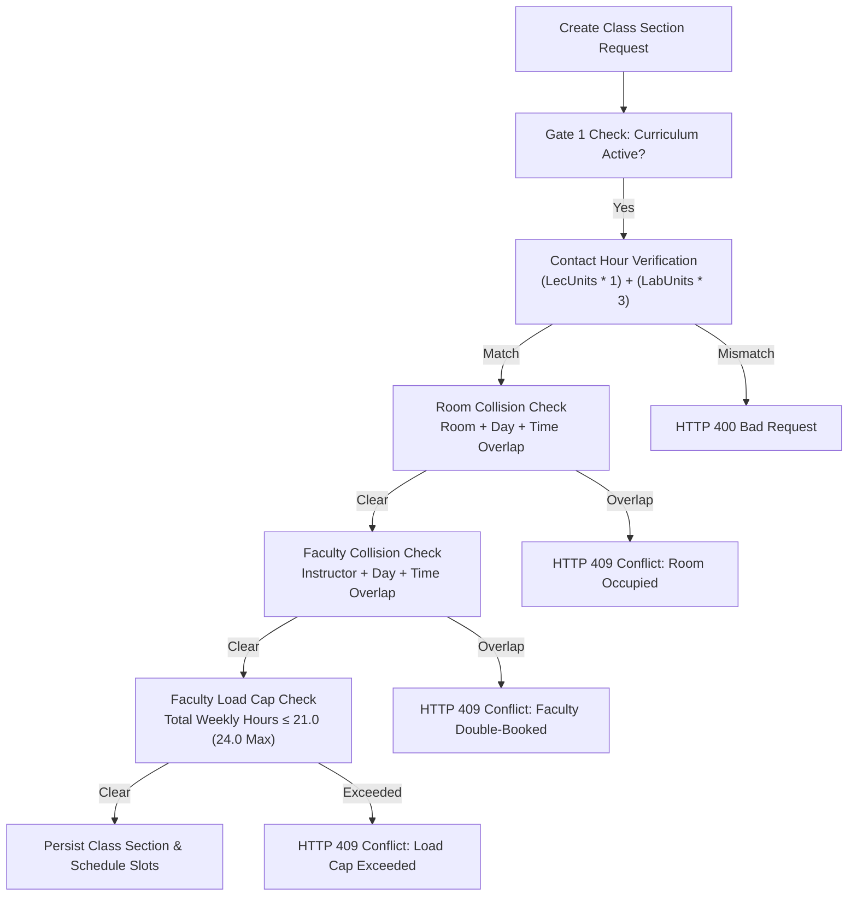

# 01 Scheduling & Subject Loading: Gate 2 Execution Specification

**Parent Specification:** [[02 Curriculum & Enrollment Management]]  
**Standard Compliance:** CHED Memorandum Order (CMO) No. 25, Series of 2015  
**Lifecycle Stage:** Phase 3 Operational Scheduling Engine

---

## 1. Overview & Operational Role

The Scheduling & Subject Loading module bridges institutional curriculum maps with campus physical facilities and academic faculty. It governs classroom allocation, weekly timetable scheduling, section capacity management, and faculty teaching load distribution.

In the Phase 3 architecture, this module enforces **Gate 2: Section & Faculty Scheduling Engine**.

---

## 2. Gate 2: Technical Specifications & Conflict Detection



### 2.1. Weekly Contact Hour Arithmetic
Under CHED CMO No. 25, s. 2015, higher education course credits map directly to scheduled weekly hours:
$$\text{Required Weekly Contact Hours} = (\text{Lecture Units} \times 1.0) + (\text{Laboratory Units} \times 3.0)$$
* **Pure Lecture Course (3 units)**: 3 lecture hours/week = 180 minutes/week (e.g., MWF 1.0 hr each, or TTh 1.5 hrs each).
* **Lecture + Lab Course (3 units: 2 lec, 1 lab)**: 2 lecture hours + 3 lab hours = 5 contact hours/week (300 minutes/week).

**Strict Validation Gate:** The sum of durations across all schedule slots associated with a section must equal the required contact minutes. Any discrepancy triggers an `IllegalArgumentException` (`HTTP 400 Bad Request`).

### 2.2. Two-Interval Overlap Collision Detection
A conflict occurs when two classes are scheduled in the same physical facility (Room) or assigned to the same instructor (Faculty) on the same day during overlapping time windows.

**The Overlap Theorem:** Time intervals $[S_1, E_1)$ and $[S_2, E_2)$ overlap if and only if:
$$S_1 < E_2 \quad \text{AND} \quad E_1 > S_2$$

**Optimized JPQL Conflict Queries:**
```java
@Query("""
    SELECT COUNT(s) > 0 FROM ClassSchedule s
    WHERE s.section.term.id = :termId
      AND s.room.id = :roomId
      AND s.dayOfWeek = :dayOfWeek
      AND s.startTime < :endTime
      AND s.endTime > :startTime
""")
boolean existsOverlappingRoomSchedule(Long termId, Long roomId, String dayOfWeek, LocalTime startTime, LocalTime endTime);

@Query("""
    SELECT COUNT(s) > 0 FROM ClassSchedule s
    WHERE s.section.term.id = :termId
      AND s.instructorUserId = :instructorUserId
      AND s.dayOfWeek = :dayOfWeek
      AND s.startTime < :endTime
      AND s.endTime > :startTime
""")
boolean existsOverlappingFacultySchedule(Long termId, Long instructorUserId, String dayOfWeek, LocalTime startTime, LocalTime endTime);
```

### 2.3. Faculty Load Cap Governance
* **Standard Regular Load**: 18.0 to 21.0 contact hours/week.
* **Allowable Overload**: Up to 24.0 contact hours/week with explicit authorization (`is_overload_approved = true`) signed by the College Dean or Department Chairperson.
* **System Hard Cap**: Any scheduling assignment pushing an instructor beyond 24.0 contact hours/week is rejected with `IllegalStateException` (`HTTP 409 Conflict`).

---

## 3. Database Schema Implementation (`V10`)

* `rooms`: Physical facilities categorized by `room_type` (`LECTURE`, `LABORATORY`, `SPEECH_LAB`) with capacity bounds.
* `class_sections`: Section offerings linked to `term_id`, `course_id`, and `curriculum_id` with `max_capacity` (default 40) and `status` (`PLANNED`, `OPEN`, `CLOSED`, `CANCELLED`).
* `class_schedules`: Detailed timetable slots (`day_of_week`, `start_time`, `end_time`, `schedule_type`, `room_id`, `instructor_user_id`).
* `faculty_workloads`: Aggregated teaching units and contact hours per faculty member per term.

---

## 4. Frontend User Experience (`src/app/features/scheduling/`)

* **Section Builder (`SectionBuilderComponent`)**: Master-detail management for creating, editing, and publishing course sections.
* **Timetable Grid (`TimetableGridComponent`)**: 2D interactive timetable matrix (Monday through Saturday, 07:00 to 21:00) with visual conflict indicators and room occupancy heatmaps.
* **Dialog Scoping**: Explicit confirmation dialog keys (`key="sectionActionDialog"`) preventing UI event collisions.