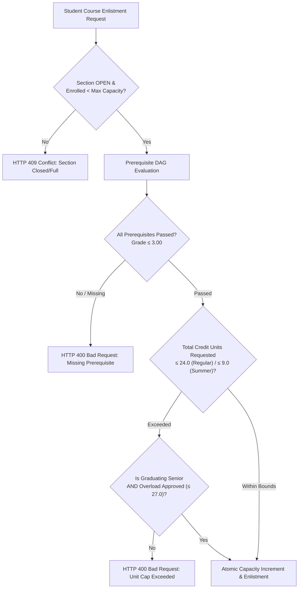

# 02 Enrollment & Registration: Gate 3 Execution Specification

**Parent Specification:** [[02 Curriculum & Enrollment Management]]  
**Standard Compliance:** CHED Memorandum Order (CMO) No. 25, Series of 2015 / RA 10931 (Universal Access to Quality Tertiary Education)  
**Lifecycle Stage:** Phase 3 Operational Enrollment Engine

---

## 1. Overview & Operational Role

The Enrollment & Registration module is the student-facing culmination of the curriculum pipeline. It orchestrates pre-enrollment advising, prerequisite compliance verification, term unit overload governance, section enlistment, and student academic standing tracking.

In the Phase 3 architecture, this module enforces **Gate 3: Student Advising & Prerequisite Engine**.

---

## 2. Gate 3: Technical Specifications & Advising Validation



### 2.1. Prerequisite DAG Traversal Algorithm
Philippine higher education utilizes a 1.00 to 5.00 grading scale where **1.00** is the highest rating, **3.00** is the minimum passing grade, and **5.00** indicates failure. Non-numerical grades (e.g., `INC` for Incomplete, `DRP` for Dropped) do not fulfill prerequisite requirements until transmuted to a passing numerical grade.

**Algorithmic Procedure:**
1. Given target course $C_t$, retrieve all directed prerequisite edges:
   $$\text{Prerequisites}(C_t) = \{ C_p \mid (C_p \rightarrow C_t) \in \text{CoursePrerequisites} \}$$
2. Query the student's historical transcript:
   $$\text{PassedCourses}(S) = \{ C \mid \text{grade} \le 3.00 \land \text{completionStatus} = \text{'PASSED'} \}$$
3. Evaluate prerequisite satisfaction:
   $$\forall C_p \in \text{Prerequisites}(C_t), \quad C_p \in \text{PassedCourses}(S)$$
   If any $C_p \notin \text{PassedCourses}(S)$, advising is immediately blocked with an RFC 7807 `ProblemDetail` containing the unfulfilled prerequisite code and title.

### 2.2. Term Credit Unit Ceilings
* **Regular Semester**: Maximum 24.0 credit units.
* **Summer / Midyear Term**: Maximum 9.0 credit units.
* **Graduating Senior Exception**: Up to 27.0 credit units in a regular semester (or 12.0 in summer) permitted if and only if:
  - `studentProfile.isGraduating == true`
  - `studentEnrollment.isOverloadApproved == true` (formally endorsed by Dean & Registrar)

### 2.3. Concurrency & Atomic Capacity Management
During high-traffic pre-enrollment windows, multiple students may attempt to claim the final open seats in a popular section simultaneously. To eliminate race conditions and over-enrollment anomalies:
* **Conditional JPQL Update**:
  ```java
  @Modifying
  @Query("""
      UPDATE ClassSection s 
      SET s.enrolledCount = s.enrolledCount + 1,
          s.status = CASE WHEN (s.enrolledCount + 1) >= s.maxCapacity THEN 'CLOSED' ELSE s.status END
      WHERE s.id = :sectionId 
        AND s.enrolledCount < s.maxCapacity 
        AND s.status = 'OPEN'
  """)
  int incrementCapacityIfOpen(Long sectionId);
  ```
  If `rowsUpdated == 0`, the section has reached max capacity or closed during transaction execution; an `IllegalStateException` (`HTTP 409 Conflict`) is thrown and rolled back cleanly.

---

## 3. Database Schema Implementation (`V10`)

* `student_profiles`: Master student academic record tracking `student_number`, `user_id`, `program_id`, `curriculum_id`, `year_level`, `enrollment_status` (`REGULAR`, `IRREGULAR`, `PROBATION`, `LOA`, `GRADUATED`), `total_units_earned`, and `cumulative_gpa`.
* `student_enrollments`: Term-level enrollment ledger recording `term_id`, `status` (`DRAFT`, `ENLISTED`, `ASSESSED`, `ENROLLED`, `DROPPED`), `total_credit_units`, and `is_overload_approved`.
* `enrollment_course_items`: Itemized course enlistments recording `section_id`, `final_numerical_grade`, and `completion_status`.

---

## 4. Frontend User Experience (`src/app/features/enrollment/`)

* **Student Advising Portal (`StudentAdvisingComponent`)**:
  - Displays the student's active curriculum checklist grouped by Year and Semester.
  - Dynamically flags courses with eligibility status: `ELIGIBLE` (green), `LOCKED_PREREQUISITE` (red), `ALREADY_PASSED` (gray).
* **Course Enlistment (`CourseEnlistmentComponent`)**:
  - Allows selecting from published `OPEN` sections.
  - Interactive Running Unit Meter displaying real-time credit summation against the 24.0-unit ceiling.
  - Scoped PrimeNG confirmation dialog (`key="enrollmentConfirmDialog"`) for final submission.