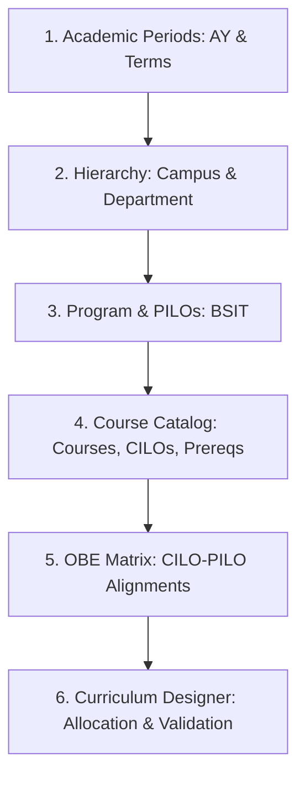
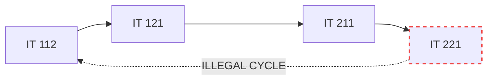

# SDT Institutional Setup & Curriculum Designer Manual Testing Guide
**Reference Standard:** CHED Memorandum Order (CMO) No. 25, Series of 2015 (*Policies, Standards, and Guidelines for the Bachelor of Science in Information Technology — BSIT*)

This document provides a production-grade, sequential manual testing manual for the Student Digital Twin (SDT) system across the Institutional Foundation and Curriculum Designer modules. Every data point conforms strictly to the underlying database schema and CHED academic program standards.

---

## PART 1: Backend Schema & Constraint Reference

Ensure manual entries comply with the following Jakarta Bean Validation and database schema constraints (`V4__phase1_master_setup.sql`, `V5__phase2_curriculum_obe.sql`, and `com.sdt.web_app.dto.institution.*`):

### 1.1 Field Lengths & Validation Constraints
| Entity | Field | Constraint / Pattern | DB Column Type | Max Length | Notes |
| :--- | :--- | :--- | :--- | :--- | :--- |
| **`Campus`** | `code` | `@NotBlank`, `@Size(max=20)` | `VARCHAR(20) UNIQUE` | 20 | Uppercase recommended (e.g., `TALISAY`, `ALIJIS`) |
| | `name` | `@NotBlank`, `@Size(max=100)` | `VARCHAR(100)` | 100 | Full formal campus name |
| | `chedInstitutionalCode` | `@Size(max=20)` | `VARCHAR(20)` | 20 | Optional CHED HEI Code (e.g., `06037`) |
| | `region` | `@Size(max=50)` | `VARCHAR(50)` | 50 | Default: `REGION VI` |
| | `contactNumber` | `@Size(max=30)` | `VARCHAR(30)` | 30 | Landline or mobile format |
| | `email` | `@Email`, `@Size(max=100)` | `VARCHAR(100)` | 100 | Standard email pattern |
| **`Department`** | `code` | `@NotBlank`, `@Size(max=20)` | `VARCHAR(20)` | 20 | Unique per campus: `(campus_id, code)` |
| | `name` | `@NotBlank`, `@Size(max=100)` | `VARCHAR(100)` | 100 | Full department name |
| **`AcademicYear`** | `code` | `@NotBlank`, `@Size(max=20)` | `VARCHAR(20) UNIQUE` | 20 | Recommended format: `AY 2026-2027` |
| | `startDate`, `endDate` | `@NotNull`, `ISO-8601` | `DATE` | 10 | `YYYY-MM-DD` (`endDate > startDate`) |
| **`Program`** | `code` | `@NotBlank` | `VARCHAR(20) UNIQUE` | 20 | Uppercase (e.g., `BSIT`) |
| | `name` | `@NotBlank` | `VARCHAR(150)` | 150 | e.g., `Bachelor of Science in Information Technology` |
| | `totalUnitsRequired` | `@Min(1)` | `INT` | — | CMO 25 s. 2015 benchmark: `146` to `150` |
| **`ProgramOutcome`** | `code` | `@NotBlank` | `VARCHAR(30)` | 30 | Unique per program: `(program_id, code)` |
| | `description` | `@NotBlank` | `TEXT` | — | Full graduate competency statement |
| **`Course`** | `code` | `@NotBlank`, `@Size(max=30)` | `VARCHAR(30) UNIQUE` | 30 | Standard academic code (e.g., `IT 111`) |
| | `title` | `@NotBlank`, `@Size(max=150)` | `VARCHAR(150)` | 150 | Full descriptive course title |
| | `lectureUnits` | `@NotNull`, `@DecimalMin("0.0")` | `DECIMAL(4,2)` | 4 digits, 2 dec | Range: `0.00` to `99.99` |
| | `labUnits` | `@NotNull`, `@DecimalMin("0.0")` | `DECIMAL(4,2)` | 4 digits, 2 dec | Range: `0.00` to `99.99` |
| | `creditUnits` | Derived (`lec + lab`) | `DECIMAL(4,2)` | 4 digits, 2 dec | Evaluated automatically |
| | `contactHoursLec` | `@Min(0)` | `INT` | — | **CHED 1:1 Rule:** `contactHoursLec = lectureUnits * 1` |
| | `contactHoursLab` | `@Min(0)` | `INT` | — | **CHED 1:3 Rule:** `contactHoursLab = labUnits * 3` |
| **`CourseOutcome`** | `code` | `@NotBlank`, `@Size(max=30)` | `VARCHAR(30)` | 30 | Unique per course: `(course_id, code)` |
| | `description` | `@NotBlank` | `TEXT` | — | Measurable learning outcome |
| | `bloomsLevel` | `@NotBlank`, `@Size(max=30)` | `VARCHAR(30)` | 30 | Bloom's taxonomy category |
| **`Curriculum`** | `code` | `@NotBlank`, `@Size(max=30)` | `VARCHAR(30) UNIQUE` | 30 | e.g., `BSIT-2026` |
| | `name` | `@NotBlank`, `@Size(max=150)` | `VARCHAR(150)` | 150 | e.g., `BSIT Curriculum 2026-2030 (CMO 25, s. 2015)` |
| | `effectiveAcademicYear`| `@NotBlank`, `@Size(max=20)` | `VARCHAR(20)` | 20 | e.g., `2026-2027` |

---

### 1.2 Enumerations & Exact Casing Reference
| Enum Type | Allowed Values (Strict Casing) | Frontend Display Label |
| :--- | :--- | :--- |
| `DepartmentType` | `COLLEGE`, `DEPARTMENT`, `ADMINISTRATIVE` | College, Department, Administrative Office |
| `TermType` | `FIRST_SEM` (`1ST_SEM`), `SECOND_SEM` (`2ND_SEM`), `SUMMER` (`SUMMER`) | 1st Semester, 2nd Semester, Summer Term |
| `Curriculum.Status`| `DRAFT`, `UNDER_REVIEW`, `APPROVED`, `ACTIVE`, `ARCHIVED` | Draft, Under Review, Approved, Active, Archived |
| `CurriculumCourse.category` | `GEN_ED`, `PROFESSIONAL_MAJOR`, `ELECTIVE`, `MANDATED` | General Education, Professional Major, Elective, Mandated Course |
| `RuleType` (Prerequisite) | `HARD`, `CO_REQUISITE`, `STANDING` | Hard Prerequisite, Co-Requisite, Year Standing |
| `MappingType` (OBE Matrix)| `I`, `E`, `D` | **I** (Introduced), **E** (Emphasized), **D** (Demonstrated) |
| `Bloom's Taxonomy` | `REMEMBER`, `UNDERSTAND`, `APPLY`, `ANALYZE`, `EVALUATE`, `CREATE` | Bloom's Cognitive Levels 1–6 |

---

## PART 2: Step-by-Step Manual Encoding Guide

Follow this sequential chain to preserve relational integrity across all screens.

---

### STEP 1: Academic Periods
**Navigation:** `http://localhost:4200/dashboard/institution/academic-periods`

#### 1.1 Academic Year
Click **"New Academic Year"** and enter:

| Field | Test Value | Notes |
| :--- | :--- | :--- |
| **Code** | `AY 2026-2027` | Primary operational academic year |
| **Start Date** | `2026-08-10` | Mid-August academic calendar start |
| **End Date** | `2027-07-16` | Academic year completion date |
| **Is Current** | `true` (checked) | Active academic cycle |

#### 1.2 Academic Terms
Under the created Academic Year, click **"Add Term"** for each item:

| Academic Year | Term Type | Start Date | End Date | Status Flags |
| :--- | :--- | :--- | :--- | :--- |
| `AY 2026-2027` | `FIRST_SEM` | `2026-08-10` | `2026-12-18` | Active: Yes, Enrollment: Yes |
| `AY 2026-2027` | `SECOND_SEM` | `2027-01-11` | `2027-05-28` | Active: No, Enrollment: No |
| `AY 2026-2027` | `SUMMER` | `2027-06-07` | `2027-07-16` | Active: No, Enrollment: No |

---

### STEP 2: Organizational Hierarchy
**Navigation:** `http://localhost:4200/dashboard/institution/hierarchy`

#### 2.1 Campus Details
*(If baseline CHMSU campuses are already present, select `ALIJIS` for the IT program).*
Click **"New Campus"** if configuring fresh:

| Field | Test Value |
| :--- | :--- |
| **Code** | `ALIJIS` |
| **Name** | `CHMSU - Alijis Campus` |
| **CHED Code** | `06037` |
| **Region** | `REGION VI` |
| **Address** | `Brgy. Alijis, Bacolod City, Negros Occidental` |
| **Contact Number**| `(034) 434-2194` |
| **Email** | `alijis.campus@chmsu.edu.ph` |
| **Is Main** | `false` (unchecked) |

#### 2.2 Department Details
Under the **Departments** tab, click **"New Department"**:

| Field | Parent College (Root) | Academic Department (Child) |
| :--- | :--- | :--- |
| **Campus** | `ALIJIS` | `ALIJIS` |
| **Code** | `CCS` | `IT_DEPT` |
| **Name** | `College of Computer Studies` | `Department of Information Technology` |
| **Type** | `COLLEGE` | `DEPARTMENT` |
| **Parent Department** | *None* | `College of Computer Studies (CCS)` |

---

### STEP 3: Degree Program & Program Learning Outcomes (PILOs)
**Navigation:** `http://localhost:4200/dashboard/institution/hierarchy` (Programs sub-tab)

#### 3.1 Program Details (BSIT)
Click **"New Program"**:

| Field | Test Value | Notes |
| :--- | :--- | :--- |
| **Department** | `Department of Information Technology` | Parent academic unit |
| **Program Code** | `BSIT` | Master degree code |
| **Program Name** | `Bachelor of Science in Information Technology` | Formal program title |
| **Major** | *None (General)* | Optional specialization |
| **Degree Level** | `UNDERGRADUATE` | Tertiary undergraduate |
| **CMO Reference** | `CHED CMO No. 25, Series of 2015` | Policy anchor |
| **Government Permit** | `BOR Resolution No. 45, s. 2016` | Institutional authority |
| **Total Units Required** | `146` | Full 4-year degree credit unit requirement |

#### 3.2 Program Intended Learning Outcomes (PILOs per CMO 25, s. 2015)
Select `BSIT` in the programs table, open the **"Program Outcomes"** manager, and add:

| Outcome Code | Description                                                                                                             |
| :----------- | :---------------------------------------------------------------------------------------------------------------------- |
| `PILO-a`     | Apply knowledge of computing, science, and mathematics appropriate to the information technology discipline.            |
| `PILO-b`     | Understand best practices and standards and their applications in developing secure and robust IT solutions.            |
| `PILO-c`     | Analyze complex computing problems and define the user and software requirements appropriate to its solution.           |
| `PILO-d`     | Design, implement, and evaluate computer-based systems, processes, components, or programs to meet desired needs.       |
| `PILO-e`     | Integrate IT-based solutions into the user environment effectively and securely.                                        |
| `PILO-f`     | Function effectively on teams to accomplish a common goal with professional, ethical, legal, and social responsibility. |

---

### STEP 4: Master Course Catalog, CILOs & Prerequisites
**Navigation:** `http://localhost:4200/dashboard/institution/courses`

#### 4.1 Master Course List (CHED 1:1 and 1:3 Contact Hour Ratios)
Click **"New Course"** and encode each subject:

| Course Code | Course Title                    | Lec Units | Lab Units | Credit Units | Lec Hours | Lab Hours | Category             |
| :---------- | :------------------------------ | :-------: | :-------: | :----------: | :-------: | :-------: | :------------------- |
| `GE 101`    | Understanding the Self          |  `3.00`   |  `0.00`   |    `3.00`    |    `3`    |    `0`    | `GEN_ED`             |
| `GE 104`    | Mathematics in the Modern World |  `3.00`   |  `0.00`   |    `3.00`    |    `3`    |    `0`    | `GEN_ED`             |
| `GE 105`    | Purposive Communication         |  `3.00`   |  `0.00`   |    `3.00`    |    `3`    |    `0`    | `GEN_ED`             |
| `IT 111`    | Introduction to Computing       |  `2.00`   |  `1.00`   |    `3.00`    |    `2`    |    `3`    | `PROFESSIONAL_MAJOR` |
| `IT 112`    | Computer Programming 1          |  `2.00`   |  `1.00`   |    `3.00`    |    `2`    |    `3`    | `PROFESSIONAL_MAJOR` |
| `IT 121`    | Computer Programming 2          |  `2.00`   |  `1.00`   |    `3.00`    |    `2`    |    `3`    | `PROFESSIONAL_MAJOR` |
| `IT 122`    | Discrete Mathematics for IT     |  `3.00`   |  `0.00`   |    `3.00`    |    `3`    |    `0`    | `PROFESSIONAL_MAJOR` |
| `IT 211`    | Data Structures and Algorithms  |  `2.00`   |  `1.00`   |    `3.00`    |    `2`    |    `3`    | `PROFESSIONAL_MAJOR` |
| `IT 212`    | Object-Oriented Programming     |  `2.00`   |  `1.00`   |    `3.00`    |    `2`    |    `3`    | `PROFESSIONAL_MAJOR` |
| `IT 221`    | Information Management          |  `2.00`   |  `1.00`   |    `3.00`    |    `2`    |    `3`    | `PROFESSIONAL_MAJOR` |

> [!NOTE]
> Every lecture unit corresponds to 1 hour/week (`contactHoursLec = lectureUnits * 1`) and every laboratory unit corresponds to 3 hours/week (`contactHoursLab = labUnits * 3`). This complies with CHED rules and ensures zero `CHED_CONTACT_HOUR_CONVERSION_ANOMALY` diagnostic warnings during validation audits.

#### 4.2 Course Learning Outcomes (CILOs)
Select the target course from the table and open the **"Outcomes"** tab:

**For `IT 111` (Introduction to Computing):**
| CILO Code | Bloom's Level | Description |
| :--- | :--- | :--- |
| `IT111-CILO1` | `UNDERSTAND` | Explain fundamental concepts of hardware, software, network architectures, and information security. |
| `IT111-CILO2` | `APPLY` | Demonstrate basic command-line navigation and directory management across multiple operating systems. |

**For `IT 112` (Computer Programming 1):**
| CILO Code | Bloom's Level | Description |
| :--- | :--- | :--- |
| `IT112-CILO1` | `ANALYZE` | Analyze algorithmic logic using structured pseudocode and flowcharts for computational problems. |
| `IT112-CILO2` | `CREATE` | Develop, debug, and execute modular computer programs using primitive data types and control structures. |

**For `IT 121` (Computer Programming 2):**
| CILO Code | Bloom's Level | Description |
| :--- | :--- | :--- |
| `IT121-CILO1` | `APPLY` | Implement array data handling and file input/output streams in structured program solutions. |
| `IT121-CILO2` | `CREATE` | Build robust software applications using dynamic memory allocation and recursive functions. |

#### 4.3 Prerequisite Rules (Valid DAG)
Navigate to the **"Prerequisites"** tab for each target course:
| Target Course | Prerequisite Course | Rule Type | Min Grade | Notes |
| :--- | :--- | :--- | :--- | :--- |
| `IT 121` | `IT 112` | `HARD` | `3.00` | Prereq for Intermediate Programming |
| `IT 122` | `GE 104` | `HARD` | `3.00` | Prereq for Discrete Math |
| `IT 211` | `IT 121` | `HARD` | `3.00` | Prereq for Data Structures |
| `IT 212` | `IT 121` | `HARD` | `3.00` | Prereq for OOP |
| `IT 221` | `IT 211` | `HARD` | `3.00` | Prereq for Database Management |

---

### STEP 5: Outcome Alignment Matrix (CILO-PILO)
**Navigation:** `http://localhost:4200/dashboard/institution/cilo-pilo-matrix`

1. Select **Degree Program**: `BSIT - Bachelor of Science in Information Technology`.
2. Select **Target Course**: `IT 111` or `IT 112`.
3. Click matrix cells to cycle values (**I** $\rightarrow$ **E** $\rightarrow$ **D** $\rightarrow$ Clear):

#### Constructive Alignment Mapping Grid:
| Course | CILO Code | PILO-a | PILO-b | PILO-c | PILO-d | PILO-e | PILO-f |
| :--- | :--- | :---: | :---: | :---: | :---: | :---: | :---: |
| **`IT 111`** | `IT111-CILO1` | **I** | — | — | — | — | — |
| **`IT 111`** | `IT111-CILO2` | — | — | **I** | — | — | — |
| **`IT 112`** | `IT112-CILO1` | **I** | — | **E** | — | — | — |
| **`IT 112`** | `IT112-CILO2` | — | — | — | **E** | **E** | — |
| **`IT 121`** | `IT121-CILO1` | — | — | **E** | **E** | — | — |
| **`IT 121`** | `IT121-CILO2` | — | **E** | — | **D** | **E** | — |

4. Refresh the page to verify that all cells retain their values.

---

### STEP 6: Curriculum Designer & Term Grid
**Navigation:** `http://localhost:4200/dashboard/curriculum/designer`

#### 6.1 Create New Curriculum Revision
Click **"New Curriculum"** from the header:
| Field | Test Value |
| :--- | :--- |
| **Program** | `BSIT - Bachelor of Science in Information Technology` |
| **Curriculum Code** | `BSIT-2026` |
| **Curriculum Name** | `BSIT Curriculum 2026-2030 (CMO 25, s. 2015)` |
| **Effective Academic Year** | `2026-2027` |

#### 6.2 Allocate Catalog Courses to Terms
Open the **"Course Catalog"** drawer and assign each subject:
| Term Block | Course Code | Units | Load (hrs/wk) | Category | Expected Term Subtotal |
| :--- | :--- | :---: | :---: | :--- | :--- |
| **Year 1, 1st Sem** | `GE 101` | 3.00 | 3 | `GEN_ED` | |
| | `GE 104` | 3.00 | 3 | `GEN_ED` | |
| | `IT 111` | 3.00 | 5 | `PROFESSIONAL_MAJOR` | |
| | `IT 112` | 3.00 | 5 | `PROFESSIONAL_MAJOR` | **12.00 Units · 16 hrs/wk** *(Safe)* |
| **Year 1, 2nd Sem** | `GE 105` | 3.00 | 3 | `GEN_ED` | |
| | `IT 121` | 3.00 | 5 | `PROFESSIONAL_MAJOR` | |
| | `IT 122` | 3.00 | 3 | `PROFESSIONAL_MAJOR` | **9.00 Units · 11 hrs/wk** *(Safe)* |
| **Year 2, 1st Sem** | `IT 211` | 3.00 | 5 | `PROFESSIONAL_MAJOR` | |
| | `IT 212` | 3.00 | 5 | `PROFESSIONAL_MAJOR` | **6.00 Units · 10 hrs/wk** *(Safe)* |
| **Year 2, 2nd Sem** | `IT 221` | 3.00 | 5 | `PROFESSIONAL_MAJOR` | **3.00 Units · 5 hrs/wk** *(Safe)* |

#### 6.3 Verify DAG Visualizer
1. Switch to the **"Prerequisite DAG Visualizer"** tab.
2. Confirm the graph renders nodes for all 10 allocated courses.
3. Verify directed edges:
   - `IT 112` $\rightarrow$ `IT 121` $\rightarrow$ `IT 211` $\rightarrow$ `IT 221`
   - `IT 121` $\rightarrow$ `IT 212`
   - `GE 104` $\rightarrow$ `IT 122`

---

## PART 3: Edge-Case & Negative Testing Suite

Execute these test scenarios to confirm that validation barriers, error banners, and rollback mechanisms function as specified.

### Test 1: Duplicate Code Rejection
| Action | Test Payload | Expected Outcome |
| :--- | :--- | :--- |
| Create Course | Code: `IT 111`, Title: `Duplicate Course Test` | **Toast/Error Modal:** `Course with code already exists: IT 111` (HTTP 400). Form remains open. |
| Create Curriculum | Code: `BSIT-2026`, Name: `Duplicate Curriculum` | **Toast/Error Modal:** `Curriculum code already exists: BSIT-2026` (HTTP 400). |
| Create Program | Code: `BSIT`, Name: `Duplicate BSIT Program` | **Toast/Error Modal:** `Program with code already exists: BSIT` (HTTP 400). |

---

### Test 2: Relational Integrity Violations
| Action | Test Payload | Expected Outcome |
| :--- | :--- | :--- |
| Create Department without Campus | Submit form with empty Campus dropdown | Form submission disabled or rejected with *"Campus ID is required"*. |
| Create Curriculum without Program | Submit modal without selecting a Program | Submit button disabled or rejected with *"Program ID is required"*. |
| Delete Course with Active Prerequisite | Attempt to delete `IT 112` from the Course Catalog | **Error Toast:** `Cannot delete course referenced in prerequisite rules` (HTTP 409). Record is preserved. |

---

### Test 3: Cyclic Prerequisite Dependency Detection
*A directed acyclic graph cannot have feedback loops.*

1. Navigate to the **"Prerequisite DAG Visualizer"** tab in Curriculum Designer.
2. Click **"Add Prerequisite Edge"**.
3. Select:
   - **Target Subject:** `IT 112 - Computer Programming 1`
   - **Prerequisite Subject:** `IT 221 - Information Management`
   - **Rule Type:** `HARD`
4. Click **"Save Dependency"**.

**Expected Result:**
- **Backend Response:** HTTP 409 / 500 with message:
  > *"Prerequisite insertion rejected. It introduces a circular dependency."*
- **UI State:** PrimeNG error toast appears. The invalid edge is not drawn on the Cytoscape graph.

---

### Test 4: Self-Referential Validation Rejection
1. In the **"Add Prerequisite Edge"** dialog, select:
   - **Target Subject:** `IT 111 - Introduction to Computing`
   - **Prerequisite Subject:** `IT 111 - Introduction to Computing`

**Expected Result:**
- Inline warning banner appears:
  > *⚠️ A subject cannot be a prerequisite of itself.*
- The **"Save Dependency"** button is automatically disabled.

---

### Test 5: Department Cyclic Self-Parenting
1. Navigate to `http://localhost:4200/dashboard/institution/hierarchy`.
2. Edit `Department of Information Technology` (`IT_DEPT`).
3. Set **Parent Department** to `Department of Information Technology` (`IT_DEPT`).
4. Click **"Save Changes"**.

**Expected Result:**
- **Error Response:** `A department cannot be its own parent` (HTTP 400).
- Department hierarchy remains unchanged.

---

### Test 6: Dynamic CHED Overload Badges (>24 Units / >30 Contact Hours)
1. On the **Year / Semester Board**, drag 6 additional courses into **Year 1, 1st Semester** so the term total exceeds 24 units and 30 contact hours.

**Expected Result:**
- The semester column header dynamically updates:
  - Unit badge turns **red** (`p-tag severity="danger"`).
  - Red warning badge appears: `⚠️ Overload (>24u)`.
  - Clock badge appears: `🕒 >30 hrs/wk`.
- Clicking **"Validate Curriculum"** in the top toolbar lists diagnostic warnings:
  - `SEMESTER_UNIT_OVERLOAD`
  - `CONTACT_HOUR_OVERLOAD`
- The curriculum status cannot be transitioned to `APPROVED` or `ACTIVE` until these discrepancies are resolved.
