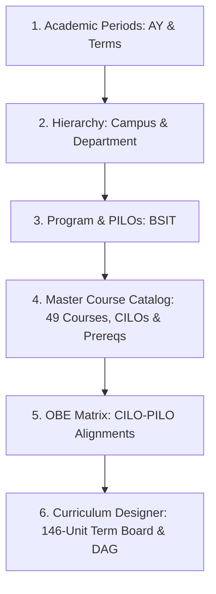
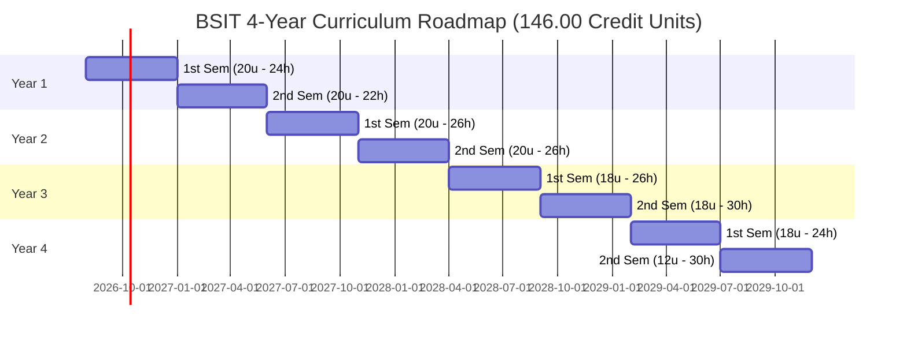
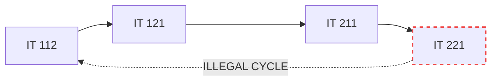

# SDT Institutional Setup & Curriculum Designer Manual Testing Guide
**Reference Standard:** CHED Memorandum Order (CMO) No. 25, Series of 2015 (*Policies, Standards, and Guidelines for the Bachelor of Science in Information Technology — BSIT*)

This document provides a production-grade, sequential manual testing manual for the Student Digital Twin (SDT) system across the Institutional Foundation and Curriculum Designer modules. Every data point conforms strictly to the underlying database schema and CHED academic program standards, fully establishing the complete 4-year curriculum totaling **146.00 Credit Units**.

---

## PART 1: Backend Schema & Constraint Reference

Ensure manual entries comply with the following Jakarta Bean Validation and database schema constraints (`V4__phase1_master_setup.sql`, `V5__phase2_curriculum_obe.sql`, and `com.sdt.web_app.dto.institution.*`):

### 1.1 Field Lengths & Validation Constraints
| Entity | Field | Constraint / Pattern | DB Column Type | Max Length | Notes |
| :--- | :--- | :--- | :--- | :--- | :--- |
| **`Campus`** | `code` | `@NotBlank`, `@Size(max=20)` | `VARCHAR(20) UNIQUE` | 20 | Uppercase recommended (e.g., `TALISAY`, `ALIJIS`) |
| | `name` | `@NotBlank`, `@Size(max=100)` | `VARCHAR(100)` | 100 | Full formal campus name |
| | `chedInstitutionalCode` | `@Size(max=20)` | `VARCHAR(20)` | 20 | Optional CHED HEI Code (e.g., `06037`) |
| | `region` | `@Size(max=50)` | `VARCHAR(50)` | 50 | Default: `REGION VI` |
| | `contactNumber` | `@Size(max=30)` | `VARCHAR(30)` | 30 | Landline or mobile format |
| | `email` | `@Email`, `@Size(max=100)` | `VARCHAR(100)` | 100 | Standard email pattern |
| **`Department`** | `code` | `@NotBlank`, `@Size(max=20)` | `VARCHAR(20)` | 20 | Unique per campus: `(campus_id, code)` |
| | `name` | `@NotBlank`, `@Size(max=100)` | `VARCHAR(100)` | 100 | Full department name |
| **`AcademicYear`** | `code` | `@NotBlank`, `@Size(max=20)` | `VARCHAR(20) UNIQUE` | 20 | Recommended format: `AY 2026-2027` |
| | `startDate`, `endDate` | `@NotNull`, `ISO-8601` | `DATE` | 10 | `YYYY-MM-DD` (`endDate > startDate`) |
| **`Program`** | `code` | `@NotBlank` | `VARCHAR(20) UNIQUE` | 20 | Uppercase (e.g., `BSIT`) |
| | `name` | `@NotBlank` | `VARCHAR(150)` | 150 | e.g., `Bachelor of Science in Information Technology` |
| | `totalUnitsRequired` | `@Min(1)` | `INT` | — | CMO 25 s. 2015 benchmark: `146` units minimum |
| **`ProgramOutcome`** | `code` | `@NotBlank` | `VARCHAR(30)` | 30 | Unique per program: `(program_id, code)` |
| | `description` | `@NotBlank` | `TEXT` | — | Full graduate competency statement |
| **`Course`** | `code` | `@NotBlank`, `@Size(max=30)` | `VARCHAR(30) UNIQUE` | 30 | Standard academic code (e.g., `IT 111`) |
| | `title` | `@NotBlank`, `@Size(max=150)` | `VARCHAR(150)` | 150 | Full descriptive course title |
| | `lectureUnits` | `@NotNull`, `@DecimalMin("0.0")` | `DECIMAL(4,2)` | 4 digits, 2 dec | Range: `0.00` to `99.99` |
| | `labUnits` | `@NotNull`, `@DecimalMin("0.0")` | `DECIMAL(4,2)` | 4 digits, 2 dec | Range: `0.00` to `99.99` |
| | `creditUnits` | Derived (`lec + lab`) | `DECIMAL(4,2)` | 4 digits, 2 dec | Evaluated automatically |
| | `contactHoursLec` | `@Min(0)` | `INT` | — | **CHED 1:1 Rule:** `contactHoursLec = lectureUnits * 1` |
| | `contactHoursLab` | `@Min(0)` | `INT` | — | **CHED 1:3 Rule:** `contactHoursLab = labUnits * 3` |
| **`CourseOutcome`** | `code` | `@NotBlank`, `@Size(max=30)` | `VARCHAR(30)` | 30 | Unique per course: `(course_id, code)` |
| | `description` | `@NotBlank` | `TEXT` | — | Measurable learning outcome |
| | `bloomsLevel` | `@NotBlank`, `@Size(max=30)` | `VARCHAR(30)` | 30 | Bloom's taxonomy category |
| **`Curriculum`** | `code` | `@NotBlank`, `@Size(max=30)` | `VARCHAR(30) UNIQUE` | 30 | e.g., `BSIT-2026` |
| | `name` | `@NotBlank`, `@Size(max=150)` | `VARCHAR(150)` | 150 | e.g., `BSIT Curriculum 2026-2030 (CMO 25, s. 2015)` |
| | `effectiveAcademicYear`| `@NotBlank`, `@Size(max=20)` | `VARCHAR(20)` | 20 | e.g., `2026-2027` |

---

### 1.2 Enumerations & Exact Casing Reference
| Enum Type | Allowed Values (Strict Casing) | Frontend Display Label |
| :--- | :--- | :--- |
| `DepartmentType` | `COLLEGE`, `DEPARTMENT`, `ADMINISTRATIVE` | College, Department, Administrative Office |
| `TermType` | `FIRST_SEM` (`1ST_SEM`), `SECOND_SEM` (`2ND_SEM`), `SUMMER` (`SUMMER`) | 1st Semester, 2nd Semester, Summer Term |
| `Curriculum.Status`| `DRAFT`, `UNDER_REVIEW`, `APPROVED`, `ACTIVE`, `ARCHIVED` | Draft, Under Review, Approved, Active, Archived |
| `CurriculumCourse.category` | `GEN_ED`, `PROFESSIONAL_MAJOR`, `ELECTIVE`, `MANDATED` | General Education, Professional Major, Elective, Mandated Course |
| `RuleType` (Prerequisite) | `HARD`, `CO_REQUISITE`, `STANDING` | Hard Prerequisite, Co-Requisite, Year Standing |
| `MappingType` (OBE Matrix)| `I`, `E`, `D` | **I** (Introduced), **E** (Emphasized), **D** (Demonstrated) |
| `Bloom's Taxonomy` | `REMEMBER`, `UNDERSTAND`, `APPLY`, `ANALYZE`, `EVALUATE`, `CREATE` | Bloom's Cognitive Levels 1–6 |

---

### 1.3 CHED CMO No. 25, Series of 2015 Curricular Distribution
| Curricular Classification | Minimum Units (CHED) | Documented Dataset Units | Course Count |
| :--- | :---: | :---: | :---: |
| **General Education (GE) Core & Electives** | 36 Units | 36.00 Units | 12 Courses |
| **Common Computing Core (CC)** | 18 Units | 18.00 Units | 6 Courses |
| **IT Professional Core Courses** | 51 Units | 54.00 Units | 18 Courses |
| **Professional Electives (Track/Specialization)** | 12 Units | 12.00 Units | 4 Courses |
| **Capstone Project (1 & 2)** | 6 Units | 6.00 Units | 2 Courses |
| **Practicum / Industry Internship (486-500 hrs)** | 6 Units | 6.00 Units | 1 Course |
| **Physical Education (PE 1 to PE 4)** | 8 Units | 8.00 Units | 4 Courses |
| **National Service Training Program (NSTP 1 & 2)** | 6 Units | 6.00 Units | 2 Courses |
| **GRAND TOTAL** | **146 Units** | **146.00 Units** | **49 Courses** |

---

## PART 2: Step-by-Step Manual Encoding Guide

Follow this sequential dependency flow to ensure relational integrity across all screens:

---

### STEP 1: Academic Periods
**Navigation:** `http://localhost:4200/dashboard/institution/academic-periods`

#### 1.1 Academic Year
Click **"New Academic Year"** and enter:

| Field | Test Value | Notes |
| :--- | :--- | :--- |
| **Code** | `AY 2026-2027` | Primary operational academic year |
| **Start Date** | `2026-08-10` | Mid-August academic calendar start |
| **End Date** | `2027-07-16` | Academic year completion date |
| **Is Current** | `true` (checked) | Active academic cycle |

#### 1.2 Academic Terms
Under the created Academic Year, click **"Add Term"** for each item:

| Academic Year | Term Type | Start Date | End Date | Status Flags |
| :--- | :--- | :--- | :--- | :--- |
| `AY 2026-2027` | `FIRST_SEM` | `2026-08-10` | `2026-12-18` | Active: Yes, Enrollment: Yes |
| `AY 2026-2027` | `SECOND_SEM` | `2027-01-11` | `2027-05-28` | Active: No, Enrollment: No |
| `AY 2026-2027` | `SUMMER` | `2027-06-07` | `2027-07-16` | Active: No, Enrollment: No |

---

### STEP 2: Organizational Hierarchy
**Navigation:** `http://localhost:4200/dashboard/institution/hierarchy`

#### 2.1 Campus Details
Click **"New Campus"** (or verify `ALIJIS`):

| Field | Test Value |
| :--- | :--- |
| **Code** | `ALIJIS` |
| **Name** | `CHMSU - Alijis Campus` |
| **CHED Code** | `06037` |
| **Region** | `REGION VI` |
| **Address** | `Brgy. Alijis, Bacolod City, Negros Occidental` |
| **Contact Number**| `(034) 434-2194` |
| **Email** | `alijis.campus@chmsu.edu.ph` |
| **Is Main** | `false` (unchecked) |

#### 2.2 Department Details
Under the **Departments** tab, click **"New Department"**:

| Field | Parent College (Root) | Academic Department (Child) |
| :--- | :--- | :--- |
| **Campus** | `ALIJIS` | `ALIJIS` |
| **Code** | `CCS` | `IT_DEPT` |
| **Name** | `College of Computer Studies` | `Department of Information Technology` |
| **Type** | `COLLEGE` | `DEPARTMENT` |
| **Parent Department** | *None* | `College of Computer Studies (CCS)` |

---

### STEP 3: Degree Program & Program Learning Outcomes (PILOs)
**Navigation:** `http://localhost:4200/dashboard/institution/hierarchy` (Programs sub-tab)

#### 3.1 Program Details (BSIT)
Click **"New Program"**:

| Field | Test Value | Notes |
| :--- | :--- | :--- |
| **Department** | `Department of Information Technology` | Parent academic unit |
| **Program Code** | `BSIT` | Master degree code |
| **Program Name** | `Bachelor of Science in Information Technology` | Formal program title |
| **Major** | *None (General)* | Enterprise Systems & Cloud Track |
| **Degree Level** | `UNDERGRADUATE` | Tertiary undergraduate |
| **CMO Reference** | `CHED CMO No. 25, Series of 2015` | Policy anchor |
| **Government Permit** | `BOR Resolution No. 45, s. 2016` | Institutional authority |
| **Total Units Required** | `146` | Full 4-year degree credit unit requirement |

#### 3.2 Program Intended Learning Outcomes (PILOs per CMO 25, s. 2015)
Select `BSIT` in the programs table, open the **"Program Outcomes"** manager, and add:

| Outcome Code | Description |
| :--- | :--- |
| `PILO-a` | Apply knowledge of computing, science, and mathematics appropriate to the information technology discipline. |
| `PILO-b` | Understand best practices and standards and their applications in developing secure and robust IT solutions. |
| `PILO-c` | Analyze complex computing problems and define the user and software requirements appropriate to its solution. |
| `PILO-d` | Design, implement, and evaluate computer-based systems, processes, components, or programs to meet desired needs. |
| `PILO-e` | Integrate IT-based solutions into the user environment effectively and securely. |
| `PILO-f` | Function effectively on teams to accomplish a common goal with professional, ethical, legal, and social responsibility. |

---

### STEP 4: Master Course Catalog, CILOs & Prerequisites
**Navigation:** `http://localhost:4200/dashboard/institution/courses`

#### 4.1 Master Course Catalog (Complete 49 Courses — 146.00 Credit Units)
Encode each of the 49 courses. All contact hours conform strictly to the CHED 1:1 (`contactHoursLec = lectureUnits * 1`) and 1:3 (`contactHoursLab = labUnits * 3`) rules:

| # | Course Code | Course Title | Lec Units | Lab Units | Credit Units | Lec Hours | Lab Hours | Category |
| :-: | :--- | :--- | :---: | :---: | :---: | :---: | :---: | :--- |
| 1 | `GE 101` | Understanding the Self | `3.00` | `0.00` | `3.00` | `3` | `0` | `GEN_ED` |
| 2 | `GE 102` | Readings in Philippine History | `3.00` | `0.00` | `3.00` | `3` | `0` | `GEN_ED` |
| 3 | `GE 103` | The Contemporary World | `3.00` | `0.00` | `3.00` | `3` | `0` | `GEN_ED` |
| 4 | `GE 104` | Mathematics in the Modern World | `3.00` | `0.00` | `3.00` | `3` | `0` | `GEN_ED` |
| 5 | `GE 105` | Purposive Communication | `3.00` | `0.00` | `3.00` | `3` | `0` | `GEN_ED` |
| 6 | `GE 106` | Art Appreciation | `3.00` | `0.00` | `3.00` | `3` | `0` | `GEN_ED` |
| 7 | `GE 107` | Science, Technology, and Society | `3.00` | `0.00` | `3.00` | `3` | `0` | `GEN_ED` |
| 8 | `GE 108` | Ethics | `3.00` | `0.00` | `3.00` | `3` | `0` | `GEN_ED` |
| 9 | `GE 109` | Life and Works of Rizal | `3.00` | `0.00` | `3.00` | `3` | `0` | `GEN_ED` |
| 10 | `GE-ELEC 1` | Environmental Science | `3.00` | `0.00` | `3.00` | `3` | `0` | `GEN_ED` |
| 11 | `GE-ELEC 2` | Gender and Society | `3.00` | `0.00` | `3.00` | `3` | `0` | `GEN_ED` |
| 12 | `GE-ELEC 3` | Philippine Popular Culture | `3.00` | `0.00` | `3.00` | `3` | `0` | `GEN_ED` |
| 13 | `PE 1` | Movement Competency | `2.00` | `0.00` | `2.00` | `2` | `0` | `MANDATED` |
| 14 | `PE 2` | Fitness and Exercise | `2.00` | `0.00` | `2.00` | `2` | `0` | `MANDATED` |
| 15 | `PE 3` | Physical Activities in Dance and Sports | `2.00` | `0.00` | `2.00` | `2` | `0` | `MANDATED` |
| 16 | `PE 4` | Recreational and Outdoor Activities | `2.00` | `0.00` | `2.00` | `2` | `0` | `MANDATED` |
| 17 | `NSTP 1` | National Service Training Program 1 | `3.00` | `0.00` | `3.00` | `3` | `0` | `MANDATED` |
| 18 | `NSTP 2` | National Service Training Program 2 | `3.00` | `0.00` | `3.00` | `3` | `0` | `MANDATED` |
| 19 | `IT 111` | Introduction to Computing | `2.00` | `1.00` | `3.00` | `2` | `3` | `PROFESSIONAL_MAJOR` |
| 20 | `IT 112` | Computer Programming 1 | `2.00` | `1.00` | `3.00` | `2` | `3` | `PROFESSIONAL_MAJOR` |
| 21 | `IT 121` | Computer Programming 2 | `2.00` | `1.00` | `3.00` | `2` | `3` | `PROFESSIONAL_MAJOR` |
| 22 | `IT 122` | Discrete Mathematics for IT | `3.00` | `0.00` | `3.00` | `3` | `0` | `PROFESSIONAL_MAJOR` |
| 23 | `IT 211` | Data Structures and Algorithms | `2.00` | `1.00` | `3.00` | `2` | `3` | `PROFESSIONAL_MAJOR` |
| 24 | `IT 212` | Object-Oriented Programming | `2.00` | `1.00` | `3.00` | `2` | `3` | `PROFESSIONAL_MAJOR` |
| 25 | `IT 213` | Platform Technologies | `2.00` | `1.00` | `3.00` | `2` | `3` | `PROFESSIONAL_MAJOR` |
| 26 | `IT 221` | Information Management | `2.00` | `1.00` | `3.00` | `2` | `3` | `PROFESSIONAL_MAJOR` |
| 27 | `IT 222` | Networking 1 (Fundamentals of Networking) | `2.00` | `1.00` | `3.00` | `2` | `3` | `PROFESSIONAL_MAJOR` |
| 28 | `IT 223` | Quantitative Methods | `3.00` | `0.00` | `3.00` | `3` | `0` | `PROFESSIONAL_MAJOR` |
| 29 | `IT 224` | Web Systems and Technologies 1 | `2.00` | `1.00` | `3.00` | `2` | `3` | `PROFESSIONAL_MAJOR` |
| 30 | `IT 311` | Networking 2 (Advanced Routing & Switching) | `2.00` | `1.00` | `3.00` | `2` | `3` | `PROFESSIONAL_MAJOR` |
| 31 | `IT 312` | Systems Analysis and Design | `3.00` | `0.00` | `3.00` | `3` | `0` | `PROFESSIONAL_MAJOR` |
| 32 | `IT 313` | Advanced Database Systems | `2.00` | `1.00` | `3.00` | `2` | `3` | `PROFESSIONAL_MAJOR` |
| 33 | `IT 314` | Systems Integration and Architecture 1 | `2.00` | `1.00` | `3.00` | `2` | `3` | `PROFESSIONAL_MAJOR` |
| 34 | `IT 315` | Information Assurance and Security 1 | `2.00` | `1.00` | `3.00` | `2` | `3` | `PROFESSIONAL_MAJOR` |
| 35 | `IT 321` | Information Assurance and Security 2 | `2.00` | `1.00` | `3.00` | `2` | `3` | `PROFESSIONAL_MAJOR` |
| 36 | `IT 322` | Integrative Programming and Technologies | `2.00` | `1.00` | `3.00` | `2` | `3` | `PROFESSIONAL_MAJOR` |
| 37 | `IT 323` | Applications Development and Emerging Tech | `2.00` | `1.00` | `3.00` | `2` | `3` | `PROFESSIONAL_MAJOR` |
| 38 | `IT 324` | Systems Integration and Architecture 2 | `2.00` | `1.00` | `3.00` | `2` | `3` | `PROFESSIONAL_MAJOR` |
| 39 | `IT 325` | Human-Computer Interaction | `2.00` | `1.00` | `3.00` | `2` | `3` | `PROFESSIONAL_MAJOR` |
| 40 | `IT-ELEC 1` | Cloud Computing Fundamentals | `2.00` | `1.00` | `3.00` | `2` | `3` | `ELECTIVE` |
| 41 | `IT 411` | Social and Professional Issues in IT | `3.00` | `0.00` | `3.00` | `3` | `0` | `PROFESSIONAL_MAJOR` |
| 42 | `IT 412` | Systems Administration and Maintenance | `2.00` | `1.00` | `3.00` | `2` | `3` | `PROFESSIONAL_MAJOR` |
| 43 | `IT 413` | Capstone Project 1 | `3.00` | `0.00` | `3.00` | `3` | `0` | `PROFESSIONAL_MAJOR` |
| 44 | `IT 414` | IT Project Management | `3.00` | `0.00` | `3.00` | `3` | `0` | `PROFESSIONAL_MAJOR` |
| 45 | `IT-ELEC 2` | Mobile Application Development | `2.00` | `1.00` | `3.00` | `2` | `3` | `ELECTIVE` |
| 46 | `IT-ELEC 3` | Enterprise Architecture & Cloud Deployment | `2.00` | `1.00` | `3.00` | `2` | `3` | `ELECTIVE` |
| 47 | `IT 421` | Capstone Project 2 | `1.00` | `2.00` | `3.00` | `1` | `6` | `PROFESSIONAL_MAJOR` |
| 48 | `IT 422` | Practicum / Industry Internship | `0.00` | `6.00` | `6.00` | `0` | `18` | `PROFESSIONAL_MAJOR` |
| 49 | `IT-ELEC 4` | Full-Stack Web Development & Microservices | `2.00` | `1.00` | `3.00` | `2` | `3` | `ELECTIVE` |

---

#### 4.2 Key Course Learning Outcomes (CILOs)
Select each course from the Course Catalog and open the **"Outcomes"** tab:

| Course Code | CILO Code | Bloom's Level | Measurable Learning Outcome Statement |
| :--- | :--- | :--- | :--- |
| **`IT 111`** | `IT111-CILO1` | `UNDERSTAND` | Explain fundamental concepts of hardware, software, network architectures, and information security. |
| | `IT111-CILO2` | `APPLY` | Demonstrate basic command-line navigation and directory management across multiple operating systems. |
| **`IT 112`** | `IT112-CILO1` | `ANALYZE` | Analyze algorithmic logic using structured pseudocode and flowcharts for computational problems. |
| | `IT112-CILO2` | `CREATE` | Develop, debug, and execute modular computer programs using primitive data types and control structures. |
| **`IT 121`** | `IT121-CILO1` | `APPLY` | Implement array data handling and file input/output streams in structured program solutions. |
| | `IT121-CILO2` | `CREATE` | Build robust software applications using dynamic memory allocation and recursive functions. |
| **`IT 211`** | `IT211-CILO1` | `ANALYZE` | Compare time and space computational complexity across searching, sorting, and tree traversal algorithms. |
| | `IT211-CILO2` | `APPLY` | Implement linked lists, stacks, queues, hash tables, and graphs in solving real-world engineering problems. |
| **`IT 221`** | `IT221-CILO1` | `CREATE` | Design normalized relational database schemas meeting Boyce-Codd Normal Form (BCNF) specifications. |
| | `IT221-CILO2` | `APPLY` | Construct optimized transactional SQL queries, stored procedures, and triggers ensuring ACID compliance. |
| **`IT 311`** | `IT311-CILO1` | `EVALUATE` | Diagnose and troubleshoot complex multi-area OSPF routing and VLAN trunking configurations. |
| | `IT311-CILO2` | `CREATE` | Configure enterprise-grade access control lists (ACLs) and Network Address Translation (NAT) policies. |
| **`IT 312`** | `IT312-CILO1` | `ANALYZE` | Synthesize business requirements into functional use case specifications and UML activity diagrams. |
| | `IT312-CILO2` | `CREATE` | Formulate comprehensive system architecture documentation following Agile Scrum sprint methodologies. |
| **`IT 315`** | `IT315-CILO1` | `UNDERSTAND` | Assess enterprise vulnerability vectors against CIA triad standards and ISO/IEC 27001 security controls. |
| | `IT315-CILO2` | `APPLY` | Execute penetration testing techniques and implement symmetric and asymmetric cryptographic protocols. |
| **`IT 413`** | `IT413-CILO1` | `ANALYZE` | Formulate a rigorous technical feasibility proposal and design specification for an enterprise IT solution. |
| | `IT413-CILO2` | `CREATE` | Defend a prototype architecture before an academic panel, validating alignment with industry standards. |
| **`IT 421`** | `IT421-CILO1` | `CREATE` | Deploy a production-ready, validated software system featuring CI/CD automated deployment pipelines. |
| | `IT421-CILO2` | `EVALUATE` | Perform automated load testing, code coverage audits, and user acceptance testing (UAT) with clients. |
| **`IT 422`** | `IT422-CILO1` | `APPLY` | Complete 486-500 hours of immersion in an IT industry workplace adhering to professional ethical standards. |
| | `IT422-CILO2` | `EVALUATE` | Document industry workflows, technical contributions, and problem-solving retrospectives in a portfolio. |

---

#### 4.3 Prerequisite Dependency Rules (Strict Directed Acyclic Graph — DAG)
Under each target course, open the **"Prerequisites"** tab and encode the dependency. Every rule points from an earlier semester to a later semester, ensuring **zero circular dependencies**:

| Target Course | Prerequisite Course | Rule Type | Min Grade | Rationale / Dependency Description |
| :--- | :--- | :---: | :---: | :--- |
| `PE 2` | `PE 1` | `HARD` | `3.00` | Movement competency required before exercise fitness |
| `PE 3` | `PE 2` | `HARD` | `3.00` | Sequential physical education progression |
| `PE 4` | `PE 3` | `HARD` | `3.00` | Sequential physical education progression |
| `NSTP 2` | `NSTP 1` | `HARD` | `3.00` | Community immersion requires classroom orientation |
| `IT 121` | `IT 112` | `HARD` | `3.00` | Intermediate Programming requires Foundations 1 |
| `IT 122` | `GE 104` | `HARD` | `3.00` | Discrete Math requires Modern World Mathematics |
| `IT 211` | `IT 121` | `HARD` | `3.00` | Data Structures requires Intermediate Programming |
| `IT 212` | `IT 121` | `HARD` | `3.00` | Object-Oriented Programming requires Prog 2 |
| `IT 213` | `IT 111` | `HARD` | `3.00` | Platform Technologies requires Computing Intro |
| `IT 221` | `IT 211` | `HARD` | `3.00` | Database Management requires Data Structures |
| `IT 222` | `IT 213` | `HARD` | `3.00` | Networking Fundamentals requires Platform Tech |
| `IT 223` | `IT 122` | `HARD` | `3.00` | Quantitative Methods requires Discrete Math |
| `IT 224` | `IT 212` | `HARD` | `3.00` | Web Systems 1 requires OOP foundations |
| `IT 311` | `IT 222` | `HARD` | `3.00` | Advanced Networking requires Networking 1 |
| `IT 312` | `IT 221` | `HARD` | `3.00` | Systems Analysis requires Database Systems |
| `IT 313` | `IT 221` | `HARD` | `3.00` | Advanced DB requires Information Management |
| `IT 314` | `IT 224` | `HARD` | `3.00` | Systems Integration 1 requires Web Systems |
| `IT 315` | `IT 222` | `HARD` | `3.00` | Information Security 1 requires Networking 1 |
| `IT 321` | `IT 315` | `HARD` | `3.00` | Security 2 requires Information Security 1 |
| `IT 322` | `IT 314` | `HARD` | `3.00` | Integrative Programming requires Architecture 1 |
| `IT 323` | `IT 313` | `HARD` | `3.00` | App Development requires Advanced Databases |
| `IT 324` | `IT 314` | `HARD` | `3.00` | Systems Integration 2 requires Architecture 1 |
| `IT 325` | `IT 312` | `HARD` | `3.00` | Human-Computer Interaction requires SAD |
| `IT-ELEC 1`| `IT 311` | `HARD` | `3.00` | Cloud Computing requires Networking 2 |
| `IT 411` | `IT 312` | `HARD` | `3.00` | Social & Professional Issues requires SAD |
| `IT 412` | `IT 324` | `HARD` | `3.00` | Systems Administration requires Architecture 2 |
| `IT 413` | `IT 312` | `HARD` | `3.00` | Capstone 1 requires Systems Analysis & Design |
| `IT 413` | `IT 323` | `HARD` | `3.00` | Capstone 1 requires Applications Development |
| `IT 414` | `IT 312` | `HARD` | `3.00` | IT Project Management requires Systems Analysis |
| `IT-ELEC 2`| `IT 323` | `HARD` | `3.00` | Mobile App Dev requires Applications Development |
| `IT-ELEC 3`| `IT-ELEC 1` | `HARD` | `3.00` | Enterprise Cloud Arch requires Cloud Fundamentals |
| `IT 421` | `IT 413` | `HARD` | `3.00` | Capstone 2 requires Proposal Defense in Capstone 1 |
| `IT 422` | `IT 413` | `HARD` | `3.00` | Practicum / Internship requires Capstone 1 proposal |
| `IT-ELEC 4`| `IT-ELEC 2` | `HARD` | `3.00` | Full-Stack Web requires Mobile & API Development |

---

### STEP 5: Outcome Alignment Matrix (CILO-PILO Grid)
**Navigation:** `http://localhost:4200/dashboard/institution/cilo-pilo-matrix`

1. Select **Degree Program**: `BSIT - Bachelor of Science in Information Technology`.
2. Cycle each cell (**I** $\rightarrow$ **E** $\rightarrow$ **D** $\rightarrow$ Clear):

| Course Code | CILO Code | PILO-a | PILO-b | PILO-c | PILO-d | PILO-e | PILO-f |
| :--- | :--- | :---: | :---: | :---: | :---: | :---: | :---: |
| **`IT 111`** | `IT111-CILO1` | **I** | — | — | — | — | — |
| | `IT111-CILO2` | — | — | **I** | — | — | — |
| **`IT 112`** | `IT112-CILO1` | **I** | — | **E** | — | — | — |
| | `IT112-CILO2` | — | — | — | **E** | **E** | — |
| **`IT 121`** | `IT121-CILO1` | — | — | **E** | **E** | — | — |
| | `IT121-CILO2` | — | **E** | — | **D** | **E** | — |
| **`IT 211`** | `IT211-CILO1` | **E** | — | **E** | **E** | — | — |
| | `IT211-CILO2` | — | — | **D** | **D** | **E** | — |
| **`IT 221`** | `IT221-CILO1` | — | **E** | **E** | **D** | **E** | — |
| | `IT221-CILO2` | — | — | — | **D** | **D** | — |
| **`IT 311`** | `IT311-CILO1` | **E** | **D** | — | **D** | **D** | — |
| | `IT311-CILO2` | — | **D** | — | **D** | **D** | — |
| **`IT 312`** | `IT312-CILO1` | — | — | **D** | **D** | **E** | **E** |
| | `IT312-CILO2` | — | **D** | — | **D** | **D** | **D** |
| **`IT 315`** | `IT315-CILO1` | — | **D** | **E** | — | **E** | **E** |
| | `IT315-CILO2` | — | **D** | — | **D** | **D** | — |
| **`IT 413`** | `IT413-CILO1` | **D** | **D** | **D** | **D** | **D** | **D** |
| | `IT413-CILO2` | — | **D** | — | **D** | **D** | **D** |
| **`IT 421`** | `IT421-CILO1` | **D** | **D** | **D** | **D** | **D** | **D** |
| | `IT421-CILO2` | — | **D** | **D** | **D** | **D** | **D** |
| **`IT 422`** | `IT422-CILO1` | **D** | **D** | **D** | **D** | **D** | **D** |
| | `IT422-CILO2` | — | **D** | — | — | **D** | **D** |

3. Refresh page to verify persistence in both PostgreSQL database and frontend signal store.

---

### STEP 6: Curriculum Designer & Complete Term Grid
**Navigation:** `http://localhost:4200/dashboard/curriculum/designer`

#### 6.1 Create New Curriculum Revision
Click **"New Curriculum"** from the header:

| Field | Test Value |
| :--- | :--- |
| **Program** | `BSIT - Bachelor of Science in Information Technology` |
| **Curriculum Code** | `BSIT-2026` |
| **Curriculum Name** | `BSIT Curriculum 2026-2030 (CMO 25, s. 2015)` |
| **Effective Academic Year** | `2026-2027` |

---

#### 6.2 Full Term-by-Term Allocation Grid (Year 1 to Year 4 — 146.00 Credit Units)
Open the **"Course Catalog"** drawer and drag or assign each course into its target Year and Semester block:

##### Year 1, 1st Semester
| Course Code    | Course Title                        |   Units   | Lec Hrs | Lab Hrs |  Total Load   | Category             | Term Status            |
| :------------- | :---------------------------------- | :-------: | :-----: | :-----: | :-----------: | :------------------- | :--------------------- |
| `GE 101`       | Understanding the Self              |  `3.00`   |    3    |    0    |   3 hrs/wk    | `GEN_ED`             |                        |
| `GE 102`       | Readings in Philippine History      |  `3.00`   |    3    |    0    |   3 hrs/wk    | `GEN_ED`             |                        |
| `GE 104`       | Mathematics in the Modern World     |  `3.00`   |    3    |    0    |   3 hrs/wk    | `GEN_ED`             |                        |
| `IT 111`       | Introduction to Computing           |  `3.00`   |    2    |    3    |   5 hrs/wk    | `PROFESSIONAL_MAJOR` |                        |
| `IT 112`       | Computer Programming 1              |  `3.00`   |    2    |    3    |   5 hrs/wk    | `PROFESSIONAL_MAJOR` |                        |
| `PE 1`         | Movement Competency                 |  `2.00`   |    2    |    0    |   2 hrs/wk    | `MANDATED`           |                        |
| `NSTP 1`       | National Service Training Program 1 |  `3.00`   |    3    |    0    |   3 hrs/wk    | `MANDATED`           |                        |
| **Y1S1 TOTAL** | **7 Courses**                       | **20.00** | **18**  |  **6**  | **24 hrs/wk** | —                    | **PASSED (Safe Load)** |

##### Year 1, 2nd Semester
| Course Code | Course Title | Units | Lec Hrs | Lab Hrs | Total Load | Category | Term Status |
| :--- | :--- | :---: | :---: | :---: | :---: | :--- | :--- |
| `GE 103` | The Contemporary World | `3.00` | 3 | 0 | 3 hrs/wk | `GEN_ED` | |
| `GE 105` | Purposive Communication | `3.00` | 3 | 0 | 3 hrs/wk | `GEN_ED` | |
| `GE 106` | Art Appreciation | `3.00` | 3 | 0 | 3 hrs/wk | `GEN_ED` | |
| `IT 121` | Computer Programming 2 | `3.00` | 2 | 3 | 5 hrs/wk | `PROFESSIONAL_MAJOR` | |
| `IT 122` | Discrete Mathematics for IT | `3.00` | 3 | 0 | 3 hrs/wk | `PROFESSIONAL_MAJOR` | |
| `PE 2` | Fitness and Exercise | `2.00` | 2 | 0 | 2 hrs/wk | `MANDATED` | |
| `NSTP 2` | National Service Training Program 2 | `3.00` | 3 | 0 | 3 hrs/wk | `MANDATED` | |
| **Y1S2 TOTAL**| **7 Courses** | **20.00** | **19** | **3** | **22 hrs/wk** | — | **PASSED (Safe Load)** |

##### Year 2, 1st Semester
| Course Code | Course Title | Units | Lec Hrs | Lab Hrs | Total Load | Category | Term Status |
| :--- | :--- | :---: | :---: | :---: | :---: | :--- | :--- |
| `GE 107` | Science, Technology, and Society | `3.00` | 3 | 0 | 3 hrs/wk | `GEN_ED` | |
| `GE 108` | Ethics | `3.00` | 3 | 0 | 3 hrs/wk | `GEN_ED` | |
| `GE-ELEC 1` | Environmental Science | `3.00` | 3 | 0 | 3 hrs/wk | `GEN_ED` | |
| `IT 211` | Data Structures and Algorithms | `3.00` | 2 | 3 | 5 hrs/wk | `PROFESSIONAL_MAJOR` | |
| `IT 212` | Object-Oriented Programming | `3.00` | 2 | 3 | 5 hrs/wk | `PROFESSIONAL_MAJOR` | |
| `IT 213` | Platform Technologies | `3.00` | 2 | 3 | 5 hrs/wk | `PROFESSIONAL_MAJOR` | |
| `PE 3` | Physical Activities in Dance and Sports| `2.00` | 2 | 0 | 2 hrs/wk | `MANDATED` | |
| **Y2S1 TOTAL**| **7 Courses** | **20.00** | **17** | **9** | **26 hrs/wk** | — | **PASSED (Safe Load)** |

##### Year 2, 2nd Semester
| Course Code | Course Title | Units | Lec Hrs | Lab Hrs | Total Load | Category | Term Status |
| :--- | :--- | :---: | :---: | :---: | :---: | :--- | :--- |
| `GE 109` | Life and Works of Rizal | `3.00` | 3 | 0 | 3 hrs/wk | `GEN_ED` | |
| `GE-ELEC 2` | Gender and Society | `3.00` | 3 | 0 | 3 hrs/wk | `GEN_ED` | |
| `IT 221` | Information Management | `3.00` | 2 | 3 | 5 hrs/wk | `PROFESSIONAL_MAJOR` | |
| `IT 222` | Networking 1 (Fundamentals of Networking) | `3.00` | 2 | 3 | 5 hrs/wk | `PROFESSIONAL_MAJOR` | |
| `IT 223` | Quantitative Methods | `3.00` | 3 | 0 | 3 hrs/wk | `PROFESSIONAL_MAJOR` | |
| `IT 224` | Web Systems and Technologies 1 | `3.00` | 2 | 3 | 5 hrs/wk | `PROFESSIONAL_MAJOR` | |
| `PE 4` | Recreational and Outdoor Activities | `2.00` | 2 | 0 | 2 hrs/wk | `MANDATED` | |
| **Y2S2 TOTAL**| **7 Courses** | **20.00** | **17** | **9** | **26 hrs/wk** | — | **PASSED (Safe Load)** |

##### Year 3, 1st Semester
| Course Code | Course Title | Units | Lec Hrs | Lab Hrs | Total Load | Category | Term Status |
| :--- | :--- | :---: | :---: | :---: | :---: | :--- | :--- |
| `GE-ELEC 3` | Philippine Popular Culture | `3.00` | 3 | 0 | 3 hrs/wk | `GEN_ED` | |
| `IT 311` | Networking 2 (Advanced Routing & Switching) | `3.00` | 2 | 3 | 5 hrs/wk | `PROFESSIONAL_MAJOR` | |
| `IT 312` | Systems Analysis and Design | `3.00` | 3 | 0 | 3 hrs/wk | `PROFESSIONAL_MAJOR` | |
| `IT 313` | Advanced Database Systems | `3.00` | 2 | 3 | 5 hrs/wk | `PROFESSIONAL_MAJOR` | |
| `IT 314` | Systems Integration and Architecture 1 | `3.00` | 2 | 3 | 5 hrs/wk | `PROFESSIONAL_MAJOR` | |
| `IT 315` | Information Assurance and Security 1 | `3.00` | 2 | 3 | 5 hrs/wk | `PROFESSIONAL_MAJOR` | |
| **Y3S1 TOTAL**| **6 Courses** | **18.00** | **14** | **12** | **26 hrs/wk** | — | **PASSED (Safe Load)** |

##### Year 3, 2nd Semester
| Course Code | Course Title | Units | Lec Hrs | Lab Hrs | Total Load | Category | Term Status |
| :--- | :--- | :---: | :---: | :---: | :---: | :--- | :--- |
| `IT 321` | Information Assurance and Security 2 | `3.00` | 2 | 3 | 5 hrs/wk | `PROFESSIONAL_MAJOR` | |
| `IT 322` | Integrative Programming and Technologies | `3.00` | 2 | 3 | 5 hrs/wk | `PROFESSIONAL_MAJOR` | |
| `IT 323` | Applications Development and Emerging Tech | `3.00` | 2 | 3 | 5 hrs/wk | `PROFESSIONAL_MAJOR` | |
| `IT 324` | Systems Integration and Architecture 2 | `3.00` | 2 | 3 | 5 hrs/wk | `PROFESSIONAL_MAJOR` | |
| `IT 325` | Human-Computer Interaction | `3.00` | 2 | 3 | 5 hrs/wk | `PROFESSIONAL_MAJOR` | |
| `IT-ELEC 1` | Cloud Computing Fundamentals | `3.00` | 2 | 3 | 5 hrs/wk | `ELECTIVE` | |
| **Y3S2 TOTAL**| **6 Courses** | **18.00** | **12** | **18** | **30 hrs/wk** | — | **PASSED (Safe Load)** |

##### Year 4, 1st Semester
| Course Code | Course Title | Units | Lec Hrs | Lab Hrs | Total Load | Category | Term Status |
| :--- | :--- | :---: | :---: | :---: | :---: | :--- | :--- |
| `IT 411` | Social and Professional Issues in IT | `3.00` | 3 | 0 | 3 hrs/wk | `PROFESSIONAL_MAJOR` | |
| `IT 412` | Systems Administration and Maintenance | `3.00` | 2 | 3 | 5 hrs/wk | `PROFESSIONAL_MAJOR` | |
| `IT 413` | Capstone Project 1 | `3.00` | 3 | 0 | 3 hrs/wk | `PROFESSIONAL_MAJOR` | |
| `IT 414` | IT Project Management | `3.00` | 3 | 0 | 3 hrs/wk | `PROFESSIONAL_MAJOR` | |
| `IT-ELEC 2` | Mobile Application Development | `3.00` | 2 | 3 | 5 hrs/wk | `ELECTIVE` | |
| `IT-ELEC 3` | Enterprise Architecture & Cloud Deployment | `3.00` | 2 | 3 | 5 hrs/wk | `ELECTIVE` | |
| **Y4S1 TOTAL**| **6 Courses** | **18.00** | **15** | **9** | **24 hrs/wk** | — | **PASSED (Safe Load)** |

##### Year 4, 2nd Semester
| Course Code | Course Title | Units | Lec Hrs | Lab Hrs | Total Load | Category | Term Status |
| :--- | :--- | :---: | :---: | :---: | :---: | :--- | :--- |
| `IT 421` | Capstone Project 2 | `3.00` | 1 | 6 | 7 hrs/wk | `PROFESSIONAL_MAJOR` | |
| `IT 422` | Practicum / Industry Internship (486-500 hrs)| `6.00` | 0 | 18 | 18 hrs/wk | `PROFESSIONAL_MAJOR` | |
| `IT-ELEC 4` | Full-Stack Web Development & Microservices | `3.00` | 2 | 3 | 5 hrs/wk | `ELECTIVE` | |
| **Y4S2 TOTAL**| **3 Courses** | **12.00** | **3** | **27** | **30 hrs/wk** | — | **PASSED (Safe Load)** |

---

#### 6.3 Curriculum Validation Audit Verification (Zero Diagnostics Checklist)
Click **"Validate Curriculum"** in the top toolbar. Confirm that all four diagnostic gates return green passes:

1. **Total Units Gate:** `146.00 / 146.00 Units` $\rightarrow$ **PASS** (Zero `UNDER_CREDIT_UNITS_THRESHOLD` diagnostic).
2. **DAG Cycle Gate:** Topological Sort on 49 Vertices and 34 Edges $\rightarrow$ **PASS** (Zero `CIRCULAR_PREREQUISITE_CYCLE` diagnostic).
3. **Term Overload Gate:** All terms $\le 21$ units and $\le 30$ contact hrs/wk $\rightarrow$ **PASS** (Zero `SEMESTER_UNIT_OVERLOAD` diagnostic).
4. **Mandated Category Balance Gate:**
   - General Education: `36.00 Units`
   - Mandated (PE/NSTP): `14.00 Units`
   - Core & Major: `78.00 Units`
   - Electives: `12.00 Units`
   - Practicum: `6.00 Units`
   $\rightarrow$ **PASS** (Zero `DEFICIENT_CURRICULAR_CLASSIFICATION` diagnostic).

---

#### 6.4 Verify DAG Visualizer
1. Switch to the **"Prerequisite DAG Visualizer"** tab.
2. Confirm the graph renders nodes for all 49 allocated courses.
3. Verify that major trunk lines flow uninterrupted from left to right:
   - **Programming Line:** `IT 112` $\rightarrow$ `IT 121` $\rightarrow$ `IT 211` $\rightarrow$ `IT 221` $\rightarrow$ `IT 312` $\rightarrow$ `IT 413` $\rightarrow$ `IT 421`
   - **Networking & Security Line:** `IT 111` $\rightarrow$ `IT 213` $\rightarrow$ `IT 222` $\rightarrow$ `IT 311` / `IT 315` $\rightarrow$ `IT 321`
   - **Cloud Elective Line:** `IT 311` $\rightarrow$ `IT-ELEC 1` $\rightarrow$ `IT-ELEC 3`
   - **Mobile & Full-Stack Line:** `IT 121` $\rightarrow$ `IT 212` $\rightarrow$ `IT 224` $\rightarrow$ `IT 314` $\rightarrow$ `IT 322` / `IT 323` $\rightarrow$ `IT-ELEC 2` $\rightarrow$ `IT-ELEC 4`
   - **Capstone & Practicum Capstone Line:** `IT 312` & `IT 323` $\rightarrow$ `IT 413` $\rightarrow$ `IT 421` & `IT 422`

---

## PART 3: Edge-Case & Negative Testing Suite

Execute these test scenarios to confirm that validation barriers, error banners, and rollback mechanisms function as specified.

### Test 1: Duplicate Code Rejection
| Action | Test Payload | Expected Outcome |
| :--- | :--- | :--- |
| Create Course | Code: `IT 111`, Title: `Duplicate Course Test` | **Toast/Error Modal:** `Course with code already exists: IT 111` (HTTP 400). Form remains open. |
| Create Curriculum | Code: `BSIT-2026`, Name: `Duplicate Curriculum` | **Toast/Error Modal:** `Curriculum code already exists: BSIT-2026` (HTTP 400). |
| Create Program | Code: `BSIT`, Name: `Duplicate BSIT Program` | **Toast/Error Modal:** `Program with code already exists: BSIT` (HTTP 400). |

---

### Test 2: Relational Integrity Violations
| Action | Test Payload | Expected Outcome |
| :--- | :--- | :--- |
| Create Department without Campus | Submit form with empty Campus dropdown | Form submission disabled or rejected with *"Campus ID is required"*. |
| Create Curriculum without Program | Submit modal without selecting a Program | Submit button disabled or rejected with *"Program ID is required"*. |
| Delete Course with Active Prerequisite | Attempt to delete `IT 112` from the Course Catalog | **Error Toast:** `Cannot delete course referenced in prerequisite rules` (HTTP 409). Record is preserved. |

---

### Test 3: Cyclic Prerequisite Dependency Detection
*A directed acyclic graph cannot have feedback loops.*

1. Navigate to the **"Prerequisite DAG Visualizer"** tab in Curriculum Designer.
2. Click **"Add Prerequisite Edge"**.
3. Select:
   - **Target Subject:** `IT 112 - Computer Programming 1`
   - **Prerequisite Subject:** `IT 221 - Information Management`
   - **Rule Type:** `HARD`
4. Click **"Save Dependency"**.

**Expected Result:**
- **Backend Response:** HTTP 409 / 500 with message:
  > *"Prerequisite insertion rejected. It introduces a circular dependency."*
- **UI State:** PrimeNG error toast appears. The invalid edge is not drawn on the Cytoscape graph.

---

### Test 4: Self-Referential Validation Rejection
1. In the **"Add Prerequisite Edge"** dialog, select:
   - **Target Subject:** `IT 111 - Introduction to Computing`
   - **Prerequisite Subject:** `IT 111 - Introduction to Computing`

**Expected Result:**
- Inline warning banner appears:
  > *⚠️ A subject cannot be a prerequisite of itself.*
- The **"Save Dependency"** button is automatically disabled.

---

### Test 5: Department Cyclic Self-Parenting
1. Navigate to `http://localhost:4200/dashboard/institution/hierarchy`.
2. Edit `Department of Information Technology` (`IT_DEPT`).
3. Set **Parent Department** to `Department of Information Technology` (`IT_DEPT`).
4. Click **"Save Changes"**.

**Expected Result:**
- **Error Response:** `A department cannot be its own parent` (HTTP 400).
- Department hierarchy remains unchanged.

---

### Test 6: Dynamic CHED Overload Badges (>24 Units / >30 Contact Hours)
1. On the **Year / Semester Board**, drag 6 additional courses into **Year 1, 1st Semester** so the term total exceeds 24 units and 30 contact hours.

**Expected Result:**
- The semester column header dynamically updates:
  - Unit badge turns **red** (`p-tag severity="danger"`).
  - Red warning badge appears: `⚠️ Overload (>24u)`.
  - Clock badge appears: `🕒 >30 hrs/wk`.
- Clicking **"Validate Curriculum"** in the top toolbar lists diagnostic warnings:
  - `SEMESTER_UNIT_OVERLOAD`
  - `CONTACT_HOUR_OVERLOAD`
- The curriculum status cannot be transitioned to `APPROVED` or `ACTIVE` until these discrepancies are resolved.
