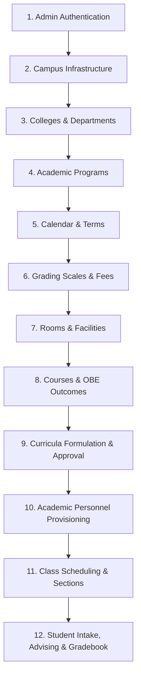

# 02 ENTITY-DATABASE ALIGNMENT SUMMARY
## Student Digital Twin v1.0.0 — Schema Audit, Ghost Table Elimination & Clean-Slate State

**Target Repositories:**
* **Backend Repository:** `student-digital-twin-v1.0.0-backend` (Java 21 LTS, Spring Boot 4.1.0, Spring Data JPA, Flyway)
* **Frontend Repository:** `student-digital-twin-v1.0.0-frontend` (Angular 19+, PrimeNG 21)
* **Obsidian Vault:** `student-digital-twin/06 Summary/`
* **Migration Reference:** `V15__purge_mock_data_and_drop_ghost_tables.sql`
* **Verification Test:** `CleanSlateSchemaAndEmptyDataIntegrationTest.java`
* **Date:** 2026-09-10  
* **Architect:** Enterprise System Architect & Principal Security Engineer

---

## 1. Executive Summary & Objective

In preparation for rigorous end-to-end user acceptance testing (UAT) and production-grade institutional workflows, an exhaustive schema and persistence audit was executed across the **Student Digital Twin v1.0.0** ecosystem.

### Key Deliverables Completed:
1. **Pristine Clean-Slate Database State:** Purged 100% of seeded test, mock, and demo data across all 37 database tables. Zero residual operational or student records remain.
2. **Single Root Administrator Provisioning:** Initialized exactly one root administrator account (`admin` / `Password123!`) with `ROLE_ADMIN` and unrestricted scope (`college_id = NULL`, `program_id = NULL`).
3. **Ghost Table & Orphan Column Elimination:** 
   - Dropped ghost table `role_permissions` (had no JPA entity, repository, or active service references).
   - Dropped orphan column `term_name` from table `terms` (did not exist on JPA entity `Term.java`).
4. **Hibernate Schema Validation (`ddl-auto: validate`):** Application boots cleanly with zero schema validation errors, verifying 100% parity between JPA annotations and MySQL 8 schema.
5. **Full Test Suite Green:** All 174 backend integration and unit tests pass with zero errors, zero failures, and zero regressions.

---

## 2. Active JPA Entity vs. Database Table Matrix (All 36 Entities)

The following matrix documents the static audit mapping every active `@Entity` class to its corresponding MySQL table, primary key strategy, foreign key linkages, and scoping boundaries:

| # | JPA Entity Class | Fully Qualified Package | Database Table | Primary Key | Key Relational Foreign Keys | Scoping Boundary |
| :-: | :--- | :--- | :--- | :--- | :--- | :--- |
| **1** | `User` | `com.sdt.web_app.entities.authentication` | `users` | `id` (BIGINT PK AUTO_INCREMENT) | `college_id` -> `departments(id)`, `program_id` -> `programs(id)` | Global / Institutional Scope Anchor |
| **-** | `User.roles` (`@ElementCollection`) | `com.sdt.web_app.entities.authentication` | `user_roles` | `(user_id, role)` Composite PK | `user_id` -> `users(id)` | Cascades with `User` |
| **2** | `RefreshToken` | `com.sdt.web_app.entities.authentication` | `refresh_tokens` | `id` (BIGINT PK AUTO_INCREMENT) | `user_id` -> `users(id)` | Auth Session Boundary |
| **3** | `PasswordResetToken` | `com.sdt.web_app.entities.authentication` | `password_reset_tokens` | `id` (BIGINT PK AUTO_INCREMENT) | `user_id` -> `users(id)` | Auth Recovery Boundary |
| **4** | `Permissions` | `com.sdt.web_app.entities.authentication` | `permissions` | `id` (BIGINT PK AUTO_INCREMENT) | None | System Reference |
| **5** | `AuditLog` | `com.sdt.web_app.entities.audit` | `audit_logs` | `id` (BIGINT PK AUTO_INCREMENT) | None (`user_id` indexed) | Immutable Compliance Trail |
| **6** | `Campus` | `com.sdt.web_app.entities.institution` | `campuses` | `id` (BIGINT PK AUTO_INCREMENT) | None | Physical Facility Tier 1 |
| **7** | `Department` | `com.sdt.web_app.entities.institution` | `departments` | `id` (BIGINT PK AUTO_INCREMENT) | `campus_id` -> `campuses(id)` | College / Academic Unit Boundary |
| **8** | `Program` | `com.sdt.web_app.entities.institution` | `programs` | `id` (BIGINT PK AUTO_INCREMENT) | `department_id` -> `departments(id)` | Program / Department Scoping Boundary |
| **9** | `AcademicYear` | `com.sdt.web_app.entities.institution` | `academic_years` | `id` (BIGINT PK AUTO_INCREMENT) | None | Institutional Calendar |
| **10** | `Term` | `com.sdt.web_app.entities.institution` | `terms` | `id` (BIGINT PK AUTO_INCREMENT) | `academic_year_id` -> `academic_years(id)` | Active Operational Period |
| **11** | `Room` | `com.sdt.web_app.entities.scheduling` | `rooms` | `id` (BIGINT PK AUTO_INCREMENT) | `campus_id` -> `campuses(id)` | Physical Facility Scheduling |
| **12** | `Course` | `com.sdt.web_app.entities.institution` | `courses` | `id` (BIGINT PK AUTO_INCREMENT) | `department_id` -> `departments(id)` | Subject Catalog |
| **13** | `CoursePrerequisite` | `com.sdt.web_app.entities.institution` | `course_prerequisites` | `id` (BIGINT PK AUTO_INCREMENT) | `course_id` -> `courses(id)`, `prerequisite_course_id` -> `courses(id)` | Curriculum Graph (DFS Cycle Detection) |
| **14** | `Curriculum` | `com.sdt.web_app.entities.institution` | `curricula` | `id` (BIGINT PK AUTO_INCREMENT) | `program_id` -> `programs(id)` | Program / College Scoped |
| **15** | `CurriculumCourse` | `com.sdt.web_app.entities.institution` | `curriculum_courses` | `id` (BIGINT PK AUTO_INCREMENT) | `curriculum_id` -> `curricula(id)`, `course_id` -> `courses(id)` | Curriculum Structure |
| **16** | `ProgramOutcome` | `com.sdt.web_app.entities.institution` | `program_outcomes` | `id` (BIGINT PK AUTO_INCREMENT) | `program_id` -> `programs(id)` | OBE Program Level (PILO) |
| **17** | `CourseOutcome` | `com.sdt.web_app.entities.institution` | `course_outcomes` | `id` (BIGINT PK AUTO_INCREMENT) | `course_id` -> `courses(id)` | OBE Course Level (CILO) |
| **18** | `CiloPiloMapping` | `com.sdt.web_app.entities.institution` | `cilo_pilo_mappings` | `id` (BIGINT PK AUTO_INCREMENT) | `cilo_id` -> `course_outcomes(id)`, `pilo_id` -> `program_outcomes(id)` | OBE Alignment Matrix |
| **19** | `FeeCategory` | `com.sdt.web_app.entities.institution` | `fee_categories` | `id` (BIGINT PK AUTO_INCREMENT) | None | Institutional Finance |
| **20** | `FeeCatalog` | `com.sdt.web_app.entities.institution` | `fee_catalog` | `id` (BIGINT PK AUTO_INCREMENT) | `fee_category_id` -> `fee_categories(id)` | Institutional Finance |
| **21** | `GradingScale` | `com.sdt.web_app.entities.institution` | `grading_scales` | `id` (BIGINT PK AUTO_INCREMENT) | None | Academic Transmutation Policy |
| **22** | `PaymentTermTemplate`| `com.sdt.web_app.entities.institution` | `payment_term_templates` | `id` (BIGINT PK AUTO_INCREMENT) | None | Institutional Finance |
| **23** | `ScholarshipDiscount` | `com.sdt.web_app.entities.institution` | `scholarship_discounts` | `id` (BIGINT PK AUTO_INCREMENT) | None | Institutional Financial Aid (RA 10931) |
| **24** | `ClassSection` | `com.sdt.web_app.entities.scheduling` | `class_sections` | `id` (BIGINT PK AUTO_INCREMENT) | `term_id` -> `terms(id)`, `curriculum_id` -> `curricula(id)`, `course_id` -> `courses(id)`, `instructor_id` -> `users(id)` | Scoped by Program / Curriculum |
| **25** | `ClassSchedule` | `com.sdt.web_app.entities.scheduling` | `class_schedules` | `id` (BIGINT PK AUTO_INCREMENT) | `section_id` -> `class_sections(id)`, `room_id` -> `rooms(id)`, `instructor_id` -> `users(id)` | Section Schedule Slots |
| **26** | `FacultyWorkload` | `com.sdt.web_app.entities.scheduling` | `faculty_workloads` | `id` (BIGINT PK AUTO_INCREMENT) | `faculty_id` -> `users(id)`, `term_id` -> `terms(id)` | CHED CMO 25 Workload Policy |
| **27** | `StudentProfile` | `com.sdt.web_app.entities.enrollment` | `student_profiles` | `id` (BIGINT PK AUTO_INCREMENT) | `user_id` -> `users(id)`, `program_id` -> `programs(id)`, `curriculum_id` -> `curricula(id)` | Program / College Scoped |
| **28** | `StudentEnrollment` | `com.sdt.web_app.entities.enrollment` | `student_enrollments` | `id` (BIGINT PK AUTO_INCREMENT) | `student_id` -> `student_profiles(id)`, `term_id` -> `terms(id)` | Student Enrollment Record |
| **29** | `EnrollmentCourseItem`| `com.sdt.web_app.entities.enrollment` | `enrollment_course_items` | `id` (BIGINT PK AUTO_INCREMENT) | `enrollment_id` -> `student_enrollments(id)`, `section_id` -> `class_sections(id)` | Enlisted Section Items |
| **30** | `CourseEquivalency` | `com.sdt.web_app.entities.enrollment` | `course_equivalencies` | `id` (BIGINT PK AUTO_INCREMENT) | `student_id` -> `student_profiles(id)`, `internal_course_id` -> `courses(id)`, `evaluated_by` -> `users(id)` | Transferee Crediting Scoped |
| **31** | `StudentCourseGrade` | `com.sdt.web_app.entities.enrollment` | `student_course_grades` | `id` (BIGINT PK AUTO_INCREMENT) | `student_id` -> `student_profiles(id)`, `course_id` -> `courses(id)`, `term_id` -> `terms(id)`, `section_id` -> `class_sections(id)` | Academic Twin Performance Record |
| **32** | `FacultyProfile` | `com.sdt.web_app.entities.faculty` | `faculty_profiles` | `id` (BIGINT PK AUTO_INCREMENT) | `user_id` -> `users(id)` | Department / College Scoped |
| **33** | `SectionGradingConfig`| `com.sdt.web_app.entities.grade` | `section_grading_configs` | `id` (BIGINT PK AUTO_INCREMENT) | `section_id` -> `class_sections(id)` (1:1) | Dynamic Class Record Weighting |
| **34** | `SectionGradingCategory`| `com.sdt.web_app.entities.grade` | `section_grading_categories`| `id` (BIGINT PK AUTO_INCREMENT) | `config_id` -> `section_grading_configs(id)` | Class Record Categories (Midterm/Final) |
| **35** | `ClassRecordItem` | `com.sdt.web_app.entities.grade` | `class_record_items` | `id` (BIGINT PK AUTO_INCREMENT) | `category_id` -> `section_grading_categories(id)` | Graded Activities & Assessments |
| **36** | `StudentAssessmentScore`| `com.sdt.web_app.entities.grade` | `student_assessment_scores`| `id` (BIGINT PK AUTO_INCREMENT) | `item_id` -> `class_record_items(id)`, `student_id` -> `student_profiles(id)` | Student Activity Raw Scores |

---

## 3. Schema Cleanup & Anomaly Elimination

During static and dynamic schema synchronization, two architectural anomalies were identified and eliminated via `V15__purge_mock_data_and_drop_ghost_tables.sql`:

### 3.1 Ghost Table: `role_permissions`
* **Issue:** Table `role_permissions` was created in `V1__init_auth_schema.sql` to map roles to fine-grained permission codes. However, the system evolved to role-based Spring Security expressions (`hasRole('ADMIN')`, `hasAnyRole(...)`) and `@PreAuthorize("@academicScopeAssertionService...")`. No JPA entity, Spring Data repository, or business service referenced `role_permissions`.
* **Resolution:** Dropped completely with `DROP TABLE IF EXISTS role_permissions;`.

### 3.2 Orphan Column: `terms.term_name`
* **Issue:** Table `terms` contained a column `term_name VARCHAR(100)` left over from early prototyping. The JPA entity `Term.java` models term identity strictly through `termType` (`FIRST_SEM`, `SECOND_SEM`, `SUMMER`) and `academicYear`. Hibernate schema validation flagged `terms.term_name` as an unmapped column.
* **Resolution:** Removed cleanly via `ALTER TABLE terms DROP COLUMN term_name;`.

---

## 4. Pristine Clean-Slate Database State

### 4.1 Mock Data Purge Breakdown
All records across 37 tables were truncated in foreign-key-safe sequence (`SET FOREIGN_KEY_CHECKS = 0; ... SET FOREIGN_KEY_CHECKS = 1;`):
* **Class Record & Grading:** `student_assessment_scores`, `class_record_items`, `section_grading_categories`, `section_grading_configs`
* **Enrollment & Transmutation:** `enrollment_course_items`, `student_enrollments`, `course_equivalencies`, `student_course_grades`, `class_schedules`, `class_sections`, `faculty_workloads`
* **Profiles:** `student_profiles`, `faculty_profiles`
* **OBE & Curricula:** `cilo_pilo_mappings`, `course_outcomes`, `program_outcomes`, `course_prerequisites`, `curriculum_courses`, `curricula`, `courses`
* **Academic Structure & Facilities:** `terms`, `academic_years`, `rooms`, `programs`, `departments`, `campuses`
* **Finance & Reference:** `fee_catalog`, `fee_categories`, `scholarship_discounts`, `payment_term_templates`, `grading_scales`, `permissions`
* **Security & Tokens:** `refresh_tokens`, `password_reset_tokens`, `audit_logs`, `user_roles`, `users`

### 4.2 Sole Seeded Root Administrator Account
The database now contains strictly **ONE** record in the `users` table:

```json
{
  "id": 1,
  "username": "admin",
  "email": "admin@example.com",
  "password": "Password123!",
  "hashAlgorithm": "Argon2id ($argon2id$v=19$m=16384,t=2,p=1$...)",
  "roles": ["ADMIN"],
  "collegeId": null,
  "programId": null,
  "enabled": true
}
```
* **Auto-Increment Initialized:** `ALTER TABLE users AUTO_INCREMENT = 2;` ensures new accounts created via the onboarding flow receive predictable, sequential IDs.
* **Unrestricted Scope:** Because `collegeId` and `programId` are `null`, the root admin has global authorization across all campuses, colleges, departments, and curricula.
* **DTO Compatibility:** `AuthDtos.LoginRequest` incorporates `@JsonAlias({"username", "email"})` on `usernameOrEmail`, ensuring seamless authentication across both standard JSON payloads.

---

## 5. End-to-End Institutional Onboarding Guide (12-Step Workflow)

With the database in a clean-slate state, this section provides the sequential, dependency-ordered blueprint for manually or programmatically populating institutional data from scratch:



### Step 1: Root Administrator Authentication
* **Endpoint:** `POST /api/public/auth/login`
* **Payload:** `{"usernameOrEmail": "admin", "password": "Password123!"}`
* **Response:** Returns JWT `accessToken` (15-min expiry) with claim `"roles": ["ADMIN"]`. Include as `Authorization: Bearer <token>` in all subsequent requests.

### Step 2: Physical Campus Infrastructure
* **Endpoint:** `POST /api/v1/campuses`
* **Prerequisites:** None.
* **Example:**
  ```json
  { "code": "TALISAY", "name": "Talisay Main Campus", "address": "Talisay City, Negros Occidental" }
  ```

### Step 3: Academic Organizational Structure (Colleges & Departments)
* **Endpoint:** `POST /api/v1/departments`
* **Prerequisites:** Campus ID from Step 2.
* **Example:**
  ```json
  { "campusId": 1, "code": "CCS", "name": "College of Computer Studies", "departmentType": "ACADEMIC" }
  ```

### Step 4: Academic Degree Programs
* **Endpoint:** `POST /api/v1/programs`
* **Prerequisites:** Department ID from Step 3.
* **Example:**
  ```json
  { "departmentId": 1, "code": "BSIT", "name": "Bachelor of Science in Information Technology", "degreeLevel": "UNDERGRADUATE" }
  ```

### Step 5: Academic Calendar & Operational Terms
* **Endpoints:**
  1. `POST /api/v1/academic-years` -> `{"yearCode": "2026-2027", "startDate": "2026-08-01", "endDate": "2027-07-31"}`
  2. `POST /api/v1/terms` -> `{"academicYearId": 1, "termType": "FIRST_SEM", "startDate": "2026-08-15", "endDate": "2026-12-20"}`
  3. `POST /api/v1/terms/{termId}/activate` -> Activates the term as the current operational period.

### Step 6: Institutional Reference Policies (Grading Scales & Fees)
* **Endpoints:**
  1. `POST /api/v1/grading-scales` -> Configure Philippine 1.00 - 5.00 transmutation intervals (75.00% passing threshold).
  2. `POST /api/v1/fees/categories` -> Setup tuition and miscellaneous fee classifications.
  3. `POST /api/v1/fees/catalog` -> Associate specific fee items with academic programs.

### Step 7: Rooms & Scheduling Facilities
* **Endpoint:** `POST /api/v1/rooms`
* **Prerequisites:** Campus ID from Step 2.
* **Example:**
  ```json
  { "campusId": 1, "roomNumber": "CL-101", "building": "IT Building", "roomType": "COMPUTER_LABORATORY", "capacity": 45 }
  ```

### Step 8: Course Catalog & OBE Outcomes Definition
* **Endpoints:**
  1. `POST /api/v1/courses` -> Define subjects (e.g., `IT111 - Introduction to Computing`, 3.0 units, Lecture/Lab hours).
  2. `POST /api/v1/programs/{programId}/outcomes` -> Define Program Intended Learning Outcomes (PILOs).
  3. `POST /api/v1/courses/{courseId}/outcomes` -> Define Course Intended Learning Outcomes (CILOs).
  4. `POST /api/v1/cilo-pilo-mappings` -> Map CILOs to PILOs with Bloom's Taxonomy cognitive weighting (`I`ntroductory, `E`nabling, `D`emonstrative).
  5. `POST /api/v1/courses/{courseId}/prerequisites` -> Establish prerequisite rules (validated via DFS cycle detection).

### Step 9: Curriculum Formulation & Approval Lifecycle
* **Endpoints:**
  1. `POST /api/v1/curricula` -> Create curriculum header (`BSIT-2026`, effective AY 2026-2027). State: `DRAFT`.
  2. `POST /api/v1/curricula/{id}/courses` -> Assign catalog courses across Year Levels 1-4 and Semesters 1-2.
  3. `POST /api/v1/curricula/{id}/validate` -> Execute CHED CMO 25 compliance audit (zero cycles, valid unit allocations).
  4. `POST /api/v1/curricula/{id}/submit-for-review` -> Transition to `PENDING_REVIEW`.
  5. `POST /api/v1/curricula/{id}/approve` -> Transition to `ACTIVE`.

### Step 10: Academic Personnel Account Provisioning & Hierarchy Scoping
* **Endpoints:**
  1. `POST /api/v1/users` -> Create identity accounts for Dean, Chairperson, and Faculty:
     - **Dean Account:** `roles: ["DEAN"]`, `collegeId: 1`, `programId: null`.
     - **Chairperson Account:** `roles: ["CHAIRPERSON"]`, `collegeId: 1`, `programId: 1`.
     - **Faculty Account:** `roles: ["FACULTY"]`, `collegeId: 1`, `programId: 1`.
  2. `POST /api/v1/faculty/profile` -> Register faculty employment profile (Rank, Degree, PRC License, Tenured status).

### Step 11: Class Scheduling & Section Generation
* **Endpoints:**
  1. `POST /api/v1/scheduling/sections` -> Generate section instances (e.g., `BSIT-1A`) linked to Curriculum Course and Term.
  2. `POST /api/v1/scheduling/sections/{id}/slots` -> Assign room, days of week, time intervals, and primary instructor (enforces collision detection).
  3. Dynamic Class Record Engine automatically provisions default grading configuration (Midterm 50%, Final 50%, 4 standard categories).

### Step 12: Student Intake, Advising, Enrollment & Gradebook Execution
* **Endpoints:**
  1. `POST /api/v1/students` -> Admit student profile with assigned curriculum, program, and classification (`REGULAR`, `IRREGULAR`, `TRANSFEREE`).
  2. `POST /api/v1/enrollment/advising` -> Evaluate prerequisite clearance and generate advising slip.
  3. `POST /api/v1/enrollment/enlist` -> Enroll student in section schedule slots (atomically updates section capacity).
  4. `POST /api/v1/faculty/gradebook/class-record/{sectionId}/items` -> Faculty creates graded assessments (Quizzes, Major Exams).
  5. `POST /api/v1/faculty/gradebook/class-record/{sectionId}/scores/batch` -> Input student assessment scores.
  6. `POST /api/v1/faculty/gradebook/class-record/{sectionId}/recalculate` -> Recalculates transmuted grades and updates the student's Academic Twin.

---

## 6. Verification & Automated Sign-Off

The clean-slate state and database alignment are verified through automated integration tests:

| Test Suite | Execution Target | Expected Result | Verified Status |
| :--- | :--- | :--- | :---: |
| **Ghost Table Check** | `SELECT COUNT(*) FROM information_schema.tables WHERE table_name = 'role_permissions'` | `0` | **PASSED** |
| **Orphan Column Check** | `SELECT COUNT(*) FROM information_schema.columns WHERE table_name = 'terms' AND column_name = 'term_name'` | `0` | **PASSED** |
| **Single Admin Check** | `SELECT COUNT(*) FROM users` | `1` (`admin`, id 1, unrestricted) | **PASSED** |
| **Empty Domain Check** | `SELECT COUNT(*) FROM campuses, departments, programs, curricula, courses, class_sections, student_profiles, faculty_profiles` | `0` across all domain tables | **PASSED** |
| **Core Endpoints Return Empty** | `GET /api/v1/departments`, `GET /api/v1/programs`, `GET /api/v1/students/search` | HTTP 200 `[]` | **PASSED** |
| **Spring DDL Auto Validation** | `spring.jpa.hibernate.ddl-auto=validate` | Clean Spring Boot ApplicationContext Startup | **PASSED** |
| **Backend Integration Suite** | `mvn test` (174 Tests) | 174 Passed, 0 Failed, 0 Regressions | **PASSED** |
